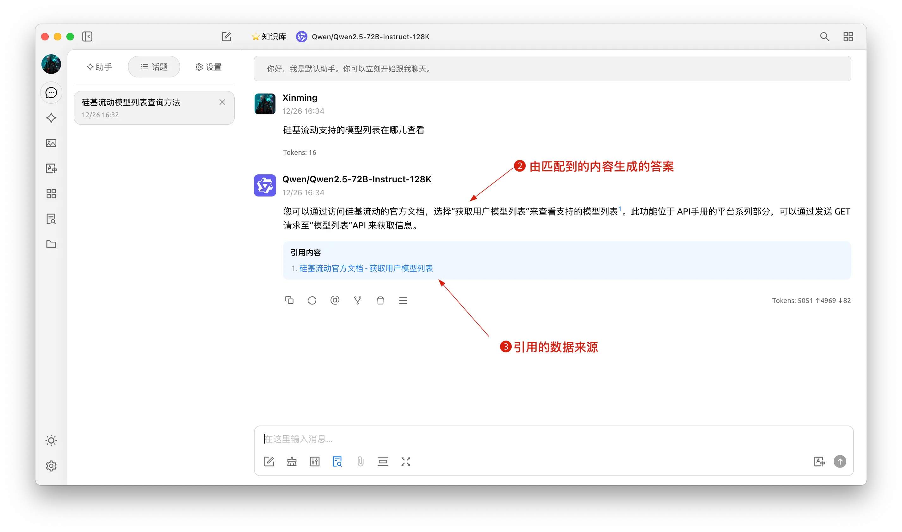


此文件由 AI 從中文翻譯而來，尚未經過審閱。


# 知識庫教程

在 0.9.1 版本中，CherryStudio 帶來了期待已久的知識庫功能。

下面我們將按步驟呈現 CherryStudio 的詳細使用說明。

## 添加嵌入模型

1. 在模型管理服務中查找模型，可以點擊「嵌入模型」快速篩選；
2. 找到需要的模型，添加到我的模型。

<figure><figcaption></figcaption></figure>

## 創建知識庫

1. 知識庫入口：在 CherryStudio 左側工具欄，點擊知識庫圖標，即可進入管理頁面；
2. 添加知識庫：點擊添加，開始創建知識庫；
3. 命名：輸入知識庫的名稱並添加嵌入模型，以 bge-m3 為例，即可完成創建。

<figure><figcaption></figcaption></figure>

<figure><figcaption></figcaption></figure>

## 添加文件並向量化

1. 添加文件：點擊添加文件的按鈕，打開文件選擇；
2. 選擇文件：選擇支援的文件格式，如 pdf，docx，pptx，xlsx，txt，md，mdx 等，並打開；
3. 向量化：系統會自動進行向量化處理，當顯示完成時（綠色 ✓），代表向量化已完成。

<figure><figcaption></figcaption></figure>

<figure><figcaption></figcaption></figure>

<figure><figcaption></figcaption></figure>

## 添加多種來源的數據

CherryStudio 支援多種添加數據的方式：

1. 文件夾目錄：可以添加整個文件夾目錄，該目錄下支援格式的文件會被自動向量化；
2. 網址連結：支援網址 url，如[https://docs.siliconflow.cn/introduction](https://docs.siliconflow.cn/introduction)；
3. 站點地圖：支援 xml 格式的站點地圖，如[https://docs.siliconflow.cn/sitemap.xml](https://docs.siliconflow.cn/sitemap.xml)；
4. 純文本筆記：支援輸入純文本的自定義內容。


提示：

1. 導入知識庫的文檔中的插圖暫不支援轉換為向量，需要手動轉換為文本；
2. 使用網址作為知識庫來源時不一定會成功，有些網站有比較嚴格的反扒機制（或需要登入、授權等），因此該方式不一定能獲取到準確內容。創建完成後建議先搜索測試一下。
3. 一般網站都會提供sitemap，如CherryStudio的[sitemap](https://docs.cherry-ai.com/sitemap-pages.xml)，一般在網站的根地址（即網址）後加/sitemap.xml可以獲取到相關資訊。如`aaa.com/sitemap.xml` 。
4. 如果網站沒提供sitemap或者網址比較雜可自行組合一個sitemap的xml文件使用，文件暫時需要使用公網可直接訪問的直鏈的方式填入，本地文件連結不會被識別。

> 1) 可以讓AI生成sitemap文件或讓AI寫一個sitemap的HTML生成器工具；
> 2) 直鏈可以使用oss直鏈或者網盤直鏈等方式來生成。如果沒有現成工具也可到[ocoolAI](https://one.ocoolai.com/login)官網，登入後使用網站頂欄的免費文件上傳工具來生成直鏈。


## 搜索知識庫

當文件等資料向量化完成後，即可進行查詢：

1. 點擊頁面下方的搜索知識庫按鈕；
2. 輸入查詢的內容；
3. 呈現搜索的結果；
4. 並顯示該條結果的匹配分數。

<figure><figcaption></figcaption></figure>

<figure><figcaption></figcaption></figure>

## 對話中引用知識庫生成回覆

1. 創建一個新的話題，在對話工具欄中，點擊知識庫，會展開已經創建的知識庫列表，選擇需要引用的知識庫；
2. 輸入並發送問題，模型即返回通過檢索結果生成的答案；
3. 同時，引用的數據來源會附在答案下方，可快捷查看源文件。

<figure><figcaption></figcaption></figure>

<figure><figcaption></figcaption></figure>