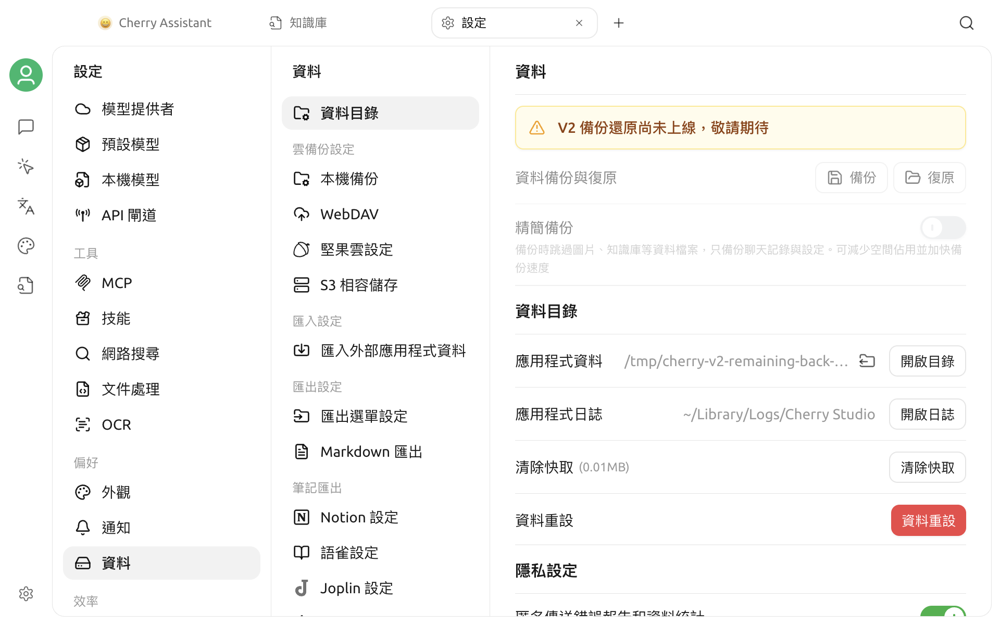

# 修改儲存位置

Cherry Studio 的應用程式資料目錄會儲存資料庫、內部檔案、知識庫、筆記和部分執行狀態。系統磁碟空間不足，或需要將資料放到另一個長期在線的本機磁碟時，可以在應用程式內移轉該目錄。


修改資料目錄是高風險操作。目前 V2 的應用程式內備份與還原尚未開放；如果沒有已驗證的獨立副本，建議暫緩移轉。確實需要移轉時，請先完全退出 Cherry Studio，再將目前的應用程式資料目錄複製到另一個磁碟。移轉期間請勿退出應用程式、關機或拔除目標磁碟。


## 查看目前的目錄

開啟**設定 > 資料設定 > 資料目錄**，在**應用程式資料**列查看目前的路徑。點擊路徑或**開啟目錄**，可以在系統檔案管理器中開啟。

設定頁面顯示的路徑是目前執行個體的正確資訊，應優先於在網路上看到的預設路徑。

常見的預設位置如下：

| 系統 | 常見位置 |
| --- | --- |
| macOS | `~/Library/Application Support/CherryStudio` |
| Windows | `%APPDATA%\CherryStudio` |
| Linux | `~/.config/CherryStudio` |
| Windows 可攜式版本 | 程式所在目錄旁的 `data` 資料夾 |

不同的安裝方式、歷史版本或可攜式版本可能會使用不同路徑，請以應用程式內顯示為準。

## 哪些內容會受到影響

應用程式資料目錄通常包含：

- Cherry Studio 的本機資料庫；
- 應用程式內部管理的檔案；
- 知識庫和筆記資料；
- 已安裝的部分資源與工作區；
- Chromium / Electron 的工作階段和網路狀態；
- 部分記錄與快取。

以下內容不一定會隨目錄移轉：

- 原本就位於目錄外部、只由 Cherry Studio 引用的檔案；
- 作業系統中安裝的字型和系統層級設定；
- 位於使用者主目錄下的獨立 Cherry Studio 基礎設施目錄；
- 第三方應用程式、雲端服務或模型服務中的資料。

因此，請勿將「修改應用程式資料目錄」當成完整的備份方案。

## 移轉前準備

1. 記錄設定頁面顯示的目前應用程式資料路徑。
2. 完全退出 Cherry Studio，將整個目前目錄複製到另一個磁碟，並確認副本可以讀取。
3. 重新開啟應用程式，結束正在執行的產生、知識庫處理、檔案匯入和同步工作。
4. 確認目標磁碟有足夠空間、連線穩定，而且目前使用者具有寫入權限。
5. 建立一個**空白資料夾**作為目標。
6. 保留原始目錄和離線副本，直到完成移轉後的驗證。


不建議使用網路共用、按需下載的雲端同步目錄或經常拔除的外接磁碟。資料庫和執行狀態需要持續且穩定的本機檔案存取。


## 選擇目標目錄

1. 開啟**設定 > 資料設定 > 資料目錄**。
2. 在**應用程式資料**右側點擊修改目錄圖示。
3. 選擇或建立目標資料夾。
4. 在確認視窗中核對**原始路徑**和**新路徑**。
5. 依需要決定是否啟用**複製資料**。
6. 點擊確認，等待應用程式完成移轉和重新啟動。

Cherry Studio 會拒絕以下目標：

- 磁碟或檔案系統根目錄；
- 目前的應用程式資料目錄本身或其內部目錄；
- Cherry Studio 的安裝目錄；
- 目前使用者沒有寫入權限的目錄。

## 「複製資料」開關

### 啟用

應用程式重新啟動後，會將原始目錄中的資料複製到新目錄，適合在保留目前對話、助理、檔案和知識庫的情況下搬遷。

- 優先選擇空白目錄；
- 複製時間取決於檔案數量、知識庫大小和磁碟速度；
- 應用程式可能會重新啟動多次；
- 複製期間請勿強制退出。

### 關閉

只會切換目錄，不會複製舊資料。第一次開啟新目錄時，可能會顯示為一個空白的 Cherry Studio 環境，舊資料仍保留在原始目錄中。

只有在你明確想要建立全新的資料目錄，或已經透過其他方式準備好目標目錄時，才關閉此開關。


如果目標目錄不是空白目錄，而且選擇繼續，現有檔案可能會被覆寫，存在資料遺失或複製失敗的風險。除非確認其中的內容可以被取代，否則請取消並選擇空白目錄。


## 移轉後的驗證

移轉完成後，請勿立即刪除原始目錄。請依序檢查：

1. 開啟**設定 > 資料設定 > 資料目錄**，確認顯示的是新路徑。
2. 隨機開啟幾個歷史話題和助理。
3. 檢查知識庫、筆記和內部檔案是否可用。
4. 新增一則測試對話，然後正常退出。
5. 再次啟動 Cherry Studio，確認新資料仍然存在。
6. 完全退出應用程式後，再製作一份新目錄的離線副本。

建議至少經過兩次完整啟動並使用一段時間後，再決定是否封存或刪除原始目錄。

## 更換外接磁碟

如果資料目錄位於外接磁碟：

- 啟動 Cherry Studio 前，請先連接磁碟；
- 保持相同的掛載點或磁碟機代號；
- 應用程式執行期間請勿退出磁碟；
- 在系統休眠、更新或備份前，確認磁碟仍然在線。

如果某次啟動後看起來像全新安裝，請先退出應用程式，不要執行重設或大量新建操作。重新連接原始磁碟並確認路徑和磁碟機代號，再啟動並檢查。

## 返回原始目錄

如果新目錄運作異常：

1. 請勿刪除新舊任何一個目錄。
2. 如果需要保留新目錄的目前狀態，請完全退出應用程式後複製該目錄。
3. 在**資料目錄**中重新選擇原始目錄。
4. 如果原始目錄已有完整資料，請關閉**複製資料**，避免相互覆寫。
5. 重新啟動後，依「移轉後的驗證」再次檢查。

請勿在應用程式執行時手動合併兩個資料目錄。相同名稱的資料庫、設定和執行狀態檔案，無法透過一般的檔案覆寫安全合併。

## 常見問題

### 無法選擇磁碟根目錄

這是保護措施。請在磁碟中建立專用的子目錄，例如 `CherryStudioData`，再選擇該目錄。

### 提示沒有寫入權限

請檢查目錄擁有者與權限，或改用目前帳號可以寫入的位置。請勿長期以系統管理員身分執行應用程式來繞過權限問題。

### 移轉很長一段時間仍未完成

大型檔案和知識庫會延長複製時間。請先觀察磁碟是否仍有讀寫活動，不要立即強制退出；如果最終失敗，請保留原始目錄並查看應用程式記錄。

### 重新啟動後仍顯示原始路徑

請確認移轉過程中沒有發生錯誤、目標磁碟仍在線，並再次檢查目錄權限。暫時不要刪除原始目錄；如果多次重新啟動後仍無法切換，請透過官方管道回報版本、系統和記錄資訊。

### 新目錄中缺少外部檔案

應用程式只會移轉自己管理的資料目錄。原本位於其他位置的外部檔案不會自動複製，需要繼續保持原始路徑可以存取，或個別移轉後重新關聯。

***

### 取得協助與提交意見回饋

如果在移轉過程中遇到問題，請保留新舊目錄和記錄，並透過[意見回饋與建議](../question-contact/suggestions.md)中列出的官方管道聯絡我們。
