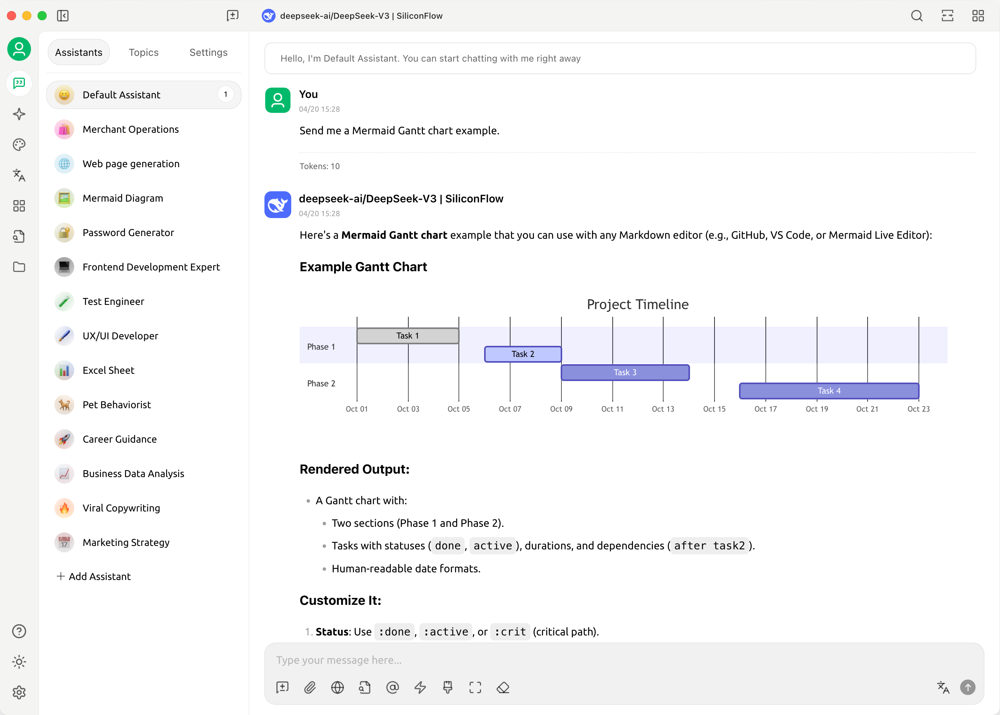

# 免費體驗 | Qwen3-8B ，由矽基流動提供！


此文件由 AI 從中文翻譯而來，尚未經過審閱。


**知名 MaaS 服務平台「矽基流動」為大家免費提供 Qwen3-8B 模型的調用服務**。作為通義千問 Qwen3 系列中的高性價比成員，Qwen3-8B 以小巧體積實現強大能力，是智能應用與高效開發的理想選擇。

***

**🚀 什麼是 Qwen3-8B？**

Qwen3-8B 是阿里巴巴於 2025 年 4 月發佈的通義千問第三代大模型系列中的 **80 億參數密集模型**，採用 **Apache 2.0 開源協議**，可自由用於商業與研究場景。

* **總參數量：80 億**
* **架構類型：Dense（純稠密結構）**
* **上下文長度：128K tokens**
* **支援多語言：涵蓋 119 種語言和方言**

儘管體積小巧，Qwen3-8B 在推理、程式碼、數學和 Agent 能力方面表現穩定，性能媲美前代更大的模型，在實際應用中展現出極高的實用性。

<figure><figcaption></figcaption></figure>

***

**📚 強大訓練基礎，小模型也有大智慧**

Qwen3-8B 基於 **約 36 萬億 token 的高質量多語言數據**完成預訓練，涵蓋網頁文本、技術文件、程式碼庫與專業領域合成數據，知識覆蓋面廣。

其後訓練階段引入了**四階段強化流程**，特別優化了以下能力：

✅ 自然語言理解與生成\
✅ 數學推理與邏輯分析\
✅ 多語言翻譯與表達\
✅ 工具調用與任務規劃

得益於訓練體系的全面升級，**Qwen3-8B 的實際表現接近甚至超越 Qwen2.5-14B**，實現顯著的參數效率躍遷。\

<figure><figcaption></figcaption></figure>

***

**💡 混合推理模式：思考 or 快速回應？**

Qwen3-8B 支援 **「思考模式」與「非思考模式」** 的靈活切換，用戶可根據任務複雜度自主選擇回應方式。

通過以下方式控制模式：

* **API 參數設置**：`enable_thinking=True/False`
* **提示詞指令**：在輸入中添加 `/think` 或 `/no_think`

| 模式        | 適用場景           | 範例                            |
| --------- | -------------- | ----------------------------- |
| **思考模式**  | 複雜推理、數學題、規劃類任務 | 
- 求解幾何問題 - 編寫完整項目架構
 |
| **非思考模式** | 快速問答、翻譯、摘要     | 
- 查詢天氣 - 中英文互譯
      |

該設計讓用戶在**回應速度與推理深度之間自由權衡**，提升使用體驗。

***

**⚙️ 原生支援 Agent 能力，賦能智能應用**

Qwen3-8B 具備出色的 **Agent 化能力**，可輕鬆整合到各類自動化系統中：

🔹 **函數調用（Function Calling）**：支援結構化工具調用\
🔹 **MCP 協議相容**：原生支援模型上下文協議，便於擴展外部能力\
🔹 **多工具協同**：可接入搜索、計算器、程式碼執行等插件

推薦結合 **Qwen-Agent 框架** 使用，快速建構具備記憶、規劃與執行能力的智能助手。

***

**🌐 廣泛語言支援，面向全球應用**

Qwen3-8B 支援包括中文、英文、阿拉伯語、西班牙語、日語、韓語、印尼語等在內的 **119 種語言和方言**，適用於國際化產品開發、跨語言客服、多語種內容生成等場景。

對中文理解尤為出色，支援簡體、繁體及粵語表達，適用於港澳台及海外華人市場。

***

**🧠 實用能力強，場景覆蓋廣**

Qwen3-8B 在多個高頻應用場景中表現優異：

✅ **程式碼生成**：支援 Python、JavaScript、Java 等主流語言，能根據需求生成可運行程式碼\
✅ **數學推理**：在 GSM8K 等基準中表現穩定，適合教育類應用\
✅ **內容創作**：撰寫郵件、報告、文案，結構清晰、語言自然\
✅ **智能助手**：可建構個人知識庫問答、日程管理、信息提取等輕量級 AI 助手

***

現在就通過 **矽基流動** 免費體驗 Qwen3-8B，開啟你的輕量 AI 應用之旅！\

📘 立即使用，讓 AI 觸手可及！