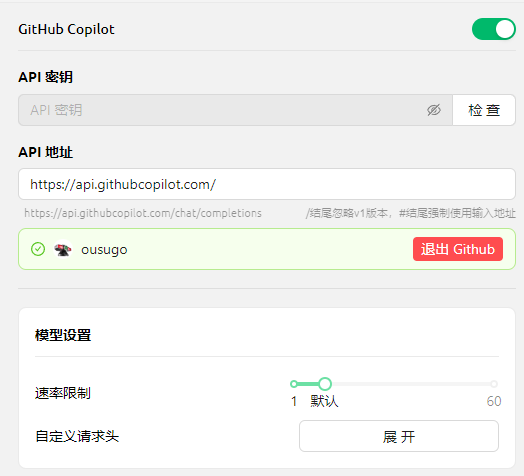

# GitHub Copilot


此文件由 AI 從中文翻譯而來，尚未經過審閱。


使用 GitHub Copilot 前需先擁有 GitHub 帳號並訂閱服務，免費版本亦可使用，但免費版本不支援最新的 Claude 3.7 模型，詳情請參考 [GitHub Copilot 官網](https://github.com/features/copilot)。

## 取得 Device Code

點擊「登入 GitHub」，取得 Device Code 並複製。

<figure><figcaption>
取得 Device Code
</figcaption></figure>

## 在瀏覽器中填寫 Device Code 並授權

成功取得 Device Code 後，點擊連結開啟瀏覽器，登入 GitHub 帳號，輸入 Device Code 並完成授權。

<figure><figcaption>
GitHub 授權
</figcaption></figure>

授權成功後，返回 Cherry Studio，點擊「連接 GitHub」，成功後將顯示 GitHub 用戶名稱和頭像。

<figure><figcaption>
GitHub 連線成功
</figcaption></figure>

## 點擊「管理」取得模型列表

點擊下方的「管理」按鈕，系統將自動連網取得當前支援的模型列表。

<figure><figcaption>
取得模型列表
</figcaption></figure>

## 常見問題

### 取得 Device Code 失敗，請重試

<figure><figcaption>
取得 Device Code 失敗
</figcaption></figure>

目前使用 Axios 構建請求，Axios 不支援 socks 代理，請改用系統代理或 HTTP 代理，或直接在 CherryStudio 中不設定代理而使用全域代理。請先確保網路連線正常，以避免取得 Device Code 失敗。