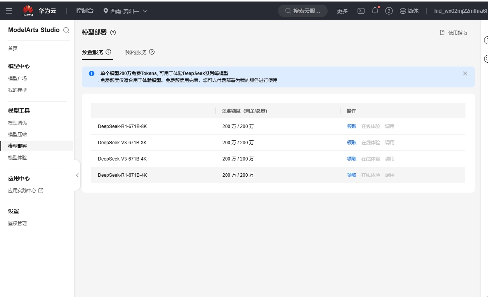


此文件由 AI 從中文翻譯而來，尚未經過審閱。


# 華為雲

一、到[華為雲](https://auth.huaweicloud.com/authui/login)建立帳號登入

二、點擊[此連結](https://console.huaweicloud.com/modelarts/?region=cn-southwest-2#/model-studio/homepage)，進入ModelArts控制台

三、授權

授權步驟（已授權請跳過）

1. 進入(二)的連結頁面後，根據提示進入授權頁面（點擊IAM子用戶→新增委託→普通用戶）

.png>)

2. 點擊建立後重新返回(二)的連結頁面
3. 會提示存取權限不足，點擊提示裡的「點選此處」
4. 追加已有授權並確定

.png>)

注意：該方法適用於新手，不用檢視過多內容，只需根據提示點擊。若您能一次性成功授權，請按照自己的方式操作即可。

四、點擊側欄「鑑權管理」，建立API Key（密鑰）並複製

<figure><figcaption></figcaption></figure>

然後在CherryStudio建立新服務商

<figure><figcaption></figcaption></figure>

建立完成後填入密鑰

五、點擊側欄「模型部署」，全部領取

<figure><figcaption></figcaption></figure>

六、點擊呼叫

<figure><figcaption></figcaption></figure>

將①處的地址複製，貼上到CherryStudio的服務商地址中，並在結尾加上「#」號

並在結尾加上「#」號  
並在結尾加上「#」號  
並在結尾加上「#」號  
並在結尾加上「#」號  

為什麼加「#」號？[詳見此處](https://docs.cherry-ai.com/cherrystudio/preview/settings/providers#api-di-zhi)

> 當然也可以不檢視該文件；
>  
> 也可使用刪除v1/chat/completions的方法填寫，只要會填可自行操作，不會填請務必按照教學操作。

<figure><figcaption></figcaption></figure>

將②處模型名稱複製，到CherryStudio中點擊「+添加」按鈕新建模型

<figure><figcaption></figcaption></figure>

輸入模型名稱，請勿增減內容，不帶引號，完全按照範例填寫。

<figure><figcaption></figcaption></figure>

點擊「添加模型」按鈕即可完成新增。


在華為雲中由於每個模型的地址不同，因此每個模型都需要新建一個服務商，請按照以上步驟重複操作。
