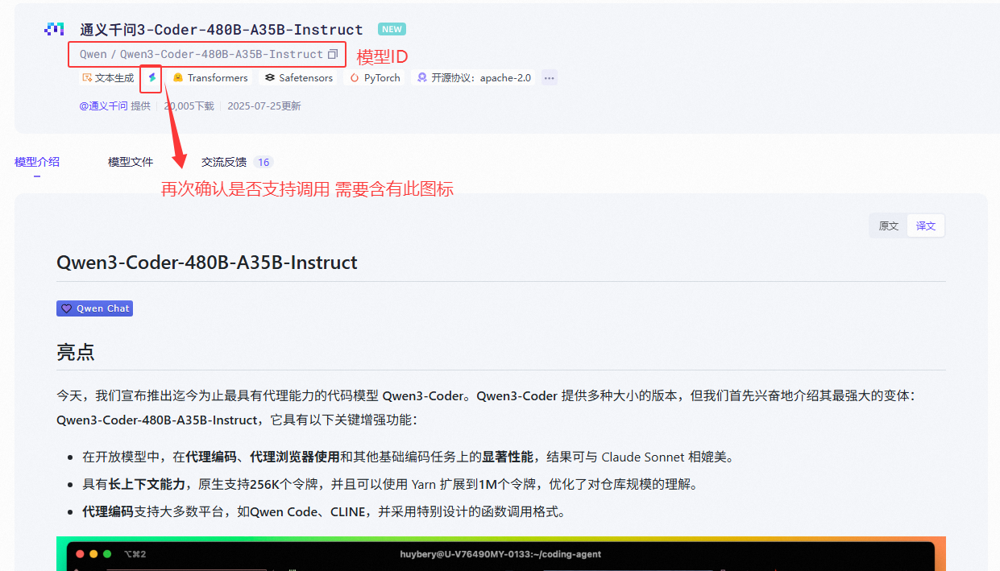

# ModelScope（魔搭）平台接入指南  


此文件由 AI 從中文翻譯而來，尚未經過審閱。


## 什麼是 ModelScope？  
> ModelScope 是新一代開源模型即服務（MaaS）共享平台，致力於為泛 AI 開發者提供**靈活、易用、低成本**的一站式模型服務解決方案，讓模型應用更簡單！  
>  
> 通過 **API-Inference 服務化能力**，平台將開源模型標準化為可調用的 API 介面，開發者可輕量、快速地整合模型能力至各類 AI 應用，支援工具調用、原型開發等創新場景。  

### 核心優勢  
- ✅ **免費額度**：每日提供 **2000 次免費 API 調用額度**（[計費規則](##計費與額度規則)）  
- ✅ **豐富模型庫**：覆蓋 NLP、CV、語音、多模態等 1000+ 開源模型  
- ✅ **即開即用**：無需部署，通過 RESTful API 快速調用  

---  

## Cherry Studio 接入流程  
### 步驟 1：獲取 ModelScope API 令牌  
1. **登入平台**  
   - 造訪 [ModelScope 官網](https://modelscope.cn) → 點擊右上角**登入** → 選擇認證方式  
     
2. **建立訪問令牌**  
   - 進入 **[帳戶設定 → 訪問令牌](https://modelscope.cn/my/myaccesstoken)**  
   - 點擊 **`新建令牌`** → 填寫描述 → **複製生成的令牌**（*頁面示範見下圖*）  
     
   > 🔑 **重要提示**：令牌洩露將影響帳號安全！  

### 步驟 2：設定 Cherry Studio  
- 開啟 **Cherry Studio** → **設定 → 模型服務 → ModelScope**  
- 在 `API 金鑰` 欄貼上複製的令牌  
    
- 點擊 **`保存`** 完成授權  

### 步驟 3：調用模型 API  
1. **查找支援 API 的模型**  
   - 造訪 [ModelScope 模型庫](https://modelscope.cn/models)  
   - 篩選條件：**勾選 `API-Inference`**（或認準模型卡片上的 `API` 圖示）  
     
   > API-Inference 覆蓋的模型範圍，主要根據模型在魔搭社群中的關注程度（參考了點讚、下載等數據）來判斷。因此，在能力更強、關注度更高的下一代開源模型發佈之後，支援的模型清單也會持續迭代。  
2. **獲取模型 ID**  
   - 進入目標模型詳情頁 → 複製 **Model ID**（格式如 `damo/nlp_structbert_sentiment-classification_chinese-base`）  
     
3. **填入 Cherry Studio**  
   - 在模型服務設定頁的 `模型 ID` 欄輸入 ID → 選擇任務類型 → 完成設定  
     

---  

## 計費與額度規則  
### 重要說明  
- 🎫 **免費額度**：每位用戶 **每日 2000 次 API 調用**（*以官網最新規則為準*）  
- 🔁 **額度重置**：每日 UTC+8 00:00 自動重置，**不支援跨日累計或升級**  
- 💡 **超額處理**：  
  - 達到當日上限後 API 將返回 `429 錯誤`  
  - 解決方案：切換備用帳號 / 使用其他平台 / 優化調用頻率  

### 查看剩餘額度  
- 登入 ModelScope → 點擊右上角 **`用戶名`** → **`API 使用情況`**  
    

> ⚠️ 注意：推論 API-Inference 每天提供 2000 次的免費調用額度。更多調用需求可考慮使用阿里雲百煉等雲端服務。