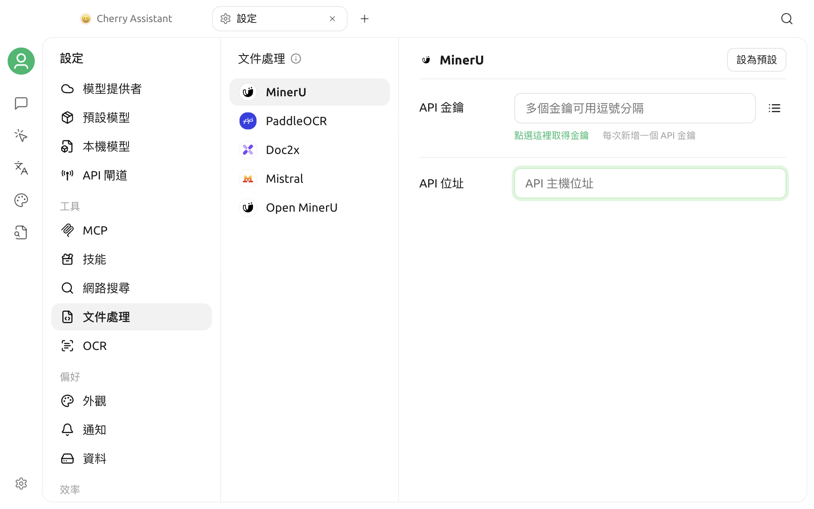

# 文件處理

Cherry Studio V2 使用兩個獨立設定頁處理檔案：**OCR** 將圖片轉換為純文字，**文件處理**將 PDF 等文件轉換為 Markdown，供後續檢索、解析和知識庫索引使用。

Cherry Studio V2 將處理能力分為兩類：

| 能力 | 輸入 | 輸出 | 常見用途 |
| --- | --- | --- | --- |
| 圖片轉文字（OCR） | 圖片檔案 | 純文字 | 擷取截圖、掃描圖片中的文字 |
| 文件轉 Markdown | 文件檔案 | Markdown 與相關資源 | 保留標題、段落、表格等結構，供知識庫繼續處理 |

兩個入口會分別選擇預設處理器。當一項服務同時支援兩種能力時，它會分別出現在 **OCR** 和 **文件處理**頁面，設定與預設狀態也會分別管理。

## 開啟 OCR 與文件處理設定

- 圖片轉文字：前往 **設定 > OCR**。
- 文件轉 Markdown：前往 **設定 > 文件處理**。

在 **文件處理**頁面中，左側會依目前 UI 順序顯示 MinerU、PaddleOCR、Doc2x、Mistral 和 Open MinerU。**OCR** 頁面會顯示目前裝置可用的圖片處理器。

OCR 處理器會依平台和執行環境篩選。清單與本文不完全一致時，請以目前應用程式實際顯示為準。


V2 初始不會預設圖片或文件的預設處理器。完成設定後，需要在對應的能力項目上點擊 **設為預設**；只填寫 API 金鑰不會自動設為預設。


## 處理器能力對照

### 圖片轉文字

| 處理器 | 執行位置 | 憑證 | 適用範圍 |
| --- | --- | --- | --- |
| System OCR | 本機 | 無 | macOS 與 Windows；直接呼叫系統 OCR |
| Tesseract OCR | 本機 | 無 | macOS、Windows、Linux；可選擇語言套件 |
| PaddleOCR | API 或自行部署的服務 | API Key | 圖片 OCR；可選擇 PaddleOCR 解析模型 |
| Mistral | Mistral API | API Key | 圖片轉文字 |
| Intel OV OCR | 本機 | 無 | 只會在符合條件的 Windows Intel Core Ultra 裝置上顯示 |

System OCR 不支援 Linux。Intel OV OCR 還要求應用程式偵測到所需的本機執行指令碼，因此不是所有 Intel 裝置都會出現。

### 文件轉 Markdown

| 處理器 | 預設 API 位址 | 憑證 | 說明 |
| --- | --- | --- | --- |
| MinerU | `https://mineru.net` | API Key | 提交遠端解析工作並輪詢結果 |
| PaddleOCR | `https://paddleocr.aistudio-app.com/` | API Key | 支援文件解析，也可以改用自行部署的位址 |
| Doc2x | `https://v2.doc2x.noedgeai.com` | API Key | 提交遠端解析與匯出工作 |
| Mistral | `https://api.mistral.ai` | API Key | 使用 Mistral OCR 解析文件 |
| Open MinerU | `http://127.0.0.1:8000` | 選填 | 連線至自行部署的 MinerU 相容服務 |

表格中的位址是目前的內建值。當服務供應商介面變更、使用自建反向 Proxy 或私有部署時，可以在介面中修改 **API 位址 (Base URL)**。


遠端處理器會將待處理檔案傳送到對應服務。處理合約、客戶資料或其他敏感檔案前，請確認服務供應商的資料處理、保留和法規遵循政策。希望檔案保留在本機時，應選擇可用的本機處理器或可信任的自行部署服務。


## 設定本機 OCR

### System OCR

System OCR 只會在 macOS 和 Windows 顯示。選擇後，頁面會顯示系統 OCR 已可用，不需要填寫 API Key 或位址。

- macOS 使用系統提供的 OCR 能力，不會顯示語言選擇器。
- Windows 可以在 **語言** 中選擇辨識語言；所需語言仍須由作業系統支援。

點擊 **設為預設** 後，System OCR 才會成為圖片轉文字的預設處理器。

### Tesseract OCR

Tesseract 可以在三個桌面平台上使用，並在本機執行。

在 **語言** 中選擇一種或多種辨識語言。未選擇時，目前版本會使用簡體中文、繁體中文和英文作為預設語言組合。

語言越多不一定越準確，也可能增加處理時間。通常只選擇圖片中實際出現的語言會更合適。

### Intel OV OCR

Intel OV OCR 只會在以下條件同時成立時出現：

- Windows 系統；
- CPU 型號包含 Intel 與 Ultra；
- 應用程式安裝內容中存在所需的 OV OCR 執行指令碼。

它不是通用的「所有 Intel 顯示卡都能使用」選項。清單中沒有出現，表示目前環境未通過可用性偵測。

## 設定 API 處理器

PaddleOCR、Mistral、MinerU 和 Doc2x 都需要 API Key；Open MinerU 的 Key 為選填，是否需要取決於你的伺服器。

### 填寫 API Key

可以直接在 **API 金鑰 (API Key)** 輸入框中填寫一個或多個 Key，多個 Key 以逗號分隔。也可以點擊輸入框右側的清單按鈕，逐筆新增、編輯、複製或刪除。

儲存時會自動：

- 移除前後空格；
- 忽略空白值；
- 合併重複的 Key。

設定多個 Key 後，同一個處理器發起新工作時會依序輪換使用。圖片與文件能力共用該處理器的 Key 清單。

請勿在截圖、問題回報或共用設定中公開完整的 Key。

### 修改 API 位址

**API 位址 (Base URL)** 會在輸入框失去焦點時驗證並儲存。位址不合法時，頁面會顯示警告，而且不會套用該值。

使用自行部署或 Proxy 位址時：

1. 確認服務實作了對應處理器所需的介面，而不只是一般的 OpenAI 相容聊天介面。
2. 保留正確的 `http://` 或 `https://` 通訊協定。
3. 確認 Cherry Studio 所在裝置可以存取該位址。
4. 如果位址指向區域網路服務，請檢查防火牆、連接埠和憑證。

### 選擇 PaddleOCR 模型

PaddleOCR 會依照入口顯示不同的模型清單：

- **OCR：** `PP-OCRv6`、`PP-OCRv5`；內建預設值為 `PP-OCRv6`。
- **文件處理：** `PaddleOCR-VL-1.5`、`PaddleOCR-VL-1.6`、`PaddleOCR-VL`、`PP-StructureV3`；內建預設值為 `PaddleOCR-VL-1.5`。

所選模型必須由目標 PaddleOCR 服務支援；自行部署版本的可用模型可能與雲端不同。

頁面提供 [PaddleOCR 專案](https://github.com/PaddlePaddle/PaddleOCR)連結，供自行部署時參考。Cherry Studio 不會代替你安裝或維護伺服器。

## 分別設定兩個預設處理器

圖片轉文字與文件轉 Markdown 的預設值彼此獨立：

1. 在左側選擇用於圖片轉文字的處理器。
2. 完成本機語言或 API 設定。
3. 點擊 **設為預設**。
4. 再選擇用於文件轉 Markdown 的處理器。
5. 完成 API 設定並點擊 **設為預設**。

設為預設後，左側項目和詳細資料頁都會顯示 **預設** 標記。

同一個處理器支援兩種能力時，API Key 會在處理器層級共用，但 API 位址和模型值會依能力分別儲存。修改其中一項能力的位址時，不應假定另一項能力也會同步變更。

## 與知識庫的關係

知識庫的文件檔案可以先轉換為 Markdown，再進行分塊、嵌入和索引。相關流程請參閱[知識庫文件預先處理](../../knowledge-base/zhi-shi-ku-wen-dang-yu-chu-li.md)。


每個知識庫會儲存自己的檔案處理器選擇。此處的全域預設不會自動覆寫現有知識庫的設定；請同時在知識庫的 RAG 設定中確認 **檔案處理** 項目。


切換處理器不會自動重做已經完成的索引。如果希望舊文件使用新的處理器，需要依知識庫功能提供的方式重新處理或重新匯入。

文件處理只負責內容轉換，不會取代嵌入模型。轉換後的 Markdown 仍需要由[嵌入模型](../../knowledge-base/emb-models-info.md)建立向量索引。

## 驗證設定

目前的文件處理設定頁面沒有獨立的「連線測試」按鈕。最可靠的驗證方式是：

1. 為目標能力設定預設處理器。
2. 對於知識庫，請在該知識庫的 RAG 設定中選擇同一個文件處理器。
3. 使用不含敏感資訊的小型測試圖片或文件，執行一次實際處理。
4. 檢查工作是否完成，以及輸出的文字、標題、表格和段落是否符合預期。

不同處理器的檔案大小、頁數、格式、配額和並行限制由伺服器決定，應以對應服務目前的規則為準。

## 常見問題

### 清單中沒有 System OCR

System OCR 僅支援 macOS 和 Windows。Linux 請使用 Tesseract、PaddleOCR 或其他可用的處理器。

### 清單中沒有 Intel OV OCR

該處理器只會在符合要求的 Windows Intel Core Ultra 環境，且本機元件存在時顯示。無法透過手動填寫 API 位址讓它出現。

### 已填寫 API Key，處理時仍提示沒有預設處理器

Key 與預設處理器是兩項獨立設定。回到對應能力的處理器頁面，點擊 **設為預設**。

### API Key 很多，如何管理？

點擊 Key 輸入框右側的清單按鈕逐筆管理。重複的 Key 不會重複儲存，多個有效 Key 會依處理器輪換使用。

### 無法連線到自行部署的服務

請檢查 Base URL、連接埠、防火牆、HTTPS 憑證和伺服器介面版本。PaddleOCR 與 Open MinerU 需要各自相容的介面，不能直接填寫一般聊天模型的 API 位址。

### 已修改處理器，為什麼現有知識庫沒有變化？

知識庫會儲存獨立的檔案處理器選擇，已完成的索引也不會自動重建。請修改知識庫的 RAG 設定，並依需要重新處理相關文件。

如果仍無法解決，請透過[意見回饋與建議](../../question-contact/suggestions.md)提交作業系統、處理器名稱、檔案類型、錯誤提示和已移除敏感資訊的設定截圖。
