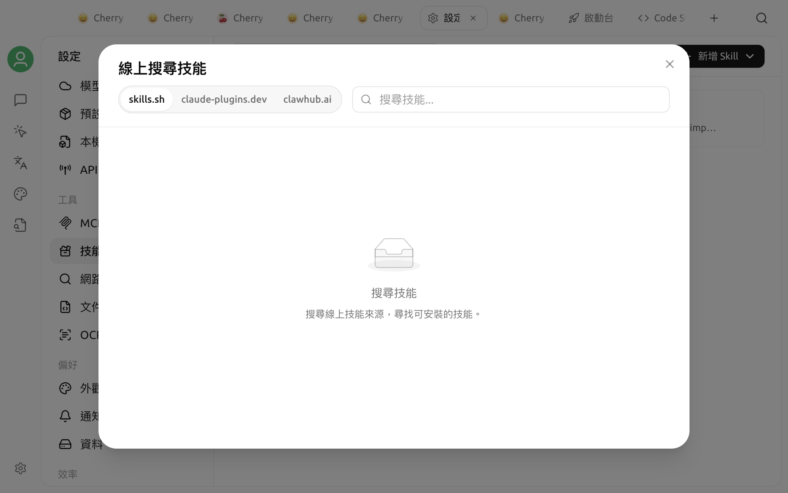

# 技能（Skills）

技能是一組供智能體按需讀取的專業指示及配套檔案。它可以規範完成某類任務的步驟、格式和工具用法，也可以包含指令碼、參考資料或資源檔案。例如，文件審查技能可以提供統一的檢查清單和交付格式。

技能不會改變底層模型，也不是獨立執行的應用程式。Cherry Studio V2 會先將技能安裝到全域技能庫，再由你決定要為哪些[智能體](../../advanced-basic/agent.md)啟用；同一項技能可以供多個智能體使用，每個智能體的啟用狀態彼此獨立。


目前 V2 技能只供智能體（Agent）使用，不供一般助手（Assistant）使用。安裝到全域技能庫，不代表所有智能體都會自動啟用該技能。


## 安裝與啟用的差異

| 操作 | 作用範圍 | 結果 |
| :--- | :--- | :--- |
| 安裝 | 全域技能庫 | 技能會顯示在**設定 → 技能**和[資源庫](../../cherrystudio/preview/library.md)中 |
| 啟用 | 單一智能體 | 技能會連結到該智能體的工作區，並可在執行時被發現及使用 |
| 停用 | 單一智能體 | 只從該智能體移除，不影響其他智能體及全域技能檔案 |
| 解除安裝 | 全域 | 刪除技能檔案，並從所有已啟用該技能的智能體中移除 |

Cherry Studio 內建的技能會在建立新智能體時預設啟用。你之後針對個別智能體做出的啟用或停用選擇會保留；應用程式更新內建技能時，不會重設這些選擇。

## 從線上市集安裝

1. 開啟**設定 → 技能**。
2. 在右上角的搜尋框輸入能力名稱。
3. 在 `claude-plugins.dev`、`skills.sh`或`clawhub.ai`分頁之間切換並查看結果。
4. 按一下結果，即可預覽說明、作者、來源及統計資料。
5. 按一下**安裝**。

線上安裝需要網路連線。從 `claude-plugins.dev`或`skills.sh`安裝時，系統還必須能夠執行 Git，因為 Cherry Studio 會複製對應的儲存庫；從 `clawhub.ai`安裝時，則會下載並解壓縮技能套件。

新安裝的第三方技能只會進入全域技能庫，不會自動為所有智能體啟用。請繼續完成「為智能體啟用」步驟。

## 從本機檔案安裝

在**設定 → 技能**頁面中，你可以：

* 按一下**從 ZIP 檔案安裝**並選擇壓縮檔；
* 按一下**從資料夾安裝**並選擇技能目錄；
* 將 ZIP 檔案或資料夾拖放到頁面的安裝區域。

本機套件中必須包含 `SKILL.md`。該檔案提供技能名稱、說明和主要指示；技能也可以包含 `scripts/`、`references/`、`assets/`等配套目錄。

你也可以在[資源庫](../../cherrystudio/preview/library.md)的技能分類中使用匯入按鈕，從 ZIP 檔案或資料夾安裝。資源庫目前只用於查看已安裝技能及本機匯入；如需搜尋線上市集，請前往**設定 → 技能**。


第三方技能可能包含命令、指令碼，或要求智能體存取外部服務的指示。安裝前請檢查來源；安裝後，請在檔案樹中閱讀 `SKILL.md`及指令碼內容，並且只在可信任的工作區中啟用。


## 讓智能體安裝或建立技能

所有智能體都可以使用內建的技能管理工具。你可以直接要求智能體：

> 搜尋適合檢查產品文件的技能，說明來源和用途，等我確認後再安裝。

透過對話安裝時，智能體會從市集搜尋並將技能安裝到全域技能庫，但只會為目前的智能體啟用，不會為其他智能體啟用。

你也可以讓智能體建立新技能。智能體會先初始化技能目錄，寫入 `SKILL.md`及所需的配套檔案，再將技能註冊到全域技能庫，並為目前的智能體啟用。建立後，建議在**設定 → 技能**中檢查檔案內容，再用一項小型任務驗證行為。

## 為智能體啟用

1. 開啟[資源庫](../../cherrystudio/preview/library.md)，進入**智能體**。
2. 開啟一個已儲存的智能體進行編輯。
3. 在功能設定中選擇 **Skills** 分頁。
4. 按一下**新增**，並選擇全域技能庫中的技能。
5. 儲存設定，然後開始一項新任務進行驗證。

技能啟用狀態會依智能體分別儲存。若要為特定智能體停用技能，只要在同一位置將它移除即可。

執行時，Cherry Studio 會將已啟用的技能連結到智能體第一個工作區目錄下的 `.claude/skills/`。因此，智能體必須有可存取的工作區目錄；如果同名位置已存在一般目錄，而不是 Cherry Studio 管理的連結，技能啟用會失敗。


啟用技能並不表示每則訊息都會強制使用它。智能體會根據技能名稱、說明及目前任務，判斷是否載入技能；如果任務必須使用特定技能，請在提示詞中明確指定技能名稱。


## 查看與解除安裝

在**設定 → 技能**中選擇已安裝的技能，即可查看完整檔案樹。Markdown 檔案會直接呈現，指令碼及其他文字檔案則會以程式碼方式顯示。

第三方技能可以透過右鍵選單、詳細資料頁面的刪除按鈕，或多選模式批次解除安裝。內建技能無法在此解除安裝，但可以針對個別智能體停用。

解除安裝是全域操作：技能檔案會被刪除，所有智能體工作區中的對應連結及啟用記錄也會一併移除。如果只是不想讓某個智能體使用特定技能，請選擇停用，而不是解除安裝。

## 技能與 MCP 的差異

| 能力 | 技能 | [MCP](../../advanced-basic/mcp/) |
| :--- | :--- | :--- |
| 主要內容 | 工作方法、提示指示、指令碼及參考資料 | 由 MCP Server 提供的可呼叫工具或資料 |
| 是否需要持續執行服務 | 通常不需要 | 取決於 MCP Server |
| 常見用途 | 固化寫作流程、檢查清單及產生規範 | 查詢資料庫、呼叫外部 API 或控制其他系統 |

技能可以指示智能體何時以及如何呼叫 MCP 工具，兩者可以同時啟用。

## 技能未生效

請依序檢查：

1. 技能是否已顯示在全域技能庫中。
2. 是否已為目前的智能體啟用，而不是只完成安裝。
3. 目前的智能體是否已設定有效的工作區目錄。
4. `.claude/skills/`下是否存在同名的一般目錄，導致連結衝突。
5. `SKILL.md`中的名稱及說明，是否足以讓智能體辨識目前的任務。

如果剛修改技能檔案，可以開始新會話再次驗證。透過智能體管理工具建立或修改的技能檔案會直接生效，不需要另外套用修補程式或重複安裝。
