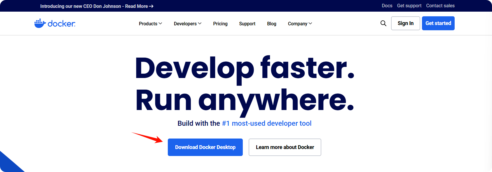
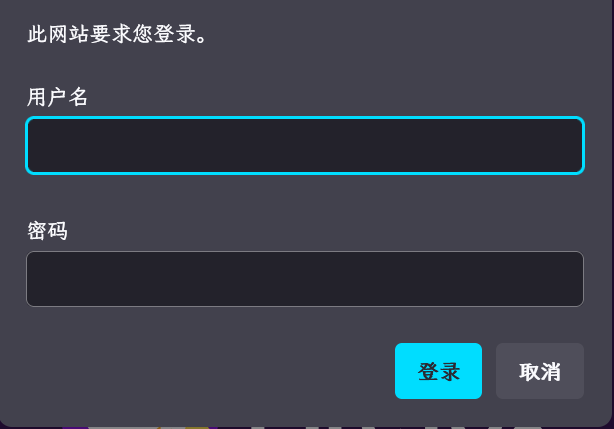
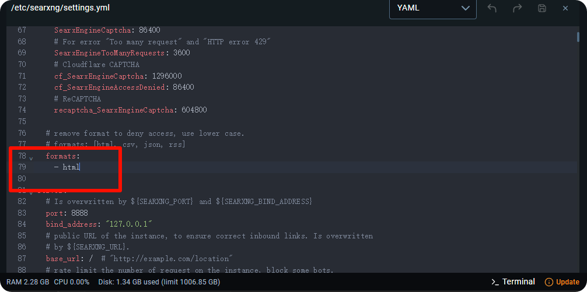
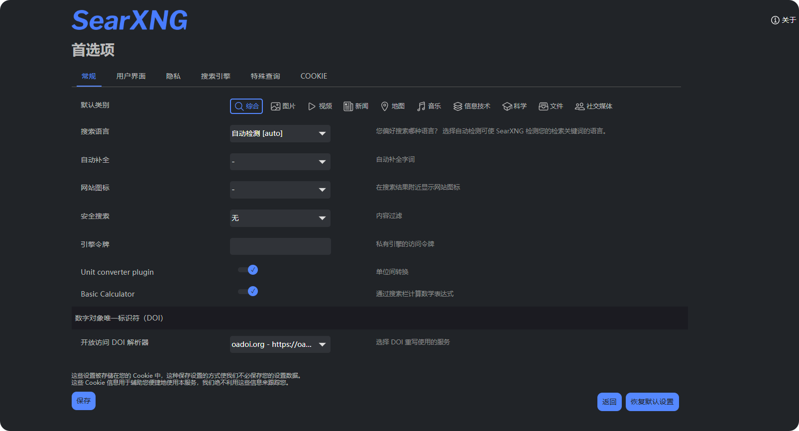
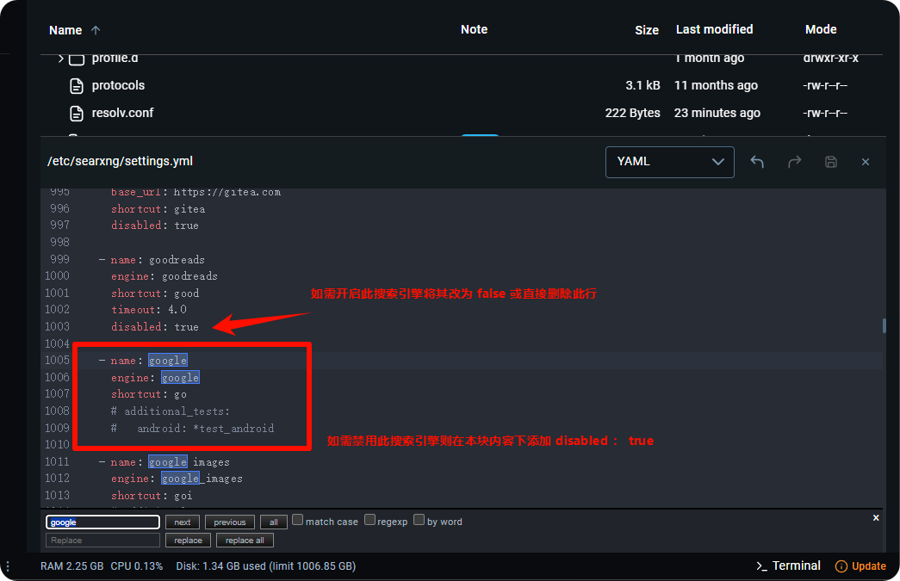

# SearXNG 本地部署與配置



此文件由 AI 從中文翻譯而來，尚未經過審閱。



CherryStudio 支援透過 SearXNG 進行網絡搜索，SearXNG 是一個可本地部署也可在伺服器上部署的開源項目，所以與其他需要 API 提供商的配置方式略有不同。

**SearXNG 項目連結**：[SearXNG](https://github.com/searxng/searxng)

## SearXNG 的優勢

* 開源免費，無需 API
* 隱私性相對較高
* 可高度定制化

## 本地部署

### 一、Docker 直接部署

由於 SearXNG 不需要複雜的環境配置，可以不用 docker compose，只需要簡單提供一個空閒埠即可部署，所以最快捷的方式可以使用 Docker 直接拉取鏡像進行部署。

#### 1. 下載安裝並配置 [docker](https://www.docker.com/)

<figure><figcaption></figcaption></figure>

安裝後選擇一個鏡像儲存路徑：

<figure><figcaption></figcaption></figure>

#### 2. 搜索並拉取 SearXNG 鏡像

搜索欄輸入 **searxng** ：

<figure><figcaption></figcaption></figure>

拉取鏡像：

<figure><figcaption></figcaption></figure>

<figure><figcaption></figcaption></figure>

#### 3. 執行鏡像

拉取成功後來到 **images** 頁面：

<figure><figcaption></figcaption></figure>

選擇拉取的鏡像點擊執行：

<figure><figcaption></figcaption></figure>

打開設定項進行配置：

<figure><figcaption></figcaption></figure>

以 `8085` 埠為例：

<figure><figcaption></figcaption></figure>

執行成功後點擊連結即可打開 SearXNG 的前端介面：

<figure><figcaption></figcaption></figure>

出現這個頁面說明部署成功：

<figure><figcaption></figcaption></figure>

## 伺服器部署

鑒於 Windows 下安裝 Docker 是一件較為麻煩的事情，使用者可以將 SearXNG 部署在伺服器上，也可藉此共享給其他人使用。但是很遺憾，SearXNG 自身暫不支援鑒權，導致他人可以透過技術手段掃描到並濫用你部署的實例。

為此，Cherry Studio 目前已支援配置 [HTTP 基本認證（RFC7617）](https://developer.mozilla.org/zh-CN/docs/Web/HTTP/Guides/Authentication)，如果使用者欲將自己部署的 SearXNG 暴露在公網環境下，請**務必**透過 Nginx 等反向代理軟體配置 HTTP 基本認證。下面提供簡要教學，需要你有基本的 Linux 運維知識。

### 部署 SearXNG

類似地，仍然使用 Docker 部署。假設你已經按照[官方教學](https://docs.docker.com/engine/install)在伺服器上安裝好了最新版 Docker CE，以下提供一條龍命令，適用於 Debian 系統下全新安裝：

```bash
sudo apt update
sudo apt install git -y

# 拉取官方倉庫
cd /opt
git clone https://github.com/searxng/searxng-docker.git
cd /opt/searxng-docker

# 如果你的伺服器頻寬很小, 可以設置為 false
export IMAGE_PROXY=true

# 修改配置文件
cat <<EOF > /opt/searxng-docker/searxng/settings.yml
# see https://docs.searxng.org/admin/settings/settings.html#settings-use-default-settings
use_default_settings: true
server:
  # base_url is defined in the SEARXNG_BASE_URL environment variable, see .env and docker-compose.yml
  secret_key: $(openssl rand -hex 32)
  limiter: false  # can be disabled for a private instance
  image_proxy: $IMAGE_PROXY
ui:
  static_use_hash: true
redis:
  url: redis://redis:6379/0
search:
  formats:
    - html
    - json
EOF
```

如果你需要修改本地監聽埠、復用本地已有的 nginx，可以編輯 `docker-compose.yaml` 文件，參考如下：

```yaml
version: "3.7"

services:
# 如果不需要 Caddy 而復用本地已經有的 Nginx, 就把下面的去掉. 我們默認不需要 Caddy.
  caddy:
    container_name: caddy
    image: docker.io/library/caddy:2-alpine
    network_mode: host
    restart: unless-stopped
    volumes:
      - ./Caddyfile:/etc/caddy/Caddyfile:ro
      - caddy-data:/data:rw
      - caddy-config:/config:rw
    environment:
      - SEARXNG_HOSTNAME=${SEARXNG_HOSTNAME:-http://localhost}
      - SEARXNG_TLS=${LETSENCRYPT_EMAIL:-internal}
    cap_drop:
      - ALL
    cap_add:
      - NET_BIND_SERVICE
    logging:
      driver: "json-file"
      options:
        max-size: "1m"
        max-file: "1"
# 如果不需要 Caddy 而復用本地已經有的 Nginx, 就把上面的去掉. 我們默認不需要 Caddy.
  redis:
    container_name: redis
    image: docker.io/valkey/valkey:8-alpine
    command: valkey-server --save 30 1 --loglevel warning
    restart: unless-stopped
    networks:
      - searxng
    volumes:
      - valkey-data2:/data
    cap_drop:
      - ALL
    cap_add:
      - SETGID
      - SETUID
      - DAC_OVERRIDE
    logging:
      driver: "json-file"
      options:
        max-size: "1m"
        max-file: "1"

  searxng:
    container_name: searxng
    image: docker.io/searxng/searxng:latest
    restart: unless-stopped
    networks:
      - searxng
    # 默認映射到宿主機 8080 埠, 假如你想監聽 8000 就改成 "127.0.0.1:8000:8080"
    ports:
      - "127.0.0.1:8080:8080"
    volumes:
      - ./searxng:/etc/searxng:rw
    environment:
      - SEARXNG_BASE_URL=https://${SEARXNG_HOSTNAME:-localhost}/
      - UWSGI_WORKERS=${SEARXNG_UWSGI_WORKERS:-4}
      - UWSGI_THREADS=${SEARXNG_UWSGI_THREADS:-4}
    cap_drop:
      - ALL
    cap_add:
      - CHOWN
      - SETGID
      - SETUID
    logging:
      driver: "json-file"
      options:
        max-size: "1m"
        max-file: "1"

networks:
  searxng:

volumes:
# 如果不需要 Caddy 而復用本地已經有的 Nginx, 就把下面的去掉
  caddy-data:
  caddy-config:
# 如果不需要 Caddy 而復用本地已經有的 Nginx, 就把上面的去掉
  valkey-data2:
```

執行 `docker compose up -d` 啟動。執行 `docker compose logs -f searxng` 可以看到日誌。

### 部署 Nginx 反向代理和 HTTP 基本認證

如果你使用了一些伺服器面板程序，例如寶塔面板或 1Panel，請參閱其文檔添加網站並配置 nginx 反向代理，隨後找到修改 nginx 配置文件的地方，\
參考下面的範例進行修改：

```conf
server
{
    listen 443 ssl;

    # 這行是你的主機名
    server_name search.example.com;

    # index index.html;
    # root /data/www/default;

    # 如果配置了 SSL 應該有這兩行
    ssl_certificate    /path/to/your/cert/fullchain.pem;
    ssl_certificate_key    /path/to/your/cert/privkey.pem;

    # HSTS
    # add_header Strict-Transport-Security "max-age=31536000; includeSubDomains; preload";

    # 默認情況下透過面板配置反向代理, 默認的 location 塊就是這樣
    location / {
        # 只需要在 location 塊添加下面兩行, 其他保留原狀就行.
        # 此處範例假設你的配置文件保存在 /etc/nginx/conf.d/ 目錄下.
        # 如果是寶塔應該是保存在 /www 之類的目錄下, 需要注意.
        auth_basic "Please enter your username and password";
        auth_basic_user_file /etc/nginx/conf.d/search.htpasswd;

        proxy_http_version 1.1;
        proxy_set_header Connection "";
        proxy_redirect off;
        proxy_set_header Host $host;
        proxy_set_header X-Forwarded-For $proxy_protocol_addr;
        proxy_pass http://127.0.0.1:8000;
        client_max_body_size 0;
    }

    # access_log  ...;
    # error_log  ...;
}
```

假設 Nginx 配置文件保存於 `/etc/nginx/conf.d` 下，我們將將密碼文件保存在同目錄下。

執行命令（自行將 `example_name`、`example_password` 替換為你將要設定的使用者名稱和密碼）：

```bash
echo "example_name:$(openssl passwd -5 'example_password')" > /etc/nginx/conf.d/search.htpasswd
```

重啟 Nginx（重載配置也可以）。

這時可以打開一下網頁，已經會提示你輸入使用者名稱和密碼，請輸入前面設定的使用者名稱和密碼查看能否成功進入 SearXNG 搜索頁面，藉此檢查配置是否正確。

<figure><figcaption></figcaption></figure>

## Cherry Studio 相關配置

SearXNG 本地或在伺服器部署成功後，接下來是 CherryStudio 的相關配置。

來到網絡搜索設定頁面，選擇 Searxng ：

<figure><figcaption></figcaption></figure>

直接輸入本地部署的連結發現驗證失敗，此時不用擔心：

<figure><figcaption></figcaption></figure>

因為直接部署後默認並沒有配置 json 返回類型，所以無法獲取數據，需要修改配置文件。

回到 Docker，來到 Files 標籤頁找到鏡像中找到帶標籤的資料夾：

<figure><figcaption></figcaption></figure>

展開後繼續往下翻，會發現另一個帶標籤的資料夾：

<figure><figcaption></figcaption></figure>

繼續展開，找到 **settings.yml** 配置文件：

<figure><figcaption></figcaption></figure>

點擊打開文件編輯器：

<figure><figcaption></figcaption></figure>

找到 78 行，可以看到類型只有一個 html

<figure><figcaption></figcaption></figure>

添加 json 類型後儲存，重新執行鏡像

<figure><figcaption></figcaption></figure>

<figure><figcaption></figcaption></figure>

重新回到 Cherry Studio 進行驗證，驗證成功：

<figure><figcaption></figcaption></figure>

地址既可以填寫本地： [http://localhost](http://localhost) : 埠號\
也可以填寫 docker 地址：[http://host.docker.internal](http://host.docker.internal) : 埠號

如果使用者遵循前面的範例在伺服器上部署並正確配置了反向代理，已經開啟了 json 返回類型。輸入地址後進行驗證，由於已給反向代理配置了 HTTP 基本認證，此時驗證則應返回 401 錯誤碼：

<figure><figcaption></figcaption></figure>

在用戶端配置 HTTP 基本認證，輸入剛才設定的使用者名稱與密碼：

<figure><figcaption></figcaption></figure>

進行驗證，應當驗證成功。

### 其他配置

此時 SearXNG 已具備默認聯網搜索能力，如需定制搜索引擎需要自行進行配置

需要注意的是此處首選項並不能影響大模型呼叫時的配置

<figure><figcaption></figcaption></figure>

如需配置需要大模型呼叫的搜索引擎，需在配置文件中設定：

<figure><figcaption></figcaption></figure>

<figure><figcaption></figcaption></figure>

配置語言參考：

<figure><figcaption></figcaption></figure>

若內容太長直接修改不方便，可將其複製到本地 IDE 中，修改後貼上到配置文件中即可。

## 驗證失敗常見原因

### 返回格式未添加 json 格式

在配置文件中將返回格式加上 json：

<figure><figcaption></figcaption></figure>

### 未正確配置搜索引擎

Cherry Studio 會默認選取 categories 同時包含 web general 的引擎進行搜索，默認情況下會選中 google 等引擎，由於大陸無法直接訪問 google 等網站導致失敗。增加以下配置使得 searxng 強制使用 baidu 引擎，即可解決問題：

```
use_default_settings:
  engines:
    keep_only:
      - baidu
engines:
  - name: baidu
    engine: baidu 
    categories: 
      - web
      - general
    disabled: false
```

### 訪問速率過快

searxng 的 limiter 配置阻礙了 API 訪問，請嘗試將其在設定中設為 false：

<figure><figcaption></figcaption></figure>