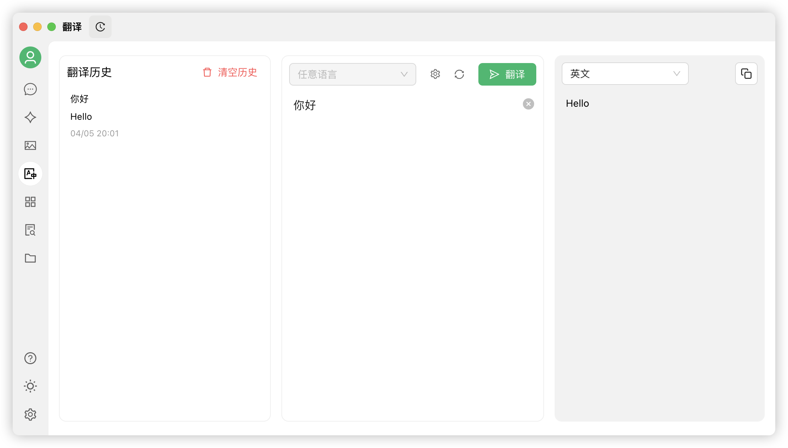


Bu belge Çince'den yapay zeka tarafından çevrilmiştir ve henüz incelenmemiştir.


# Çeviri

Cherry Studio'nun çeviri özelliği, hızlı ve doğru metin çeviri hizmeti sunar ve birden çok dil arasında karşılıklı çeviriyi destekler.

### Arayüze Genel Bakış

<figure><figcaption></figcaption></figure>

Çeviri arayüzü temel olarak aşağıdaki bölümlerden oluşur:

1. **Kaynak Dil Seçim Alanı**:
   * Herhangi bir dil: Cherry Studio otomatik olarak kaynak dili tanır ve çevirir.
2. **Hedef Dil Seçim Alanı**:
   * Açılır menü: Metni çevirmek istediğiniz dili seçin.
3. **Ayarlar Butonu**:
   * Tıkladığınızda [Varsayılan Model Ayarları](settings/default-models.md) sayfasına gideceksiniz.
4. **Kaydırma Senkronizasyonu**:
   * Kaydırma senkronizasyonunu açıp kapatabilirsiniz (herhangi bir tarafta kaydırma yapıldığında diğer taraf da birlikte kayar).
5. **Metin Giriş Kutusu (Sol)**:
   * Çevirmek istediğiniz metni girin veya yapıştırın.
6. **Çeviri Sonucu Kutusu (Sağ)**:
   * Çevrilen metin burada gösterilir.
   * Kopyala butonu: Tıklayarak çeviri sonucunu panoya kopyalayın.
7. **Çevir Butonu**:
   * Çeviriyi başlatmak için bu düğmeye tıklayın.
8. **Çeviri Geçmişi (Sol üst köşe)**:
   * Tıkladığınızda çeviri geçmişinizi görebilirsiniz.

### Kullanım Adımları

1. **Hedef dili seçin**:
   * Hedef Dil Seçim Alanı'ndan çevirmek istediğiniz dili seçin.
2. **Metin girin veya yapıştırın**:
   * Soldaki metin giriş kutusuna çevirmek istediğiniz metni girin veya yapıştırın.
3. **Çevirmeyi başlatın**:
   * `Çevir` düğmesine tıklayın.
4. **Sonuçları görüntüleyin ve kopyalayın**:
   * Çeviri sonucu sağdaki kutuda görüntülenecektir.
   * Kopyala düğmesine tıklayarak sonucu panoya kopyalayın.

### Sıkça Sorulan Sorular (SSS)

* **S: Çeviri doğru değilse ne yapmalıyım?**
  * C: Yapay zeka çevirisi güçlü olmakla birlikte kusursuz değildir. Profesyonel alanlar veya karmaşık bağlam metinleri için manuel düzeltme yapmanız önerilir. Farklı modeller arasında geçiş yapmayı da deneyebilirsiniz.
* **S: Hangi diller destekleniyor?**
  * C: Cherry Studio çeviri özelliği birçok ana dili destekler. Desteklenen dillerin tam listesi için lütfen Cherry Studio'nun resmi web sitesine veya uygulama içi açıklamalara bakın.
* **S: Tüm bir dosya çevrilebilir mi?**
  * C: Şu anki arayüz öncelikle metin çevirisi içindir. Dosya çevirisi için, Cherry Studio'nun sohbet sayfasına gidip dosya ekleyerek çeviri yapabilirsiniz.
* **S: Çeviri hızı yavaşsa ne yapmalıyım?**
  * C: Çeviri hızı ağ bağlantısı, metin uzunluğu, sunucu yükü gibi faktörlerden etkilenebilir. Lütfen ağ bağlantınızın stabil olduğundan emin olun ve sabırla bekleyin.