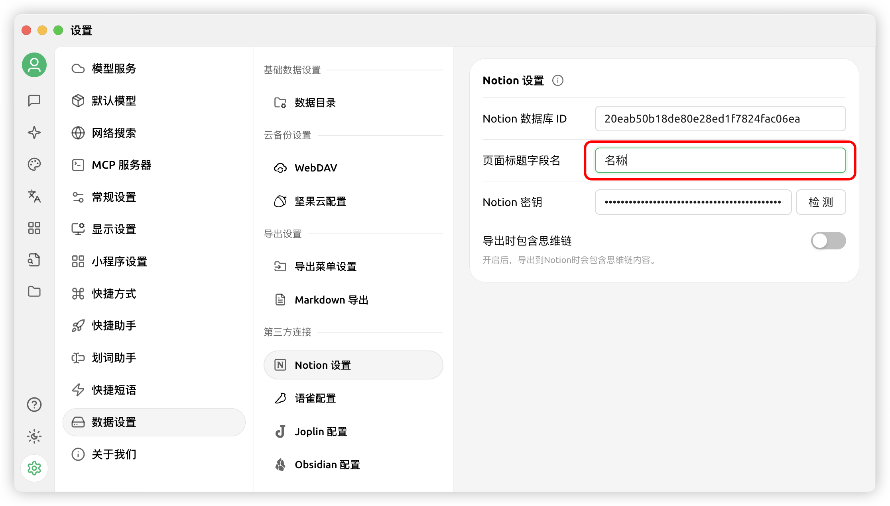


Bu belge Çince'den yapay zeka tarafından çevrilmiştir ve henüz incelenmemiştir.


# Notion Yapılandırma Eğitimi

Cherry Studio, konu başlıklarını Notion veritabanına aktarmayı destekler.

## Adım 1

[Notion Integrations](https://www.notion.so/profile/integrations) sitesini açarak bir uygulama oluşturun

<figure><figcaption>
Artı işaretine tıklayarak uygulama oluşturun
</figcaption></figure>

## Adım 2

Bir uygulama oluşturun

<figure><figcaption>
Uygulama bilgilerini doldurun
</figcaption></figure>

İsim: Cherry Studio  
Tür: İlk seçeneği seçin  
Logo: Bu resmi kaydedebilirsiniz  

<figure><figcaption></figcaption></figure>

## Adım 3

Anahtarı kopyalayıp Cherry Studio ayarlarına yapıştırın

<figure><figcaption>
Anahtarı kopyalamak için tıklayın
</figcaption></figure>

<figure><figcaption>
Anahtarı veri ayarlarına yapıştırın
</figcaption></figure>

## Adım 4

[Notion](https://www.notion.so/) sitesinde yeni bir sayfa oluşturun, altta veritabanı türünü seçin, isim olarak Cherry Studio yazın ve gösterilen şekilde bağlayın

<figure><figcaption>
Yeni bir sayfa oluşturup veritabanı türünü seçin
</figcaption></figure>

<figure><figcaption>
Sayfa ismini girip uygulamaya bağlayın
</figcaption></figure>

## Adım 5

<figure><figcaption>
Veritabanı ID'sini kopyalayın
</figcaption></figure>

Notion veritabanınızın URL'si şuna benziyorsa:  
https://www.notion.so/\<uzun\_hash\_1>?v=\<uzun\_hash\_2>  

Notion veritabanı ID'si `<uzun_hash_1>` kısmıdır  

<figure><figcaption>
Veritabanı ID'sini yazın ve kontrol edin
</figcaption></figure>

## Adım 6

`Sayfa başlık alan adını` girin:  

Web siteniz İngilizce ise `Name` yazın  
Web siteniz Çince ise `名称` yazın  

<figure><figcaption>
Sayfa başlık alan adını doldurun
</figcaption></figure>

## Adım 7

Tebrikler, Notion yapılandırması tamamlandı ✅ Artık Cherry Studio içeriğini Notion veritabanınıza aktarabilirsiniz

<figure><figcaption>
Notion'a aktarın
</figcaption></figure>

<figure><figcaption>
Aktarım sonuçlarını görüntüleyin
</figcaption></figure>