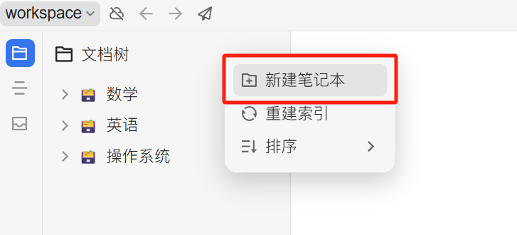


Bu belge Çince'den yapay zeka tarafından çevrilmiştir ve henüz incelenmemiştir.


# SiYuan Not Konfigürasyon Kılavuzu

Konuşmaları ve mesajları SiYuan Not'a aktarmayı destekler.

## İlk Adım

SiYuan Not'u açın ve yeni bir not defteri oluşturun

<figure><figcaption>
Yeni not defteri oluştur'a tıklayın
</figcaption></figure>

## İkinci Adım

Not defterini açın, ayarlara gidin ve `Not Defteri ID`'yi kopyalayın

<figure><figcaption>
Not defteri ayarlarını açın
</figcaption></figure>

<figure><figcaption>
Not Defteri ID kopyala düğmesine tıklayın
</figcaption></figure>

## Üçüncü Adım

Kopyalanan Not Defteri ID'sini Cherry Studio ayarlarına yapıştırın

<figure><figcaption>
Not Defteri ID'sini veri ayarlarına girin
</figcaption></figure>

## Dördüncü Adım

SiYuan Not adresini girin

* **Yerel**\
  Genellikle `http://127.0.0.1:6806`
* **Kendi Sunucunuz**\
  Alan adınız `http://note.domain.com`

<figure><figcaption>
SiYuan Not adresinizi girin
</figcaption></figure>

## Beşinci Adım

SiYuan Not `API Token`'ını kopyalayın

<figure><figcaption>
SiYuan Not token'ını kopyalayın
</figcaption></figure>

Cherry Studio ayarlarına yapıştırın ve kontrol edin

<figure><figcaption>
Veritabanı ID'yi girip Kontrol Et'e tıklayın
</figcaption></figure>

## Altıncı Adım

Tebrikler! SiYuan Not konfigürasyonu tamamlandı ✅ Artık Cherry Studio içeriğini SiYuan Not'unuza aktarabilirsiniz

<figure><figcaption>
SiYuan Not'a aktar
</figcaption></figure>

<figure><figcaption>
Aktarma sonucunu görüntüleyin
</figcaption></figure>