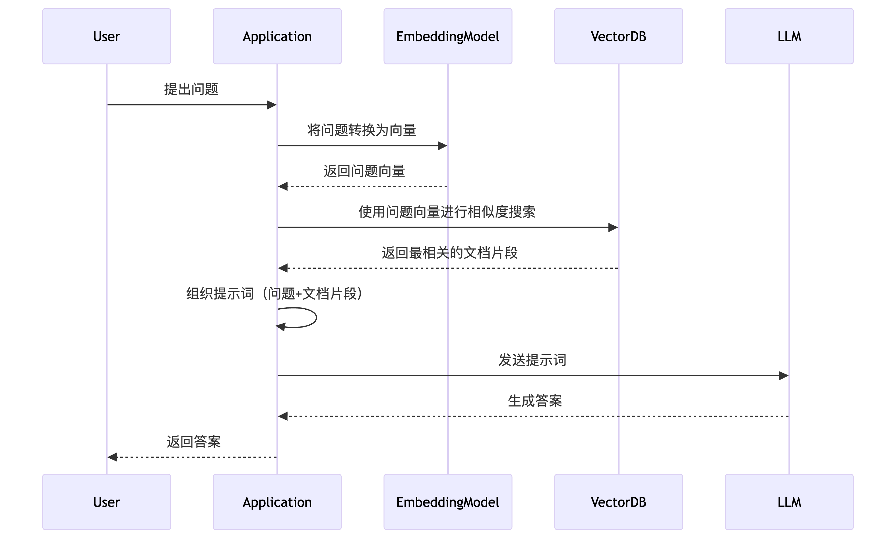


Bu belge Çince'den yapay zeka tarafından çevrilmiştir ve henüz incelenmemiştir.


```turkish
# Veri Depolama Açıklaması

Cherry Studio bilgi bankasına eklenen tüm veriler yerel olarak saklanır. Ekleme sırasında dokümanın bir kopyası, Cherry Studio veri depolama dizinine yerleştirilir.

<figure><figcaption><p>Bilgi bankası işlem akış şeması</p></figcaption></figure>

Vektör veritabanı: [https://turso.tech/libsql](https://turso.tech/libsql)

Dokümanlar Cherry Studio bilgi bankasına eklendikten sonra, parçalara bölünür ve bu parçalar embedding modeli tarafından işlenir.

Büyük dil modeliyle sorgu yapıldığında, soruyla ilişkili metin parçaları aranır ve büyük dile modeli için kullanılır.

Veri gizliliği konusunda endişeleriniz varsa, **yerel embedding veritabanı** ve **yerel büyük dil modeli** kullanılması önerilir.
```