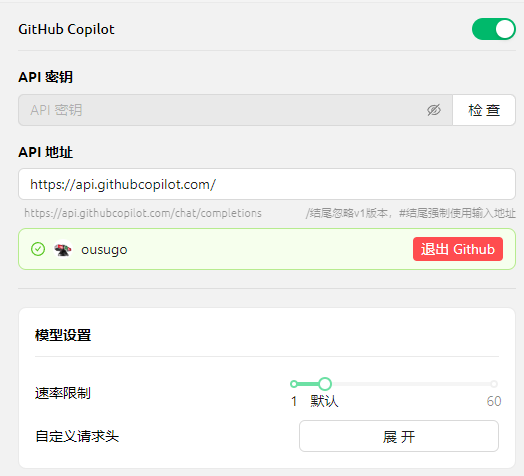


Bu belge Çince'den yapay zeka tarafından çevrilmiştir ve henüz incelenmemiştir.


# GitHub Copilot

GitHub Copilot'u kullanmak için önce bir GitHub hesabınızın olması ve GitHub Copilot hizmetine abone olmanız gerekir. Ücretsiz sürüm de kullanılabilir ancak bu sürüm en yeni Claude 3.7 modelini desteklemez. Detaylar için [GitHub Copilot resmi sitesine](https://github.com/features/copilot) bakınız.

## Device Code Alma

"GitHub'a giriş yap"ı tıklayarak Device Code alın ve kopyalayın.

<figure><figcaption>
Device Code Alma
</figcaption></figure>

## Device Code'u Tarayıcıda Girip Yetkilendirme

Device Code başarıyla alındıktan sonra, bağlantıyı tıklayarak tarayıcıyı açın. GitHub hesabınıza giriş yapın, Device Code'u girip yetki verin.

<figure><figcaption>
GitHub Yetkilendirme
</figcaption></figure>

Yetkilendirme başarılı olduktan sonra Cherry Studio'ya dönün. "GitHub'a bağlan"ı tıklayın; başarılı olursa GitHub kullanıcı adınız ve profiliniz görünecektir.

<figure><figcaption>
GitHub Bağlantısı Başarılı
</figcaption></figure>

## "Yönet" Butonuyla Model Listesini Alma

Aşağıdaki "Yönet" butonuna tıklayın; otomatik olarak şu an desteklenen modellerin listesi getirilecektir.

<figure><figcaption>
Model Listesini Alma
</figcaption></figure>

## Sık Sorulan Sorular

### Device Code Alınamadı, Lütfen Yeniden Deneyin

<figure><figcaption>
Device Code Alınamadı
</figcaption></figure>

İstekler şu anda Axios ile oluşturulmaktadır. Axios socks proxy'leri desteklemez, lütfen sistem proxy'si veya HTTP proxy kullanın ya da CherryStudio içinde proxy ayarlamayarak global proxy kullanın. Öncelikle ağ bağlantınızın sorunsuz çalıştığından emin olun, böylece Device Code alma hatası önlenebilir.