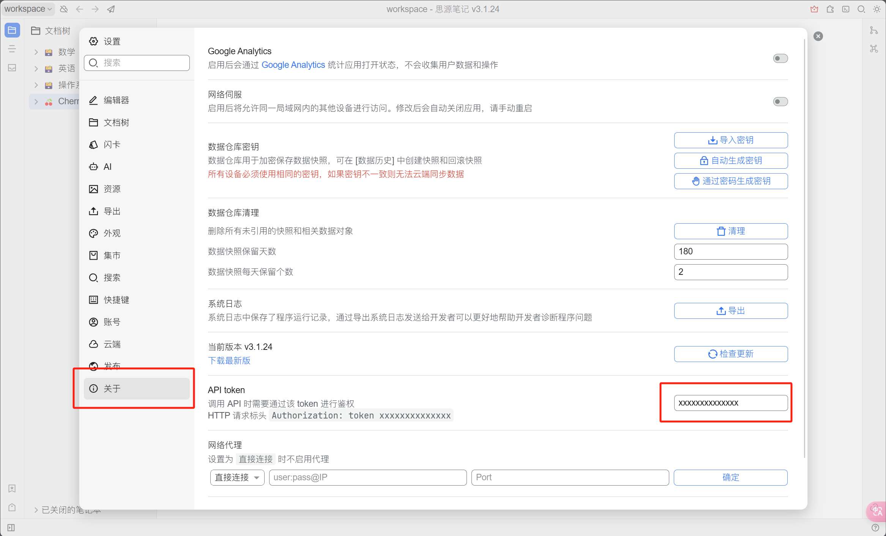
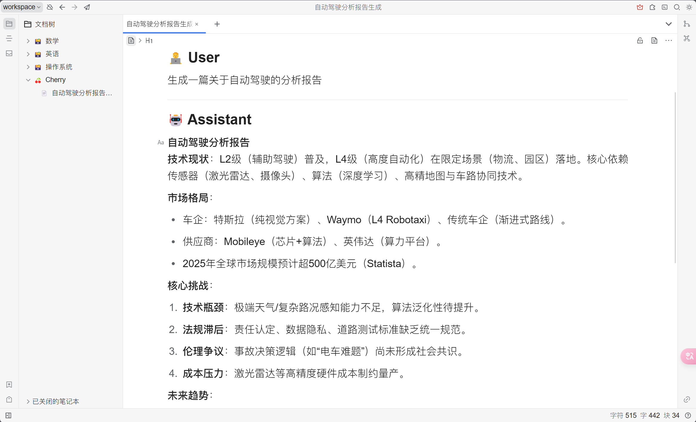


Tài liệu này được dịch từ tiếng Trung bằng AI và chưa được xem xét.


# Hướng dẫn Cấu hình SiYuan Note

Hỗ trợ xuất các chủ đề và tin nhắn đến SiYuan Note.

## Bước 1

Mở SiYuan Note, tạo một notebook mới

<figure><figcaption>
Nhấp để tạo notebook mới
</figcaption></figure>

## Bước 2

Mở cài đặt của notebook và sao chép `ID Notebook`

<figure><figcaption>
Mở cài đặt notebook
</figcaption></figure>

<figure><figcaption>
Nhấp nút sao chép ID Notebook
</figcaption></figure>

## Bước 3

Dán ID Notebook vào cài đặt Cherry Studio

<figure><figcaption>
Điền ID Notebook vào cài đặt dữ liệu
</figcaption></figure>

## Bước 4

Điền địa chỉ SiYuan Note

* **Local**\
  Thường là `http://127.0.0.1:6806`
* **Tự triển khai**\
  Là domain của bạn `http://note.domain.com`

<figure><figcaption>
Nhập địa chỉ SiYuan Note của bạn
</figcaption></figure>

## Bước 5

Sao chép `API Token` của SiYuan Note

<figure><figcaption>
Sao chép token SiYuan Note
</figcaption></figure>

Dán vào cài đặt Cherry Studio và kiểm tra

<figure><figcaption>
Điền ID cơ sở dữ liệu và nhấp kiểm tra
</figcaption></figure>

## Bước 6

Chúc mừng! Bạn đã hoàn thành cấu hình SiYuan Note ✅ Giờ có thể xuất nội dung Cherry Studio vào SiYuan Note

<figure><figcaption>
Xuất sang SiYuan Note
</figcaption></figure>

<figure><figcaption>
Xem kết quả xuất
</figcaption></figure>