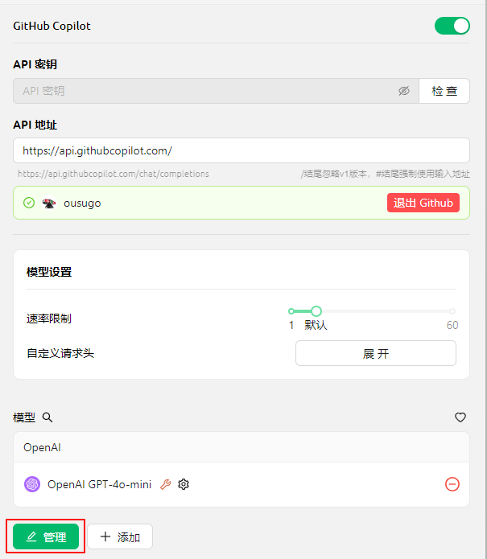


Tài liệu này được dịch từ tiếng Trung bằng AI và chưa được xem xét.


# GitHub Copilot

Để sử dụng GitHub Copilot, trước tiên bạn cần có tài khoản GitHub và đăng ký dịch vụ GitHub Copilot. Bản miễn phí cũng được chấp nhận, nhưng bản miễn phí không hỗ trợ mô hình Claude 3.7 mới nhất. Chi tiết tham khảo tại [GitHub Copilot 官网](https://github.com/features/copilot).

## Lấy Device Code

Nhấp vào "Đăng nhập GitHub" để lấy Device Code và sao chép.

<figure><figcaption>
Lấy Device Code
</figcaption></figure>

## Nhập Device Code và ủy quyền trong trình duyệt

Sau khi lấy thành công Device Code, nhấp vào liên kết để mở trình duyệt. Đăng nhập tài khoản GitHub trong trình duyệt, nhập Device Code và ủy quyền.

<figure><figcaption>
Ủy quyền GitHub
</figcaption></figure>

Sau khi ủy quyền thành công, quay lại Cherry Studio và nhấp "Kết nối GitHub". Khi thành công sẽ hiển thị tên người dùng và ảnh đại diện GitHub.

<figure><figcaption>
Kết nối GitHub thành công
</figcaption></figure>

## Nhấn "Quản lý" để lấy danh sách mô hình

Nhấp vào nút "Quản lý" bên dưới, hệ thống sẽ tự động tải xuống danh sách các mô hình hiện được hỗ trợ.

<figure><figcaption>
Lấy danh sách mô hình
</figcaption></figure>

## Câu hỏi thường gặp

### Lỗi khi lấy Device Code, vui lòng thử lại

<figure><figcaption>
Lấy Device Code thất bại
</figcaption></figure>

Hiện tại hệ thống sử dụng Axios để xây dựng yêu cầu. Axios không hỗ trợ proxy socks, vui lòng sử dụng proxy hệ thống hoặc HTTP proxy, hoặc không thiết lập proxy trong CherryStudio mà sử dụng proxy toàn cục. Trước tiên hãy đảm bảo kết nối mạng ổn định để tránh tình trạng không lấy được Device Code.