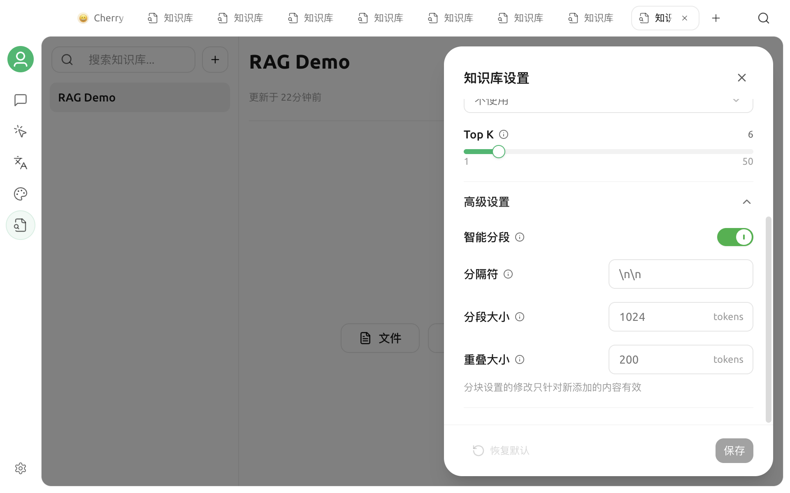

# 文档预处理

文档预处理会在分块和向量化之前，把 PDF、Word、表格等文档转换成更适合检索的 Markdown 文本。它主要用于扫描件、复杂版式、表格和多栏文档。

如果文档本身已有清晰的文本层，Cherry Studio 的内置读取通常就能工作。不要为了“更高级”而默认给所有文件启用在线处理器，应先用少量资料比较实际效果。

## 处理流程

未选择文档处理器时：

1. Cherry Studio 直接读取受支持的文件。
2. 提取文本并切分。
3. 调用嵌入模型建立索引。

选择文档处理器后：

1. Cherry Studio 把文档交给所选处理器。
2. 处理器输出 Markdown。
3. Markdown 作为处理产物由应用管理。
4. Cherry Studio 再切分并建立索引。


文档处理器负责“把文件变成可检索文本”，嵌入模型负责“把文本变成向量”，聊天模型负责“根据召回片段回答”。三者是不同环节。


## 哪些文档需要预处理

优先考虑使用文档处理器的情况：

* 扫描版 PDF 没有可复制文本
* PDF 包含复杂表格、多栏排版或大量公式
* Word、Excel 等文件的内置解析结果结构混乱
* 关键内容位于图片或页面布局中
* 召回片段出现乱码、错序或大段缺失

通常不需要额外处理的情况：

* 纯文本、Markdown、CSV 等结构清晰的文本文件
* 文字层完整、排版简单的 PDF
* 内置解析后预览和召回测试已经正常

预处理不能自动解决所有问题。手写文字、低分辨率扫描、复杂公式和嵌套表格仍可能识别错误。

## V2 支持的处理能力

Cherry Studio 的文件处理分为两类：

| 能力 | 输入 | 输出 | 与知识库的关系 |
| --- | --- | --- | --- |
| 文档转 Markdown | 文档文件 | Markdown | 知识库 RAG 设置可选择 |
| 图片转文字 | 图片 | 文本 | 用于其他图片 OCR 场景，不等同于知识库文档处理 |

知识库当前添加资料的入口不把图片作为独立数据源。要处理包含图片的 PDF 或 Office 文档，应选择支持**文档转 Markdown**的处理器。

## 可选的文档处理器

当前 V2 `main` 中，知识库可选择以下文档转 Markdown 处理器：

| 处理器 | 部署方式 | 常见配置 |
| --- | --- | --- |
| Mistral OCR | 在线 API | API Key、API Host、模型 |
| MinerU | 在线 API | API Key、API Host |
| Doc2X | 在线 API | API Key、API Host |
| Open MinerU | 自托管服务 | 本地或内网 API Host |
| PaddleOCR | API 服务或自部署 | API Key、API Host、解析模型 |

实际可见项由当前系统和应用版本决定。服务商地址、模型和申请方式可能变化，应以 **设置 → 文档处理** 中的实时界面为准。


在线处理器通常需要上传原文件。导入合同、内部资料或个人信息前，请确认服务商的数据政策、部署区域和删除机制。敏感资料优先使用本地或自托管处理器。


## 配置文档处理器

1. 打开 **设置 → 文档处理**。
2. 在左侧选择一个支持文档转 Markdown 的处理器。
3. 根据处理器要求填写 API Key。
4. 检查 API Host；自托管服务应填写实际可访问的地址。
5. 如界面提供模型选项，选择服务端已部署的模型。
6. 点击**设为默认**，可将它作为一般文档处理的默认处理器。

API Key 输入框支持管理多个密钥。配置密钥时不要把密钥放入文档、截图或反馈日志。

### 在线处理器

在线处理器需要满足：

* API Key 有效且账户状态正常
* API Host 与账号所在区域一致
* 网络能够访问服务
* 当前模型支持文档解析
* 文件大小与格式符合服务商限制

### Open MinerU

Open MinerU 用于连接自行部署的 MinerU 服务。默认地址仅适合本机测试；如果服务运行在容器、远程主机或其他端口，应填写从 Cherry Studio 所在设备可访问的完整地址。

### PaddleOCR

PaddleOCR 可以配置解析模型。模型名称必须与服务端部署一致。应用界面中的预设项不代表你的服务端一定已经安装相应模型。

## 图片 OCR 与知识库文档处理

设置页还可能显示系统 OCR、Tesseract、PaddleOCR、Mistral 和 OpenVINO OCR 等图片转文字处理器。

* 系统 OCR 只在支持的平台出现
* Tesseract 可以配置识别语言
* OpenVINO OCR 只在运行环境满足条件时出现
* PaddleOCR 和 Mistral 可能同时支持图片与文档能力

这些图片 OCR 设置不会自动替代知识库中的文档转 Markdown 选择。知识库处理 PDF、DOCX、XLSX 等文档时，应在该知识库的 RAG 设置中选择文档处理器。

## 在知识库中启用

1. 打开目标知识库。
2. 点击顶部的 **RAG 设置**。
3. 在**文件处理器**中选择已配置的文档处理器。
4. 保存设置。
5. 添加一份测试文档，等待状态变为已完成。

新建知识库默认可以不选择文件处理器。只有选中处理器后，受支持的文档文件才会进入文档转 Markdown 流程。


更换文件处理器不会自动重写已经完成的资料。要让旧资料使用新处理器，需要对相应数据源执行重新索引。


## 验证处理结果

不要只看“已完成”状态。至少完成以下三步。

### 1. 预览来源

在数据源行的更多菜单中选择**预览来源**，检查：

* 标题和段落顺序是否正确
* 表格是否保留行列关系
* 页面页眉、页脚是否产生大量噪声
* 关键数字、专有名词和公式是否被识别
* 是否出现缺页、空白或乱码

### 2. 查看分块

打开分块详情，检查内容是否在合理位置切分。解析结果即使完整，分块不当也会影响检索。

### 3. 召回测试

使用文档中真实存在的问题测试召回：

* 表格中的具体数值
* 跨段落信息
* 专有名词和编号
* OCR 容易混淆的文字

若正确文本没有被提取，先更换处理器或改善原文件；若文本正确但召回不佳，再调整分块和检索设置。

## 如何比较处理器

选择 3–5 份有代表性的文档，为每个候选处理器做相同测试。

| 维度 | 需要观察的结果 |
| --- | --- |
| 完整性 | 是否漏页、漏段、漏表格 |
| 顺序 | 多栏内容和页码是否按正确顺序 |
| 准确性 | 数字、符号、专有名词是否正确 |
| 结构 | 标题、列表、表格是否保留 |
| 速度 | 单份文档与批量处理耗时 |
| 稳定性 | 是否频繁超时或失败 |
| 隐私与费用 | 是否上传原文、如何计费 |

同一处理器在不同文档类型上的表现可能不同。合同、论文、报表和扫描票据不必使用同一套配置。

## 常见问题

### 知识库中没有文件处理器选项

确认当前打开的是知识库顶部的 RAG 设置，并检查应用版本。知识库只列出支持文档转 Markdown 的处理器，不会列出只有图片 OCR 能力的处理器。

### 文档处理一直等待

远程处理器可能采用后台任务。保持应用运行，检查网络和服务商任务状态。超时后资料会显示失败，可修复配置后重新索引。

### 显示 API Key 或 Host 错误

检查密钥是否多了空格、Host 是否包含正确协议、账号区域是否匹配，以及自托管服务能否从当前设备访问。

### 扫描 PDF 处理后仍为空

确认选择的是文档转 Markdown 处理器，而不是只有图片转文字能力的处理器。也要检查扫描分辨率、页面方向和服务商支持的语言。

### 表格解析混乱

先在预览来源中确认问题来自文档处理，而不是分块。可以换用更擅长复杂版式的处理器，或将关键表格预先导出成结构更简单的文件。

### 更换处理器后结果没有变化

修改处理器只影响后续处理。对已有数据源执行重新索引，并等待新的处理任务完成。

### 普通 Markdown 也走了在线处理器吗

知识库只会对识别为文档类型、且知识库已选择处理器的文件启动文档预处理。文本和 Markdown 文件直接进入读取与索引流程。

## 隐私与费用

在线文档处理可能产生上传、解析和存储费用。处理完成后还会继续调用嵌入模型；若启用重排序和在线聊天模型，后续检索与回答也可能产生费用。

完整数据流和备份建议请查看[知识库数据](data.md)。

***

### 获取帮助与提交反馈

如果文档处理、OCR 或知识库索引过程中遇到问题，请通过[反馈与建议](../question-contact/suggestions.md)提供的信息联系社区。
