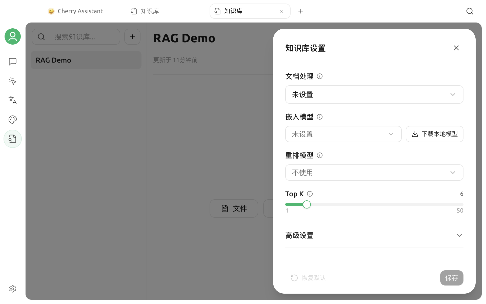

# 嵌入模型

嵌入模型会把文本转换成向量，用于按语义查找相关资料。它负责检索，不负责生成最终回答；聊天模型、嵌入模型和重排序模型是三种不同能力。

## 新建知识库时的默认行为

新建窗口只要求填写名称，并可选择分组，不需要先选择嵌入模型。

- 如果本地嵌入模型尚未下载，知识库会先以 **BM25** 模式创建。BM25 按关键词检索，不生成向量，也不会调用嵌入接口。
- 如果本地嵌入模型已经下载完成，新知识库会自动使用该模型和固定维度，从一开始建立向量索引。

因此，没有嵌入模型也可以导入资料和搜索；需要语义检索时，再到知识库设置中启用即可。

## 启用语义检索

进入目标知识库，点击右上角的**设置**，在**嵌入模型**一栏选择一种方式。

### 使用本地模型

点击**下载本地模型**。下载完成后，Cherry Studio 会自动选择并保存内置的本地嵌入模型，并为已有资料补建向量。

本地模型的优势是资料片段不需要发送给外部嵌入服务；首次下载和首次索引会占用时间、内存与磁盘空间。若当前平台不支持本地运行，下载按钮不会显示。

### 使用已配置的模型服务

也可以从下拉列表选择已启用且具有 **Embedding** 能力的模型。若列表中没有目标模型，请先到**设置 → 模型服务**完成服务商配置，并确认模型能力标记为嵌入。

保存时，Cherry Studio 会发送一段短测试文本以获取实际向量维度。API 地址、密钥、模型 ID 或网络不可用时，保存会失败，但不会使用猜测的维度。


DeepSeek、Kimi、GLM、GPT、Claude 等名称本身不代表模型支持嵌入。是否可选取决于具体模型的能力，而不是品牌。


## 已有资料会怎样处理

模型变更会根据知识库当前状态选择安全流程：

| 当前状态 | 处理方式 |
| --- | --- |
| BM25 知识库首次启用嵌入模型 | 原知识库内补建向量，不需要重新创建 |
| 空知识库更换嵌入模型 | 直接保存新设置 |
| 已有向量和资料后更换嵌入模型 | 进入恢复/重建流程，避免新旧向量混用 |

启用或重建期间不要退出应用，也不要移动原始资料。资料较多时，处理时间和在线模型费用都会相应增加。

## 如何选择模型

重点比较以下因素：

- **语言覆盖**：用自己的中文、英文、日文或俄文资料做召回测试。
- **隐私**：在线模型会接收资料片段和查询；敏感资料优先评估本地模型。
- **速度和成本**：首次索引、重新索引和查询都可能调用在线嵌入接口。
- **稳定性**：模型 ID、输出维度和接口行为应保持稳定。

不要只根据排行榜或模型名称选择。使用同一批资料和固定问题，比较正确片段能否进入前几条结果。

## 常见问题

### 嵌入模型列表为空

确认服务商已启用、模型已添加，并且模型能力包含 **Embedding**。普通聊天模型和 Rerank 模型不会出现在这里。

### 保存时提示获取维度失败

依次检查服务商状态、API 地址、密钥、模型 ID、网络和账户余额。保存时会发起一次真实的嵌入请求。

### 只使用 BM25 会有什么限制

BM25 擅长精确关键词、产品名和编号，但对同义改写和自然语言表达的召回通常弱于语义检索。可以先用 BM25 验证资料质量，再决定是否启用嵌入模型。

### 更换 API 密钥需要重建吗

如果仍然调用同一个模型且输出维度不变，通常不需要。若服务商实际路由到不同模型版本，应重新做召回测试。

详细的数据流和本地文件位置请参阅[知识库数据](data.md)。

***

### 获取帮助与提交反馈

如果模型识别、下载或索引过程中遇到问题，请通过[反馈与建议](../question-contact/suggestions.md)联系社区。
