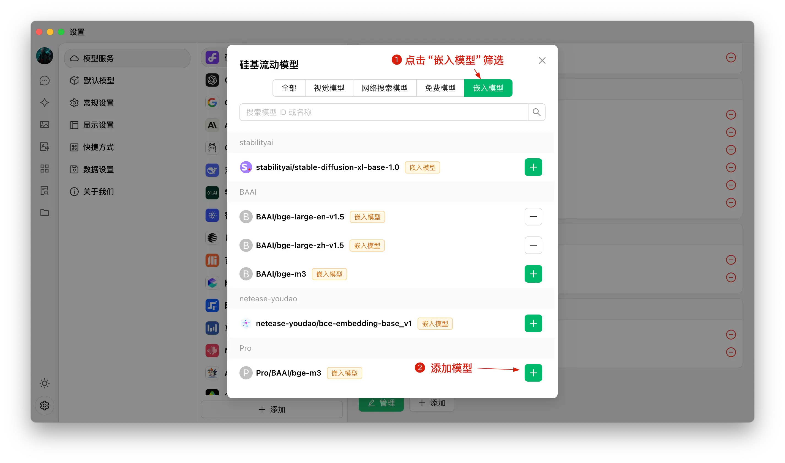
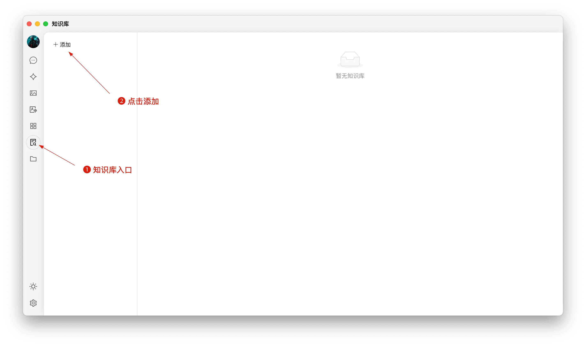
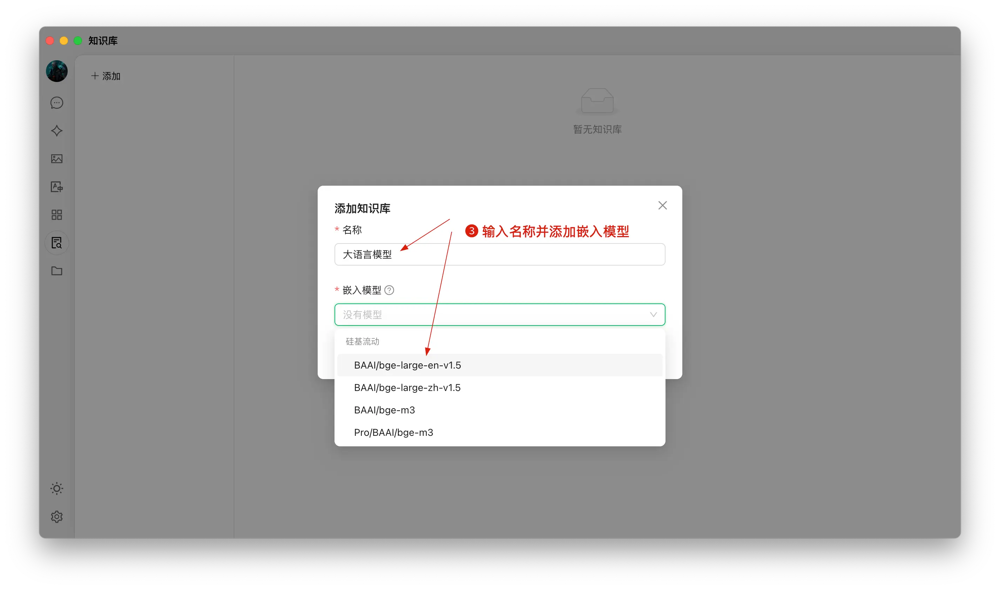
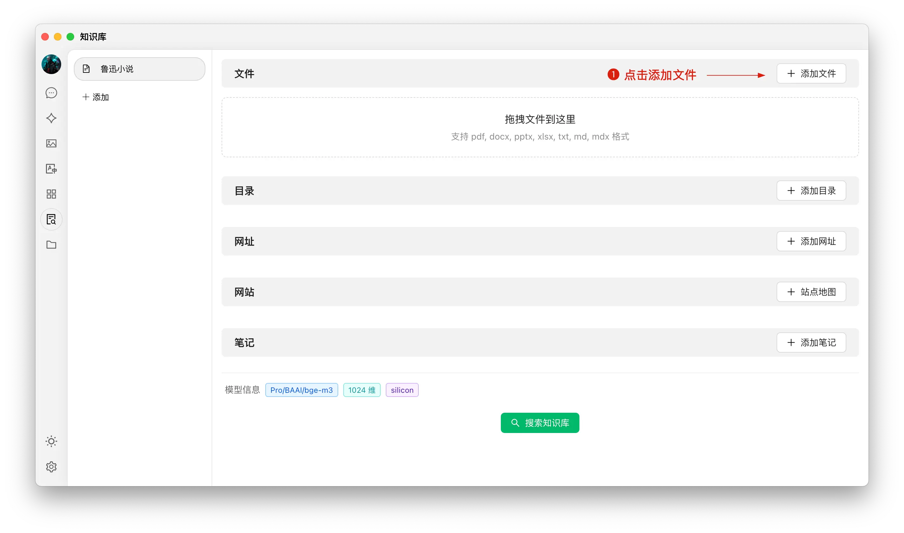
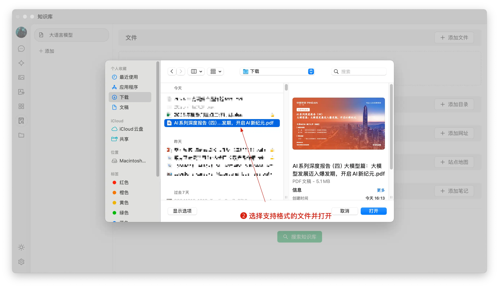
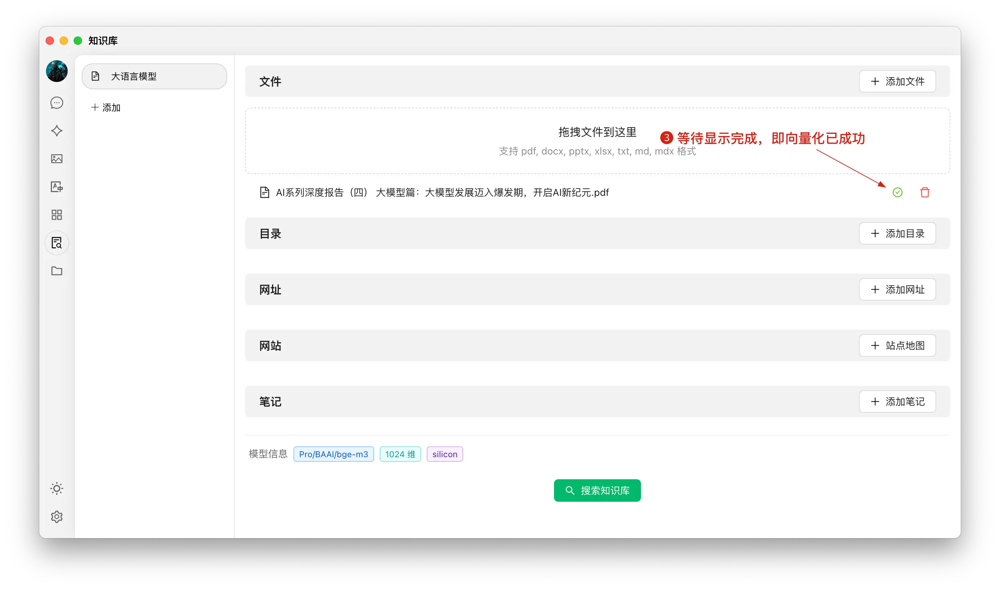
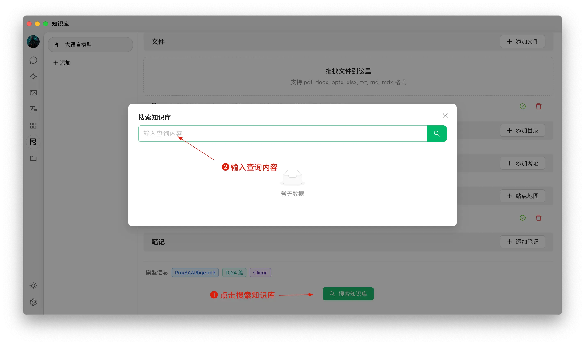
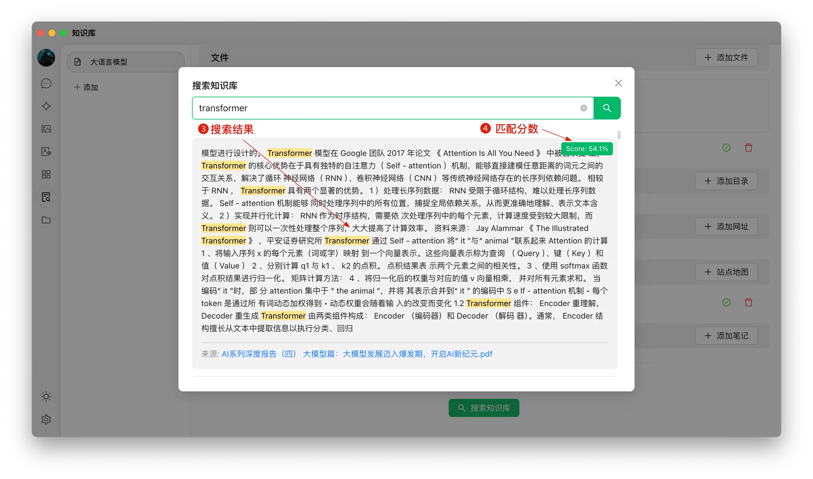
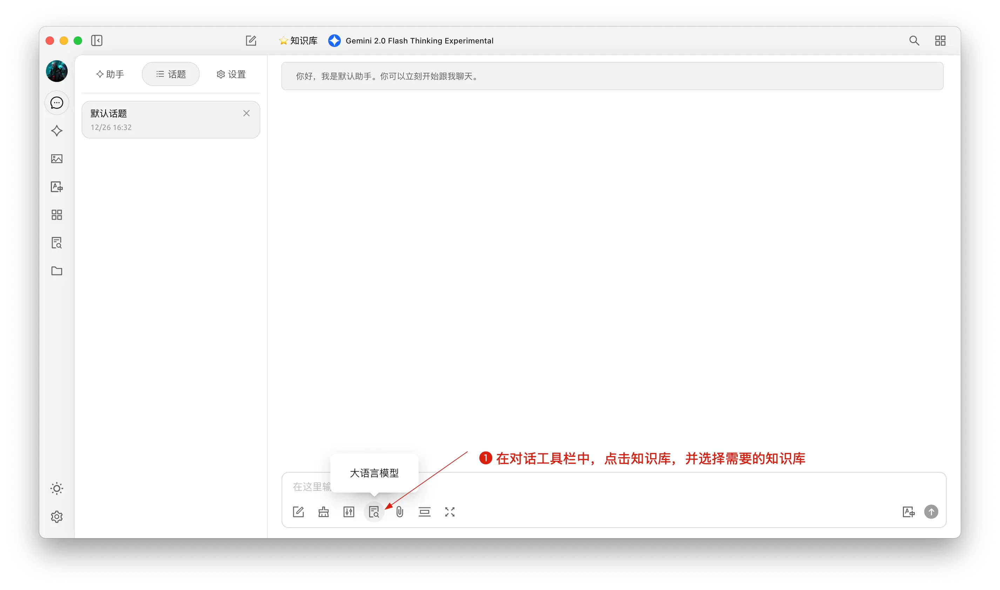
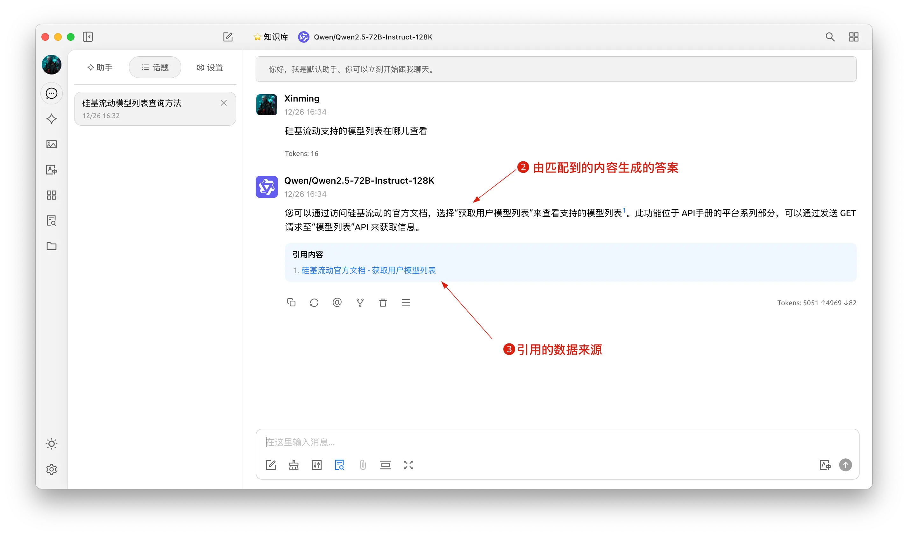

# 知识库教程

知识库就像给 AI 配一本**专属参考书**：你把自己的文档、笔记、网页放进去，之后聊天时让 AI 翻这本书来回答。

> 不知道知识库能做什么？先看 [知识库（功能介绍）](../cherrystudio/preview/knowledge-base.md) 的几个使用场景。

本页带你走完完整流程：**添加嵌入模型 → 创建知识库 → 放资料 → 在对话中调用**。


**当前版本的两个特性**：
1. 默认导航是**顶部 Tab**，传统左侧栏需在 `设置 → 常规设置` 中切换。本文以默认布局描述。
2. 文档预处理（OCR 等）现已迁移到独立的 `设置 → 文档处理`，详见 [知识库文档预处理](document-preprocessing.md)。


## 添加嵌入模型

1. 在 `设置 → 模型服务` 中，找到你常用的 Provider（如 CherryIN、硅基流动、OpenAI 等）；
2. 点击 **获取模型列表**，在顶部 Tab 切到 **嵌入** 分类；
3. 选择需要的嵌入模型添加到我的模型列表（推荐 `bge-m3` 或 `text-embedding-3-small`）。

<figure><figcaption></figcaption></figure>

## 创建知识库

1. **入口**：顶部 Tab `+` → **启动台** → 点击 `知识库`（或在左侧栏布局下点击知识库图标）；
2. **添加**：点击 **+ 添加**，开始创建知识库；
3. **命名 + 选模型**：输入名称并选择嵌入模型（以 `bge-m3` 为例），即可完成创建。

<figure><figcaption></figcaption></figure>

<figure><figcaption></figcaption></figure>

## 添加文件并向量化

1. 添加文件：点击添加文件的按钮，打开文件选择；
2. 选择文件：选择支持的文件格式，如 pdf，docx，pptx，xlsx，txt，md，mdx 等，并打开；
3. 向量化：系统会自动进行向量化处理，当显示完成时（绿色 ✓），代表向量化已完成。

<figure><figcaption></figcaption></figure>

<figure><figcaption></figcaption></figure>

<figure><figcaption></figcaption></figure>

## 添加多种来源的数据

CherryStudio 支持多种添加数据的方式：

1. 文件夹目录：可以添加整个文件夹目录，该目录下支持格式的文件会被自动向量化；
2. 网址链接：支持网址 url，如[https://docs.siliconflow.cn/introduction](https://docs.siliconflow.cn/introduction)；
3. 站点地图：支持 xml 格式的站点地图，如[https://docs.siliconflow.cn/sitemap.xml](https://docs.siliconflow.cn/sitemap.xml)；
4. 纯文本笔记：支持输入纯文本的自定义内容。


提示：

1. 导入知识库的文档中的插图暂不支持转换为向量，需要手动转换为文本；
2. 使用网址作为知识库来源时不一定会成功，有些网站有比较严格的反扒机制（或需要登录、授权等），因此该方式不一定能获取到准确内容。创建完成后建议先搜索测试一下。
3. 一般网站都会提供sitemap，如CherryStudio的[sitemap](https://docs.cherry-ai.com/sitemap-pages.xml)，一般情况下在网站的根地址（即网址）后加/sitemap.xml可以获取到相关信息。如`aaa.com/sitemap.xml` 。
4. 如果网站没提供sitemap或者网址比较杂可自行组合一个sitemap的xml文件使用，文件暂时需要使用公网可直接访问的直链的方式填入，本地文件链接不会被识别。

> 1) 可以让AI生成sitemap文件或让AI写一个sitemap的HTML生成器工具；
> 2) 直链可以使用oss直链或者网盘直链等方式来生成。如果没有现成工具也可到[ocoolAI](https://one.ocoolai.com/login)官网，登录后使用网站顶栏的免费文件上传工具来生成直链。


## 搜索知识库

当文件等资料向量化完成后，即可进行查询：

1. 点击页面下方的搜索知识库按钮；
2. 输入查询的内容；
3. 呈现搜索的结果；
4. 并显示该条结果的匹配分数。

<figure><figcaption></figcaption></figure>

<figure><figcaption></figcaption></figure>

## 对话中引用知识库生成回复

1. 创建一个新的话题，在对话工具栏中，点击知识库，会展开已经创建的知识库列表，选择需要引用的知识库；
2. 输入并发送问题，模型即返回通过检索结果生成的答案 ；
3. 同时，引用的数据来源会附在答案下方，可快捷查看源文件。

<figure><figcaption></figcaption></figure>

<figure><figcaption></figcaption></figure>
