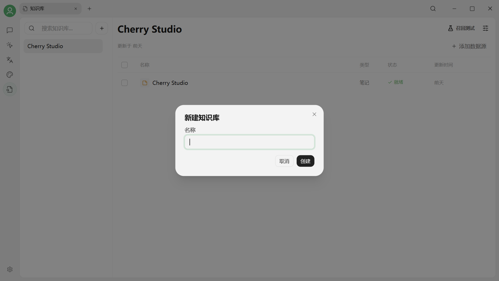
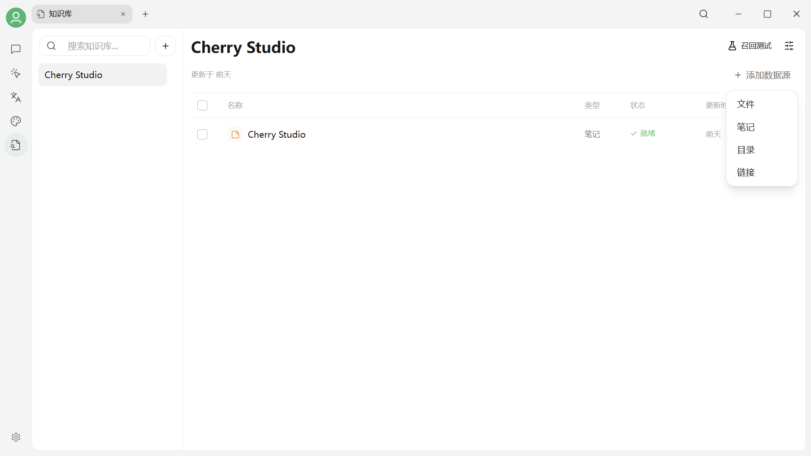

# 知识库教程

本页带你完成：**创建知识库 → 配置检索 → 添加数据源 → 测试召回 → 在对话或工作中使用**。

## 1. 创建知识库

1. 点击顶部 **知识库**，或从启动台打开；
2. 在空页面点击 **创建知识库**；
3. 输入名称并点击 **创建**。

<figure><figcaption>
知识库页面用于创建和管理资料库。
</figcaption></figure>

<figure><figcaption>
新建知识库时先填写名称，创建后再添加数据源并配置模型与检索参数。
</figcaption></figure>

## 2. 配置嵌入与检索

进入目标知识库后，打开 **知识库设置 → 嵌入模型**，直接从下拉框选择模型。如何选择模型、理解参数以及权衡云端与本地方案，请参阅[嵌入模型选择指南](emb-models-info.md)。然后按需配置：

* **嵌入模型**：把文本转换为向量；也可以使用本地嵌入模型。
* **处理服务商**：导入文件时负责提取正文和表格。
* **智能分段**：按 Markdown 标题、段落和代码块组织分片。
* **分段大小 / 重叠大小**：控制每个 Chunk 的长度与上下文重叠。
* **Top K**：每次最多召回的片段数。
* **重排模型与相似度阈值**：可选，用于重新排序并过滤低相关片段。


更换嵌入模型后，通常需要重新索引已有内容。分段参数的修改主要影响之后新添加或重新索引的数据源。


如果模型下拉为空，请先到 `设置 → 模型服务` 添加嵌入或重排模型。

## 3. 添加数据源

点击 **添加数据源**。当前界面支持：

| 类型 | 说明 |
|---|---|
| 文件 | 当前源码支持 `.txt`、`.markdown`、`.md`、`.pdf`、`.html`、`.htm`、`.xlsx`、`.xls`、`.docx`、`.csv`、`.doc`、`.epub`、`.pptx`、`.mdx`、`.draftsexport` |
| 目录 | 导入目录中受支持的文件 |
| 链接 | 抓取单个网页文本并分块索引 |
| 笔记 | 选择 Cherry Studio 笔记作为来源 |

单次添加数量和支持格式以对话框提示为准。如需批量导入网站内容，可以先整理成文件或目录。

数据源会经历 **等待中 → 分块中 → 嵌入中 → 就绪**。出错时可查看原因并执行 **重新索引**。

## 4. 管理与检查

数据源列表支持：

* 预览原文；
* 查看 Chunks；
* 重新索引；
* 批量删除；
* 按文件、目录、链接和笔记筛选。

先用 **召回测试** 输入几个真实问题，查看返回片段、相关度和排序。如果结果不理想，再调整分段、Top K、重排模型或阈值。

**成功标志**：数据源状态显示为“就绪”，并且召回测试能返回与问题相关的原文片段。只有文件上传成功但没有检索结果，不算知识库已经可用。

## 5. 在对话与工作中使用

### 普通对话

在对话输入区打开知识库选择器，勾选目标知识库后再提问。回答下方会显示召回来源，便于回看原文。

### 工作（Agent）

工作页面中的 Agent 提供**知识库搜索**和**知识库管理**工具。为目标 Agent 启用相关工具后，它可以在任务过程中检索资料，或按权限管理知识库内容。

## 常见问题

### 网页抓取失败

目标网页可能需要登录、禁止抓取或依赖脚本渲染。可改用网页导出文件、复制为 Markdown，或使用允许访问的公开页面。

### 扫描 PDF 没有文本

先在 `设置 → OCR` 和 `设置 → 文档处理` 配置合适的服务，再重新导入或重新索引。详情见 [文档预处理](document-preprocessing.md)。

### 检索结果不相关

先确认原文和 Chunks 正确，再尝试减小分段大小、增加适当重叠、调整 Top K，或配置重排模型。

## 下一步

* 日常资料问答：在[对话界面](../cherrystudio/preview/chat.md)选择该知识库后提问；
* 固定为某个领域助手：在[对话页面的助手设置](../cherrystudio/preview/chat.md#zhu-shou-she-zhi)中关联知识库；
* 在多步骤任务中检索或管理资料：为[工作（Agent）](../advanced-basic/agent.md)启用知识库工具。

***

### 💡 获取帮助与提交反馈

如果您在配置或使用过程中遇到疑问，请参考 [反馈与建议](../question-contact/suggestions.md)。
