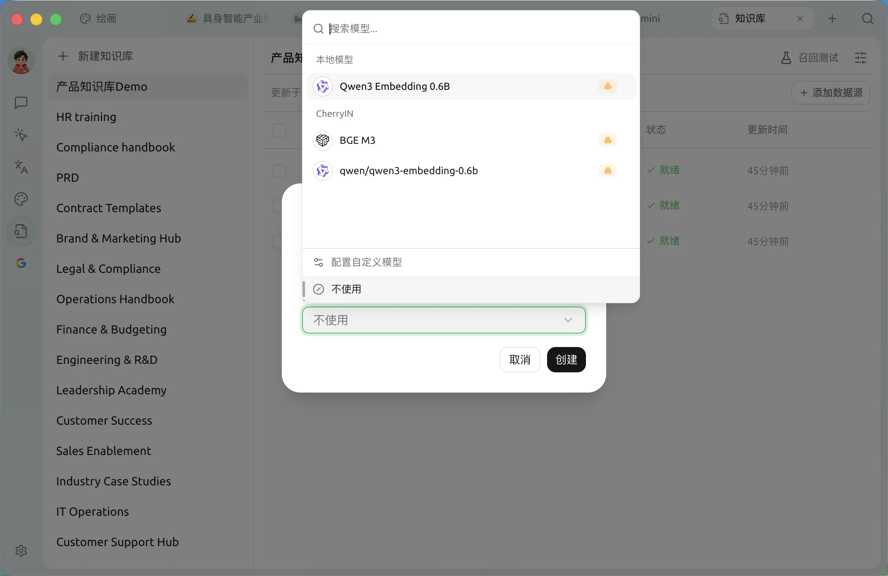
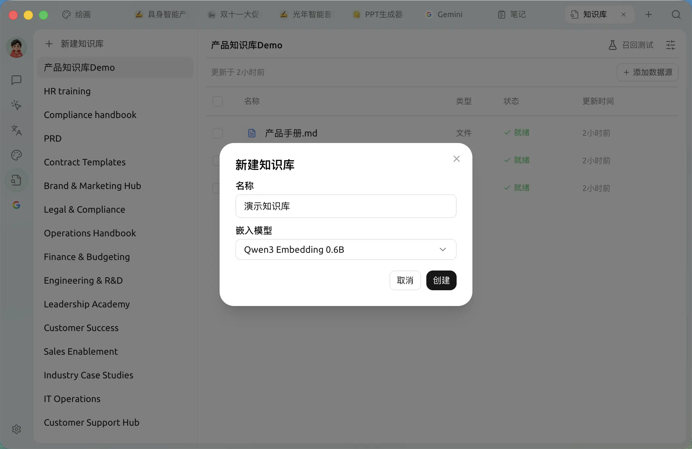
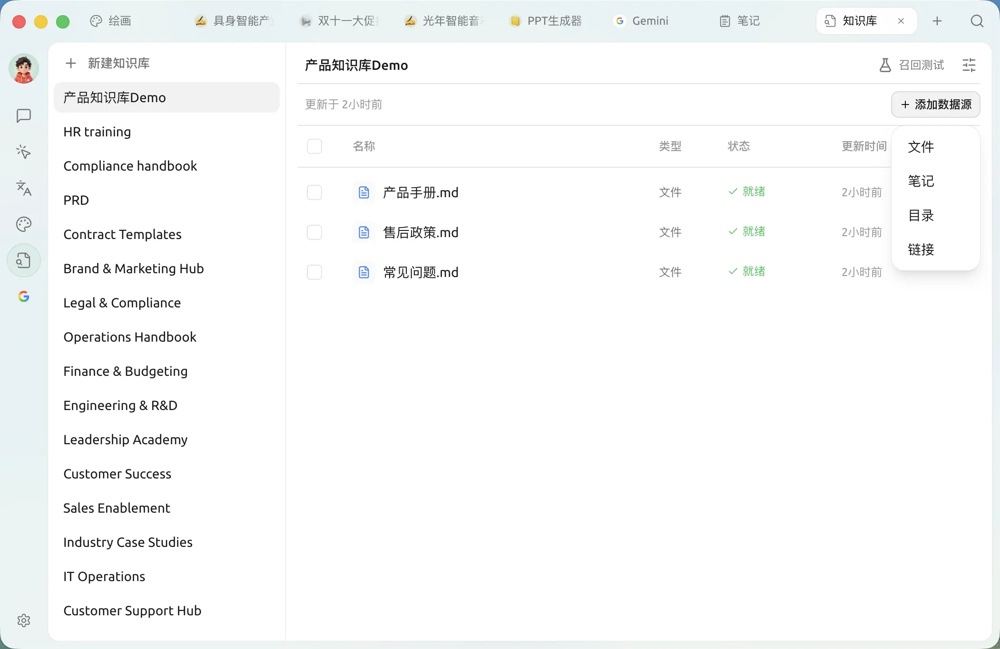
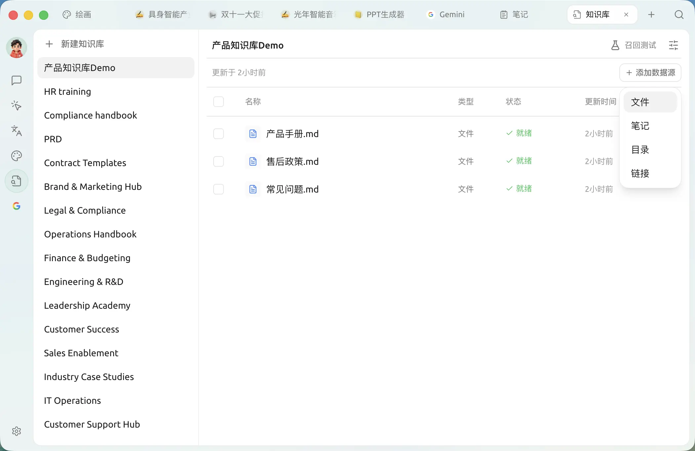
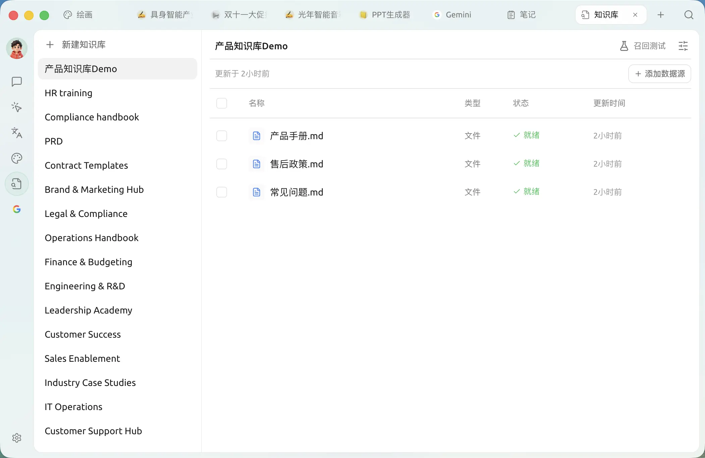
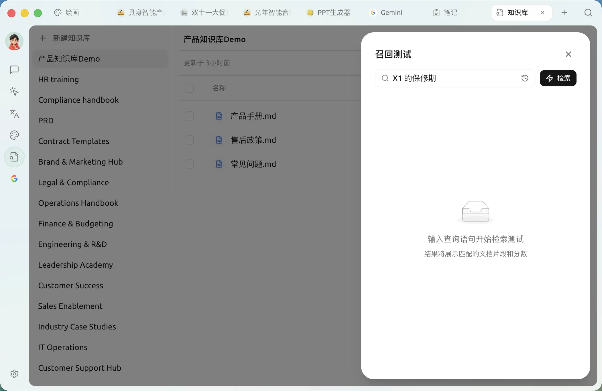
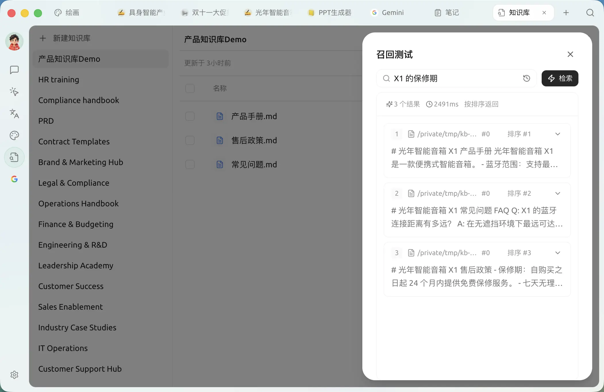
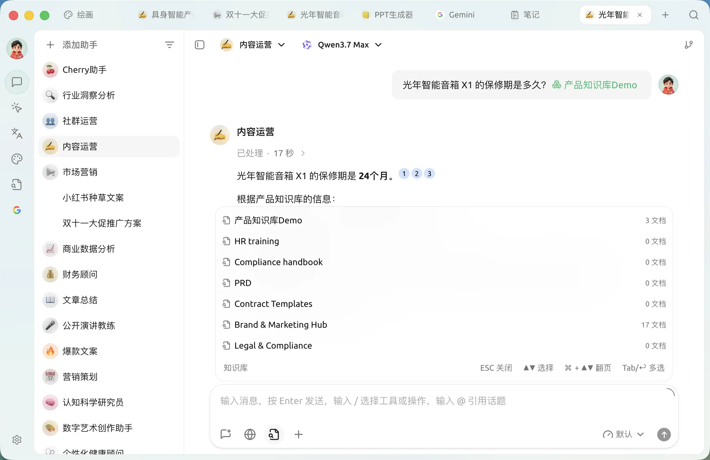

# 知识库教程

知识库就像给 AI 配一本**专属参考书**：你把自己的文档、笔记、网页放进去，之后聊天时让 AI 翻这本书来回答。

> 不知道知识库能做什么？先看 [知识库（功能介绍）](../cherrystudio/preview/knowledge-base.md) 的几个使用场景。

本页带你走完完整流程：**添加嵌入模型 → 创建知识库 → 放资料 → 在对话中调用**。

## 添加嵌入模型

1. 在 `设置 → 模型服务` 中，找到你常用的 Provider（如 CherryIN、硅基流动、OpenAI 等）；
2. 点击 **获取模型列表**，在顶部 Tab 切到 **嵌入** 分类；
3. 选择需要的嵌入模型添加到我的模型列表（推荐 `bge-m3` 或 `text-embedding-3-small`）。

<figure><figcaption></figcaption></figure>

## 创建知识库

1. **入口**：顶部 Tab `+` → **启动台** → 点击 `知识库`（或在左侧栏布局下点击知识库图标）；
2. **添加**：点击 **+ 添加**，开始创建知识库；
3. **命名 + 选模型**：输入名称。嵌入模型**可选**——选一个（以 `bge-m3` 为例）即可用向量检索；**留空则创建纯 BM25（关键词）知识库**，之后也能在知识库的 RAG 设置里再补嵌入模型。

<figure><figcaption></figcaption></figure>

<figure><figcaption></figcaption></figure>

## 添加文件并向量化

1. 添加文件：点击添加文件的按钮，打开文件选择；
2. 选择文件：选择支持的格式（PDF、DOCX、DOC、PPTX、XLSX、XLS、MD、TXT、CSV、HTML、EPUB 等），并打开；
3. 向量化：系统会自动进行向量化处理，当显示完成时（绿色 ✓），代表向量化已完成。

<figure><figcaption></figcaption></figure>

<figure><figcaption></figcaption></figure>

<figure><figcaption></figcaption></figure>

## 添加多种来源的数据

除了文件，CherryStudio 还支持三种来源：

1. **目录**：添加整个文件夹，目录下支持格式的文件会被自动向量化；
2. **链接（URL）**：支持网址，如 [https://docs.siliconflow.cn/introduction](https://docs.siliconflow.cn/introduction)；
3. **笔记**：把 Cherry Studio 里已有的笔记选进来作为知识库数据源。


提示：

1. 导入文档里的插图暂不支持转为向量，需要时先手动转成文本。
2. 用网址作来源不一定成功——有些网站有反爬机制（或需登录 / 授权），可能取不到内容。加完建议先用**召回测试**验证一下。


## 召回测试

资料向量化完成后，用**召回测试**验证"真实问题能不能找到正确片段"：

1. 打开知识库的 **召回测试**（页面右上角）；
2. 输入一个你会真正问的问题；
3. 查看返回的片段及其**相关度分数**，并可查看历史记录。

召回不准时，先修资料或调 RAG 设置，别让 AI 猜。

<figure><figcaption></figcaption></figure>

<figure><figcaption></figcaption></figure>

## 对话中引用知识库生成回复

1. 创建一个新的话题，在对话工具栏中，点击知识库，会展开已经创建的知识库列表，选择需要引用的知识库；
2. 输入并发送问题，模型即返回通过检索结果生成的答案 ；
3. 同时，引用的数据来源会附在答案下方，可快捷查看源文件。

<figure><figcaption></figcaption></figure>

<figure><figcaption></figcaption></figure>

***

### 获取帮助与提交反馈

如果您在配置或使用过程中遇到任何疑问、Bug 或有功能改进建议，请参考 [反馈与建议](../question-contact/suggestions.md) 中提供的官方渠道。
