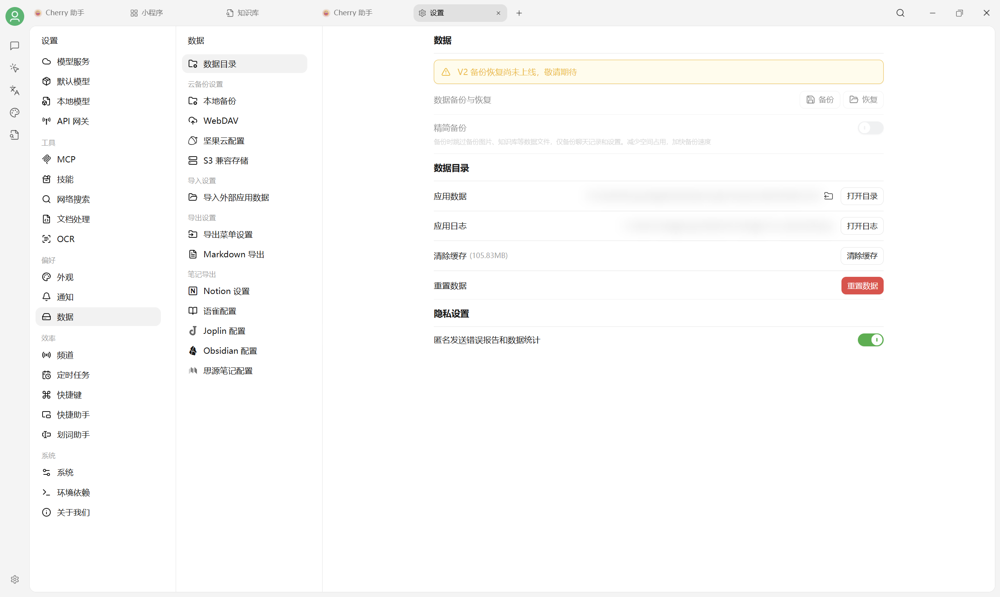

# 数据设置

打开 `设置 → 数据` 可以统一管理数据目录、本地备份、WebDAV、S3、外部数据导入和笔记软件导出。

<figure><figcaption>
V2 数据设置；截图中的本机路径已遮罩。
</figcaption></figure>

> 一句话：**怕丢数据，就来这里设置一次。**

## 我应该用什么备份方案？

| 你的场景 | 推荐方案 |
|---|---|
| 个人单机使用，担心硬盘坏掉 | [WebDAV 备份](webdav.md)（用坚果云、123 盘等）|
| 多台电脑想同步对话/助手 | [WebDAV 备份](webdav.md) —— A 电脑备份，B 电脑恢复 |
| 已经有 AWS / 阿里云 OSS 等 S3 兼容存储 | [S3 兼容存储备份](s3-compatible.md) |
| 想把对话内容自动归档到笔记软件 | [Notion](notion.md) / [Obsidian](obsidian.md) / [思源笔记](siyuan.md) |
| 想导入别人分享的助手 | [助手导入与 URL 订阅](assistants-subscribe.md) |

## 备份的是什么？

备份范围会随版本和所选备份模式变化。执行前请查看备份页面的范围说明；恢复后抽查模型服务、对话、知识库、笔记和文件是否完整。


备份文件会包含 Provider API 密钥等敏感信息。**请勿把备份文件分享给他人，也不要存储在不受信任的共享网盘**。


## 多久备份一次？

* **本地备份**：升级、迁移目录或重置数据前先创建
* **WebDAV / S3**：用于异地保存与跨设备恢复

## 数据存哪？

在 `设置 → 数据 → 数据目录` 查看实际位置。更换硬盘前看 [修改存储位置](../personalization-settings/storage.md)，并先备份。

***

### 💡 获取帮助与提交反馈

如果您在配置或使用过程中遇到任何疑问、Bug 或有功能改进建议，请参考 [反馈与建议](../../question-contact/suggestions.md) 中提供的官方渠道。
