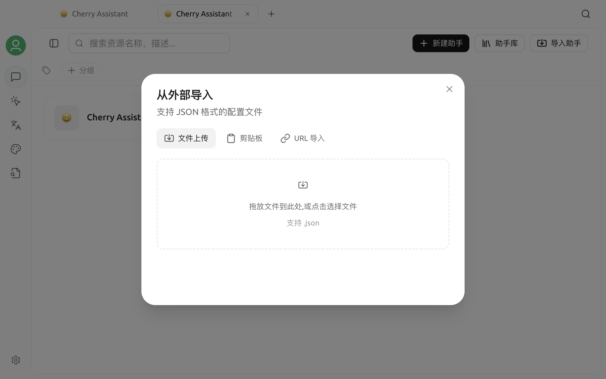

# 助手订阅与导入


当前 Cherry Studio V2 社区版不再提供持久的“助手订阅”或自动刷新远程模板功能。旧版教程中的订阅地址不会持续同步。当前可用的替代功能是一次性 **导入助手**。


导入会把 JSON 中的助手复制为本地助手。远程 JSON 后续发生变化时，已经导入的助手不会自动更新。

## 打开导入助手

1. 从侧栏或启动台打开 **对话**。
2. 打开助手与话题列表的更多菜单，选择 **管理助手**。
3. 在管理界面顶部点击 **导入助手**。
4. 在 **从外部导入**弹窗中选择一种方式：
   - **文件上传：** 选择本地 `.json` 文件；
   - **剪贴板：** 粘贴 JSON；
   - **URL 导入：** 从受支持的 Raw GitHub 或 Raw Gist 地址获取 JSON。



URL 导入是一次性下载，不会保存为订阅。当前只接受 HTTP(S) 的 `raw.githubusercontent.com` 和 `gist.githubusercontent.com` 地址；GitHub 文件预览页、普通 Gist 页面或其他任意网站地址会被拒绝。

## JSON 格式

可以导入单个对象或对象数组。每个助手至少需要 `name` 和 `prompt`：

```json
{
  "name": "文档审阅助手",
  "emoji": "📝",
  "description": "检查结构、术语和可执行性",
  "prompt": "审阅产品文档，并给出具体、可执行的修改建议。",
  "group": ["写作"]
}
```

`emoji`、`description` 和 `group` 可以省略。导入时若没有模型信息，Cherry Studio 会使用当前默认对话模型。导入文件、剪贴板内容或 URL 响应不能超过 5 MB。

## 更新导入的助手

远程内容更新后，需要重新执行导入。重新导入不会把远程内容持续绑定到原助手，并可能产生额外的本地副本；导入后请在管理助手中核对名称、分组和提示词，按需删除旧版本。

如果需要团队分发模板，建议维护可版本化的 JSON 文件，并在文件名或助手说明中标注版本，而不要依赖旧版订阅语义。

## 安全建议

- 只从可信来源导入，并先阅读完整提示词。
- 不要把 API Key、Token、内部地址或个人数据写入助手 JSON。
- 导入后检查默认模型、知识库、工具和 MCP 设置，再开始处理敏感数据。
- URL 导入失败时，确认使用的是 Raw 内容地址，返回内容是 JSON，且大小未超过限制。

助手库、创建和管理流程见[助手库](../../cherrystudio/preview/assistants.md)。如仍无法导入，请通过[反馈与建议](../../question-contact/suggestions.md)提交 Cherry Studio 版本、导入方式、已脱敏示例和错误提示。
