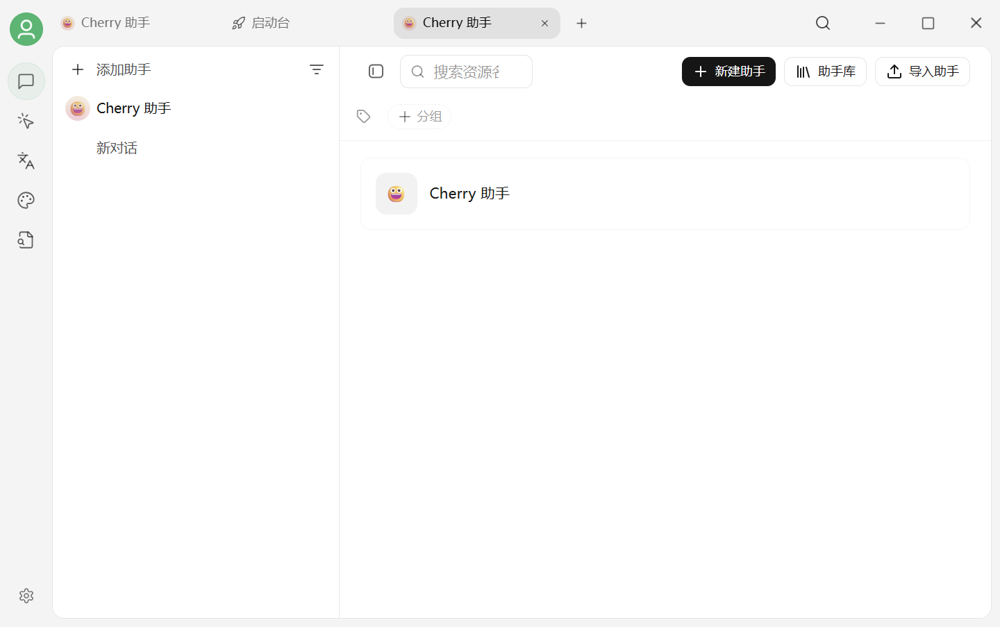
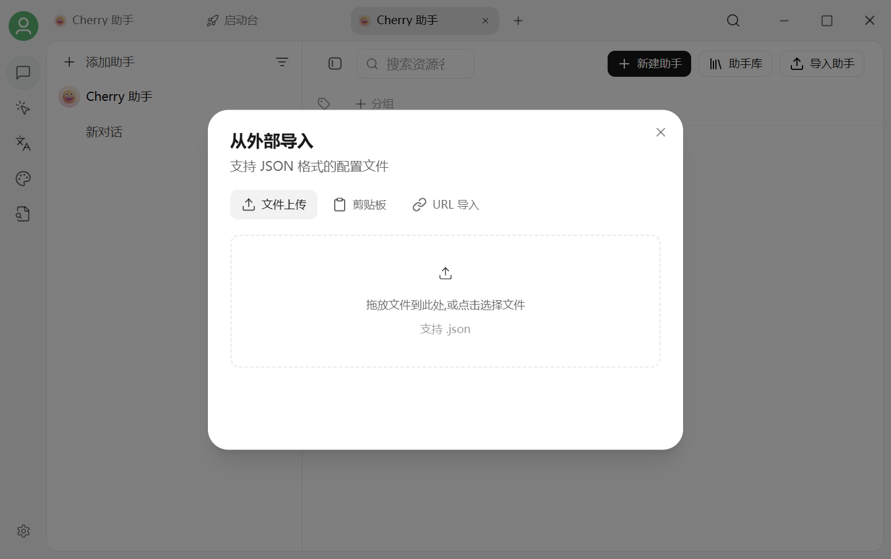

# 助手导入

Cherry Studio V2 已把助手导入移到对话页的资源库中，不再通过旧版“数据设置 → 助手订阅”维护全局订阅地址。

## 打开导入对话框

1. 打开顶部 **对话**；
2. 点击助手列表右上角的 **展示方式**；
3. 选择 **管理助手**；
4. 在资源库右上角点击 **导入助手**。

<figure><figcaption><p>助手资源库与“导入助手”入口</p></figcaption></figure>

<figure><figcaption><p>从文件、剪贴板或 URL 导入助手</p></figcaption></figure>

三种方式都支持同一套助手 JSON 格式：

* **文件**：拖入 `.json` 文件；
* **剪贴板**：直接粘贴 JSON；
* **URL**：从允许的 GitHub Raw 或 Gist Raw 地址获取 JSON。


V2 的 URL 导入只允许 `https://raw.githubusercontent.com/...` 或 `https://gist.githubusercontent.com/...` 等受支持的原始内容地址。普通网页、网盘分享页和任意第三方订阅地址会被拒绝。


## 最小 JSON 示例

```json
[
  {
    "name": "产品经理",
    "description": "帮助分析需求与制定产品方案",
    "emoji": "🧭",
    "prompt": "你是一名经验丰富的产品经理。请先澄清目标、用户和约束，再给出结构化、可执行的建议。"
  }
]
```

导入完成后，助手会出现在资源库和对话页的助手列表中。没有指定模型时，V2 会使用 [默认助手模型](../settings/default-models.md)；你也可以在助手编辑页改成其他模型。

## 维护共享助手包

团队维护共享 JSON 时建议：

* 使用 GitHub 仓库或 Gist 进行版本控制；
* 分享 Raw 链接，不要分享网页预览链接；
* 导入前检查提示词中是否包含内部信息、密钥或个人数据；
* 更新共享文件后，使用者需要重新导入；它不是后台自动同步服务。

***

### 💡 获取帮助与提交反馈

如果您在配置或使用过程中遇到疑问，请参考 [反馈与建议](../../question-contact/suggestions.md)。
