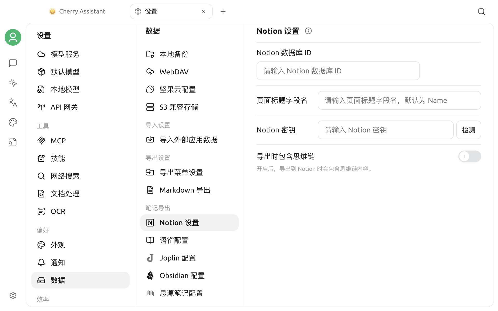

# Notion 配置与导出

Cherry Studio V2 可以把话题或单条消息导出到 Notion 数据库。每次导出都会在目标数据库中新建一个页面，并把转换后的内容写入页面正文。

配置入口位于 **设置 > 数据 > Notion 设置**。**设置 > 数据 > 导出菜单设置**只负责显示或隐藏“导出到 Notion”选项，不用于填写连接信息。


Notion Token 等同于该连接的访问凭据。不要在截图、反馈或共享配置中显示完整 Token，也不要把 Token 写进公开页面。


## 配置流程概览

完成连接需要四项内容：

1. 在 Notion 创建 workspace 内部连接。
2. 创建目标数据库，并把数据库共享给该连接。
3. 取得数据库 ID 和标题属性名。
4. 在 Cherry Studio 填入三项参数并执行检测。

## 创建 Notion 内部连接

1. 打开 [Notion Integrations](https://www.notion.so/profile/integrations)。
2. 选择创建新的内部连接。
3. 选择用于保存导出内容的 Workspace。
4. 将名称设为便于识别的名称，例如 `Cherry Studio`。
5. 在连接能力中至少允许读取内容和插入内容。
6. 保存后复制内部集成 Token。

内部连接只属于选定的 Workspace。目标数据库位于其他 Workspace 时，需要在那里另外创建或安装可用的连接。

Notion 的界面和术语可能调整。若创建入口与本文不同，请参阅 [Notion 官方内部连接指南](https://developers.notion.com/guides/get-started/internal-connections)。

## 创建目标数据库

在 Notion 中创建一个数据库，用于接收 Cherry Studio 导出的页面。表格、列表、看板等视图都可以，关键是底层必须是数据库，而不是普通页面或仅用于展示的链接视图。

数据库至少要有一个 **Title** 类型的属性。新建数据库通常默认包含名为 `Name` 的标题列，也可以改成“标题”“名称”或其他名字。


Cherry Studio 的“页面标题字段名”取决于属性的实际名称，不取决于 Notion 的界面语言。中文界面也可能是 `Name`，英文界面也可以改成“标题”。


## 把数据库共享给连接

仅创建 Token 还不能访问任意页面。必须让连接获得目标数据库的访问权：

1. 打开目标数据库的原始页面。
2. 打开右上角的页面菜单或共享设置。
3. 找到 **Connections / 添加连接**。
4. 搜索并选择刚创建的内部连接。
5. 确认连接已经出现在该数据库的连接列表中。

也可以在 Notion Developer Portal 的连接 **Content access** 中添加目标页面。无论使用哪种方式，都要确保授权的是数据库本身，而不只是一个无法访问原始数据源的链接视图。

Notion 官方说明中，未共享给连接的数据库通常会对 API 返回 404，而不是明确提示“没有权限”。

## 获取数据库 ID

在浏览器中打开目标数据库并复制链接。链接可能类似：

```text
https://www.notion.so/workspace/Tasks-0123456789abcdef0123456789abcdef?v=...
```

数据库 ID 是 `?` 之前的 32 位标识：

```text
0123456789abcdef0123456789abcdef
```

它也可能显示为带连字符的 UUID。不要复制：

- `v=` 后面的视图 ID；
- 整个网页 URL；
- 普通父页面的 ID；
- 链接数据库视图中不属于原始数据库的标识。

数据库链接中带有标题前缀时，取最后一段中的 32 位 ID。若无法确认，可以打开数据库为完整页面后再次复制链接。

## 获取页面标题字段名

查看目标数据库的属性，找到类型为 **Title** 的那一列，并原样复制其名称。

例如：

| Notion 中的实际属性名 | Cherry Studio 填写值 |
| --- | --- |
| `Name` | `Name` |
| `名称` | `名称` |
| `Title` | `Title` |
| `对话标题` | `对话标题` |

名称区分字符、空格和大小写。不要填写数据库名称、页面名称或普通文本属性。

## 在 Cherry Studio 中连接

进入 **设置 > 数据 > Notion 设置**。



依次填写：

1. **Notion 数据库 ID**；
2. **页面标题字段名**；
3. **Notion 密钥**。

点击 **Notion 密钥**输入框旁的 **检测**。检测成功表示：

- Token 有效；
- Cherry Studio 能通过该 Token 读取目标数据库；
- Database ID 对应的数据库已向连接开放。

检测不会验证“页面标题字段名”是否正确，也不会创建测试页面。因此检测成功后仍应执行一次真实导出。

## 选择是否导出思考内容

打开 **导出时包含思维链**后，Cherry Studio 会在可用时把消息中的思考 / 推理内容一并写入 Notion。

关闭时只导出正常回答内容。以下情况建议保持关闭：

- 导出内容会共享给客户或公开发布；
- 思考内容包含草稿、内部信息或不希望展示的中间过程；
- 只希望保留最终答案。

该开关不会让模型生成原本没有的思考内容。

## 启用 Notion 导出菜单

若对话菜单中没有“导出到 Notion”：

1. 打开 **设置 > 数据 > 导出菜单设置**。
2. 开启 **导出到 Notion**。
3. 返回对话，重新打开话题或消息的导出菜单。

这个开关只控制菜单可见性，不会修复 Token、权限或数据库配置。

## 执行第一次导出

建议先用一段不含敏感信息的短对话测试：

1. 打开话题或单条消息的菜单。
2. 选择 **导出到 Notion**。
3. 等待“成功导出到 Notion”提示。
4. 打开目标数据库。
5. 确认新增页面的标题、段落、代码块、列表和公式是否符合预期。

Cherry Studio 会用话题或消息标题创建数据库页面。标题超过 32 个字符时会被截短并添加省略号。

Notion 导出基于 Cherry Studio 的 Markdown 转换流程。**设置 > 数据 > Markdown 导出**中的部分选项，例如公式标记、模型信息和引用处理，也可能影响导出结果。

## 权限与数据边界

- Cherry Studio 使用 Token 直接调用 Notion API，不需要在浏览器中登录 Notion。
- 连接只能访问明确授权给它的页面和数据库。
- 导出会在目标数据库中新建页面并追加正文块，不会合并或覆盖同名页面。
- 删除 Cherry Studio 中的对话不会自动删除已经导出到 Notion 的页面。
- 在 Notion 中撤销连接权限或删除 Token 后，后续导出会失败，但已有页面仍保留。

## 常见问题

### 检测提示未配置 API Key 或 Database ID

确认 Notion 密钥和数据库 ID 都不是空值。不要把整个数据库 URL 填入 ID 输入框。

### 返回 401 或 Token 无效

Token 可能复制不完整、已撤销或属于另一个 Workspace。回到 Notion Integrations 检查连接状态，并重新复制 Token。

### 返回 403

检查连接是否有读取内容和插入内容的能力。检测需要读取数据库，实际导出还需要创建页面并追加内容。

### 返回 404，但数据库在浏览器中可以打开

通常是数据库没有共享给该连接，或填入了视图 ID / 普通页面 ID。将目标数据库添加到 Connections，并重新复制数据库 ID。

### 检测成功，但导出失败

最常见原因是 **页面标题字段名**不匹配。确认填写的是目标数据库中类型为 Title 的属性名称，而不是数据库标题。还要检查连接是否拥有插入内容能力。

### 页面创建成功，但正文缺失或格式异常

等待导出进度完全结束，再刷新 Notion。复杂 Markdown、嵌套内容或 Notion API 限制可能影响部分块；先用短文本测试，并检查 Cherry Studio 的 Markdown 导出设置。

### 对话菜单里没有 Notion

进入 **设置 > 数据 > 导出菜单设置**，打开 **导出到 Notion**。若已打开，重新进入当前对话再检查菜单。

如仍无法解决，请通过[反馈与建议](../../question-contact/suggestions.md)提交 Cherry Studio 版本、Notion 返回的状态码、已脱敏的 Database ID、标题字段名和完整错误信息。
