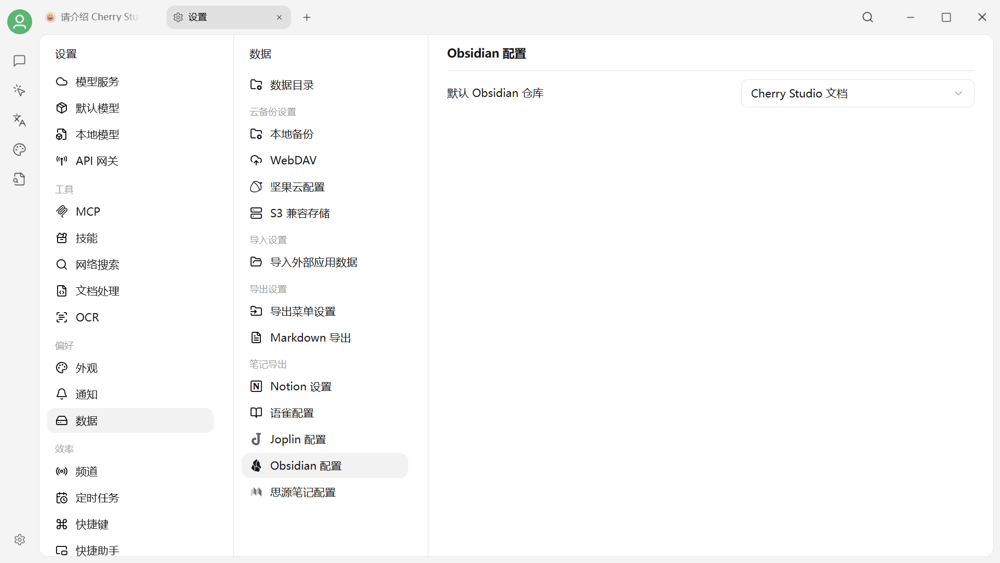
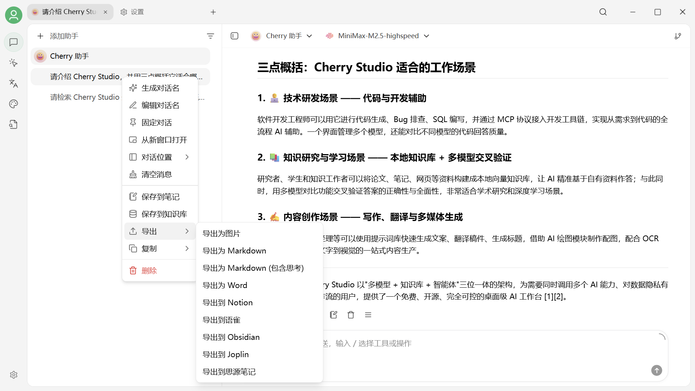
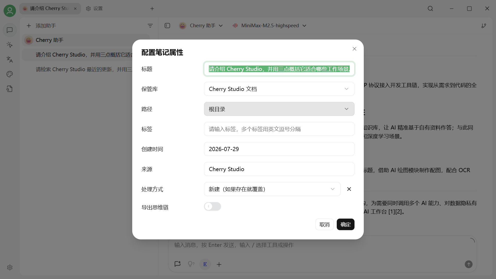
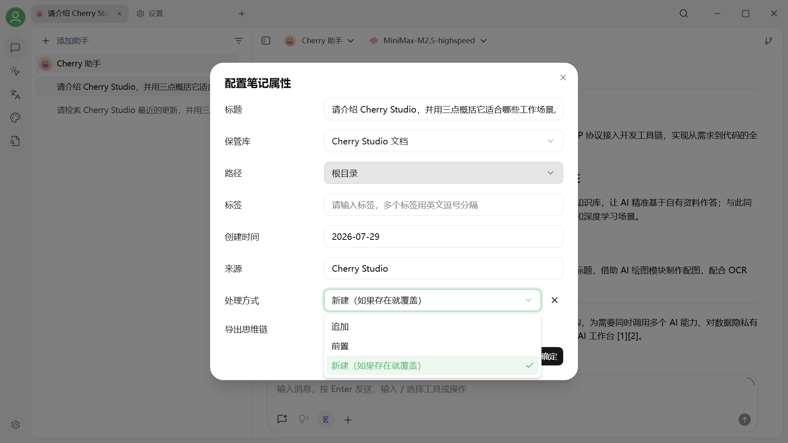
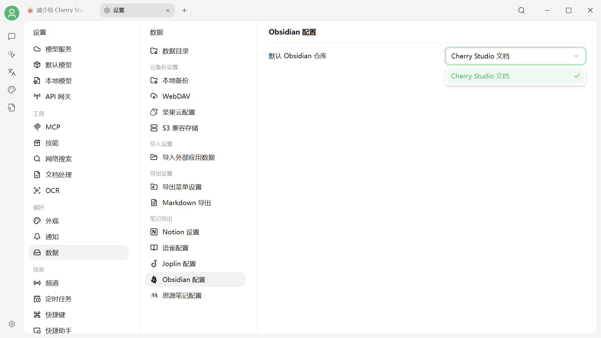

# 导出到 Obsidian

Cherry Studio 可以把完整对话或单条消息导出为 Obsidian 笔记。V2 会自动识别本机打开过的 Obsidian 保管库，不需要手动填写库名或安装额外插件。

## 使用前准备

1. 安装并打开 Obsidian。
2. 至少打开一次目标保管库，让 Cherry Studio 能识别它。
3. 建议把 Obsidian 更新到当前稳定版。


如果保管库列表为空，请先在 Obsidian 中打开目标保管库，然后重启 Cherry Studio 再试。


## 选择默认保管库

进入 **设置 → 数据设置 → Obsidian 配置**，在下拉列表中选择默认保管库。

<figure><figcaption>
选择默认 Obsidian 保管库
</figcaption></figure>

## 导出完整对话

1. 回到对话页，在目标话题上打开右键菜单。
2. 选择 **导出 → 导出到 Obsidian**。
3. 在弹窗中确认保管库、保存路径、笔记属性和处理方式。
4. 点击确定。

<figure><figcaption>
导出完整对话
</figcaption></figure>

### 导出选项

| 选项 | 作用 |
| --- | --- |
| 保管库 | 选择要写入的 Obsidian 保管库 |
| 路径 | 选择笔记保存的文件夹 |
| 标签、创建时间、来源 | 写入 Obsidian Properties 的元数据 |
| 新建（如果存在就覆盖） | 新建同名笔记；已有同名笔记时覆盖 |
| 前置 | 把本次内容添加到同名笔记开头 |
| 追加 | 把本次内容添加到同名笔记末尾 |


只有“新建（如果存在就覆盖）”会写入 Properties；“前置”和“追加”只写入正文。


<figure><figcaption>
设置笔记属性
</figcaption></figure>

<figure><figcaption>
选择保管库和保存路径
</figcaption></figure>

<figure><figcaption>
选择处理方式
</figcaption></figure>

## 导出单条消息

点击消息下方的菜单，选择 **导出 → 导出到 Obsidian**，然后按同样方式确认保管库、路径和处理方式。

<figure><figcaption>
从消息操作中选择导出到 Obsidian
</figcaption></figure>

## 确认导出结果

导出成功后，在 Obsidian 的目标文件夹中打开新笔记，检查标题、正文、附件和 Properties 是否完整。

<figure><figcaption>
确认属性后完成导出
</figcaption></figure>

<figure><figcaption>
确认默认保管库配置
</figcaption></figure>

## 常见问题

### 对话过长，导出失败

先把 Obsidian 更新到当前稳定版，再尝试分段导出单条消息。特别长的对话也可以先导出为 Markdown 文件，再手动放入保管库。

### 导出到了错误的文件夹

重新导出时检查“保管库”和“路径”。如果不希望覆盖已有笔记，请选择“前置”或“追加”，或先修改目标笔记名称。

***

### 💡 获取帮助与提交反馈

如果您在配置或使用过程中遇到任何疑问、Bug 或有功能改进建议，请参考 [反馈与建议](../../question-contact/suggestions.md) 中提供的官方渠道。
