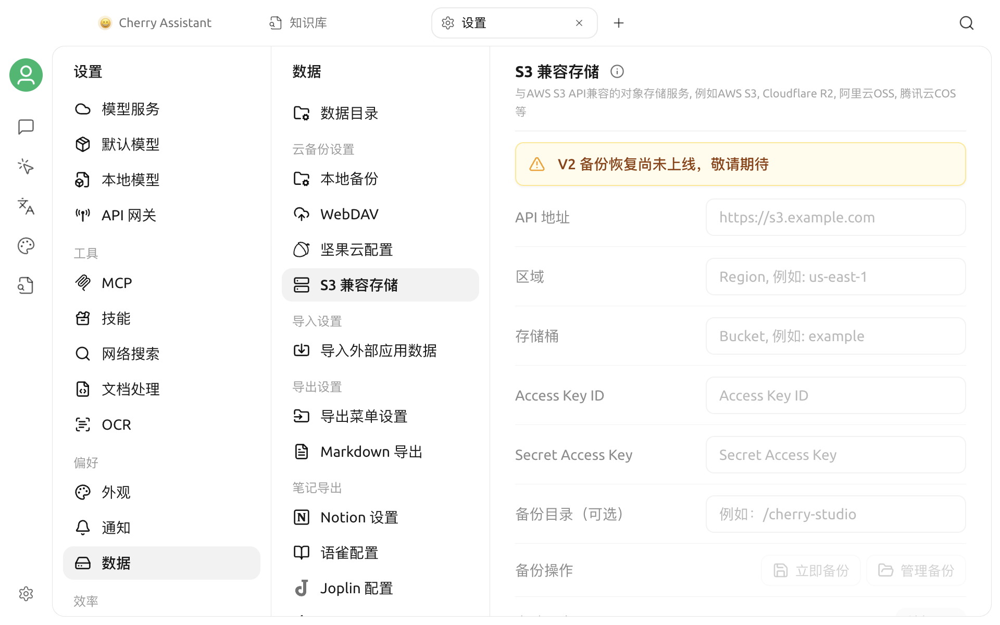

# S3 兼容存储备份

当前版本可以通过 **设置 > 数据 > S3 存储** 打开配置页面，但页面明确提示 **“V2 备份恢复尚未上线，敬请期待”**。


当前版本不能通过此页面创建、恢复或自动管理 S3 备份。请不要把页面中显示的配置项理解为已经可用的功能。


## 页面当前显示的内容

页面预留了以下配置和操作：

- API 地址、区域和存储桶；
- Access Key ID 与 Secret Access Key；
- 可选的备份目录；
- **立即备份**与**管理备份**；
- 自动同步、最大备份数和精简备份。

这些输入框、按钮和开关当前均不可用。看到页面不表示 S3 连接已经建立，也不能用于验证 Endpoint、存储桶或凭据。

## 使用建议

- 当前不要在此页面输入真实的对象存储凭据，也不要依赖它保存重要数据。
- 不要根据旧版界面或旧教程执行备份、恢复、自动同步或备份清理。
- 已经存在于对象存储中的文件不会被此不可用页面读取、修改或删除。
- 后续版本启用该功能后，请以应用中的可用状态、更新说明和本页最新内容为准。
