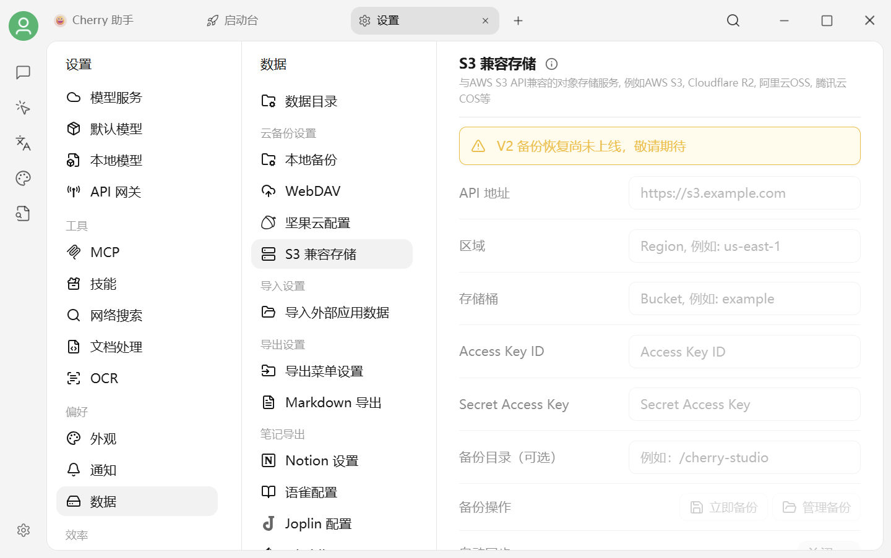

# S3 兼容存储备份


**Cherry Studio V2 的 S3 兼容存储备份目前尚未上线。** 当前配置框和备份按钮处于不可用状态，请不要创建专用密钥或按旧版教程操作。


<figure><figcaption>
设置 → 数据设置 → S3 兼容存储
</figcaption></figure>

## 现在应该怎么做

* 保留旧版已经生成的远端备份，不要主动清理存储桶。
* 不要把 Access Key、Secret Key 或存储桶地址发到群聊、截图或 Issue。
* 等待应用内解除禁用并发布正式说明后，再按届时页面要求配置。

## 功能上线后可能需要的资料

常见 S3 兼容服务包括 AWS S3、Cloudflare R2、阿里云 OSS、腾讯云 COS 和 MinIO。通常需要准备：

| 字段 | 说明 |
| --- | --- |
| API 地址 | S3 兼容端点 |
| 区域 | 服务所在 Region；部分服务使用 `auto` |
| 存储桶 | Bucket 名称，建议保持私有 |
| Access Key ID | 访问凭据标识 |
| Secret Access Key | 访问密钥，应妥善保管 |
| 备份目录 | 可选的远端根路径 |

这些字段和行为仍可能在正式上线前调整，请以应用内页面和发布说明为准。

***

### 💡 获取帮助与提交反馈

如果您在配置或使用过程中遇到疑问，请参考 [反馈与建议](../../question-contact/suggestions.md)。
