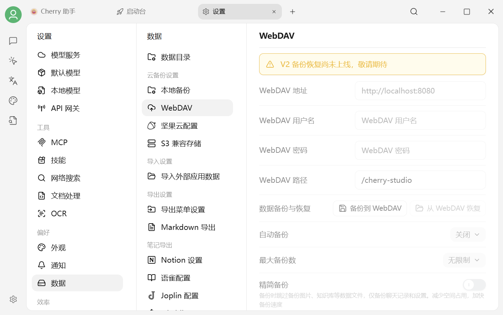

# WebDAV 备份


**Cherry Studio V2 的 WebDAV 备份与恢复目前尚未上线。** 当前页面中的地址、用户名、密码、备份和恢复控件均为不可用状态，请不要按旧版教程填写凭据。


<figure><figcaption>
设置 → 数据设置 → WebDAV：当前功能状态以页面提示为准
</figcaption></figure>

## 现在应该怎么做

* 需要保留旧版 WebDAV 备份时，不要删除远端备份文件或撤销应用密码。
* 准备升级或更换电脑时，先保留原设备和原数据目录，不要把尚未上线的 V2 页面当作迁移工具。
* 等待页面解除禁用并且官方发布说明确认可用后，再配置地址、账户和应用密码。

## 功能上线后需要准备什么

WebDAV 服务通常会提供：

* WebDAV 地址；
* 用户名；
* 独立的应用密码；
* 可选的远端路径。

为避免泄露主账户密码，优先使用服务商生成的独立应用密码。填写前请再次确认应用内已不再显示“V2 备份恢复尚未上线”。

***

### 💡 获取帮助与提交反馈

如果您在配置或使用过程中遇到疑问，请参考 [反馈与建议](../../question-contact/suggestions.md)。
