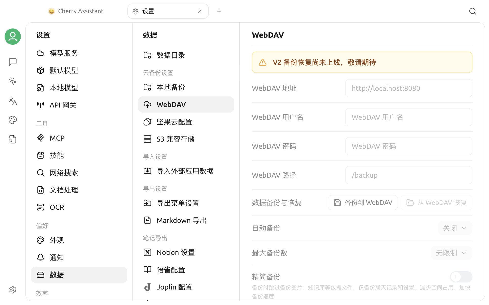

# WebDAV 备份

当前版本可以通过 **设置 > 数据 > WebDAV** 打开 WebDAV 页面，但页面明确提示 **“V2 备份恢复尚未上线，敬请期待”**。


当前版本不能通过此页面创建、恢复或自动管理 WebDAV 备份。请不要把页面中显示的配置项理解为已经可用的功能。


## 页面当前显示的内容

页面预留了以下配置和操作：

- WebDAV 地址、用户名、密码和路径；
- **备份到 WebDAV**与**从 WebDAV 恢复**；
- 自动备份周期和最大备份数；
- 精简备份选项。

这些输入框、按钮和开关当前均不可用。看到页面不表示 WebDAV 连接已经建立，也不能用于验证服务器地址或凭据。

## 使用建议

- 当前不要在此页面输入真实 WebDAV 凭据，也不要依赖它保存重要数据。
- 不要根据旧版界面或旧教程执行备份、恢复或自动备份操作。
- 后续版本启用该功能后，请以应用中的可用状态、更新说明和本页最新内容为准。
