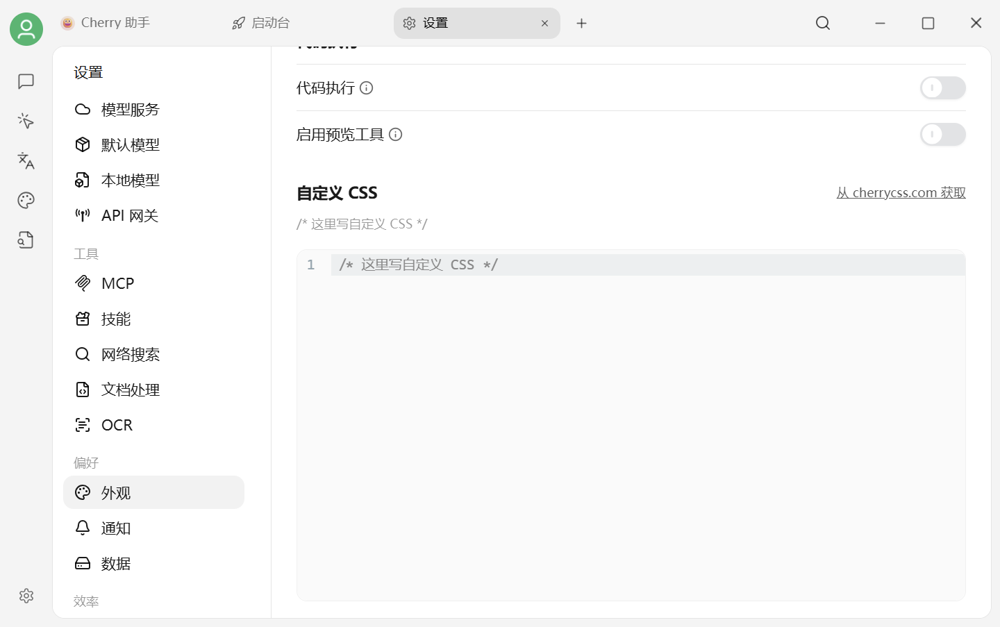

# 清除自定义 CSS

自定义 CSS 写错后，可能造成文字错位、按钮被遮挡或设置页无法正常操作。正常情况下直接清空编辑器即可。

<figure><figcaption><p>设置 → 外观 → 自定义 CSS</p></figcaption></figure>

## 设置页仍能打开

1. 进入 `设置 → 外观`。
2. 滚动到 **自定义 CSS**。
3. 删除编辑器中的全部内容。
4. 等待设置保存；如界面没有恢复，重启 Cherry Studio。

## CSS 导致设置页无法使用

1. 按 <kbd>Ctrl</kbd>+<kbd>Shift</kbd>+<kbd>I</kbd> 打开开发者工具；macOS 使用 <kbd>Command</kbd>+<kbd>Option</kbd>+<kbd>I</kbd>。
2. 在 `Console` 中输入并执行：

```javascript
document.getElementById('user-defined-custom-css')?.remove()
```

3. 回到 Cherry Studio，进入 `设置 → 外观`，清空自定义 CSS 编辑器并重启应用。


控制台命令只会临时移除当前页面注入的样式；仍需回到设置页清空保存的 CSS，问题才不会在重启后再次出现。


***

### 💡 获取帮助与提交反馈

如果您在配置或使用过程中遇到疑问，请参考 [反馈与建议](../../question-contact/suggestions.md)。
