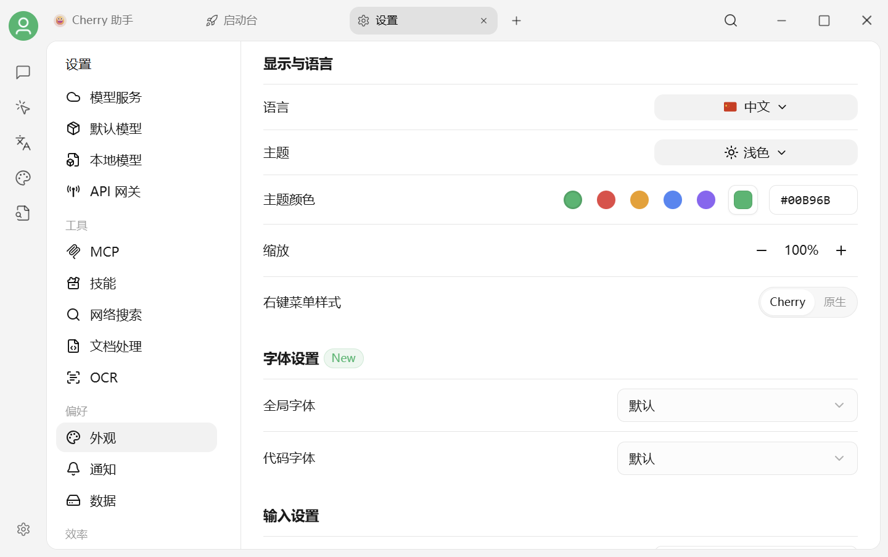

# 字体设置

Cherry Studio V2 已在 `设置 → 外观` 中提供 **全局字体** 和 **代码字体** 两个选项。字体需要先安装到操作系统，重启 Cherry Studio 后才会出现在选择器中。

<figure><figcaption>
设置 → 外观 → 字体设置
</figcaption></figure>

## 怎么选

| 用途 | 建议 |
| --- | --- |
| 中文界面与正文 | MiSans、Noto Sans CJK 或系统默认字体 |
| 中英文混排 | MiSans Global、Noto Sans |
| 代码块 | JetBrains Mono、Monaspace |
| 不确定 | 保持“默认”，兼容性最好 |

字体下载请优先使用官方来源：

* [MiSans Global](https://hyperos.mi.com/font/zh/)
* [Noto 字体](https://fonts.google.com/noto)
* [JetBrains Mono](https://www.jetbrains.com/lp/mono/)
* [Monaspace](https://github.com/githubnext/monaspace)


文档读起来拥挤时，优先调大 `设置 → 外观 → 缩放`，不要用自定义 CSS 强行修改所有字号和行高。


***

### 💡 获取帮助与提交反馈

如果您在配置或使用过程中遇到疑问，请参考 [反馈与建议](../../question-contact/suggestions.md)。
