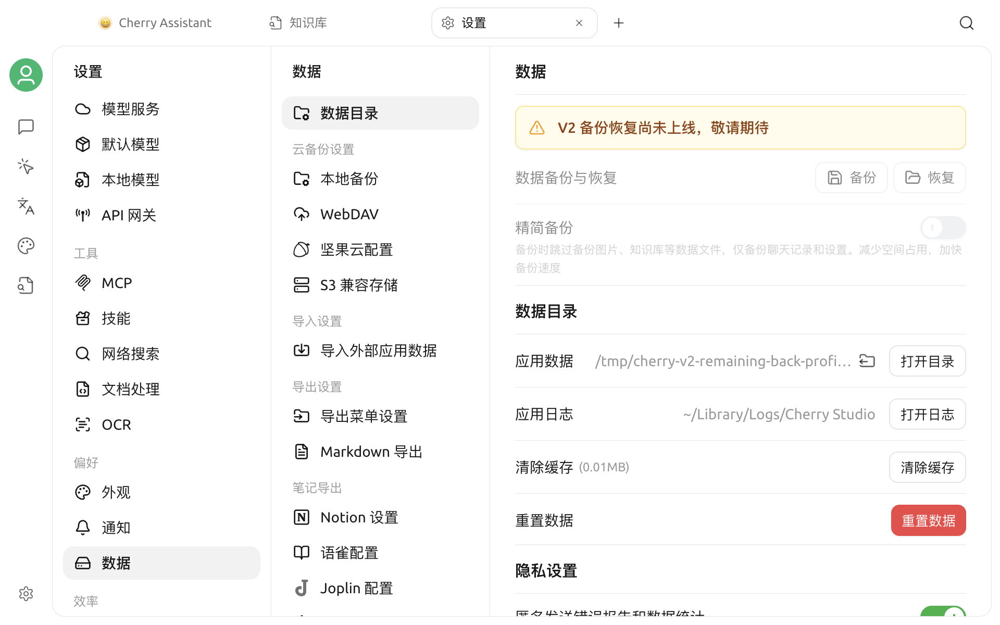

# 修改存储位置

Cherry Studio 的应用数据目录保存数据库、内部文件、知识库、笔记以及部分运行状态。系统盘空间不足，或需要把数据放到另一块长期在线的本地磁盘时，可以在应用内迁移该目录。


修改数据目录是高风险操作。当前 V2 的应用内备份与恢复尚不可用；如果没有已验证的独立副本，建议暂缓迁移。确需迁移时，先完全退出 Cherry Studio，再把当前应用数据目录复制到另一块磁盘。迁移过程中不要退出应用、关机或断开目标磁盘。


## 查看当前目录

打开**设置 > 数据设置 > 数据目录**，在**应用数据**一行查看当前路径。点击路径或**打开目录**可在系统文件管理器中打开。

设置页显示的路径是当前实例的准确信息，应优先于网上看到的默认路径。

常见的默认位置如下：

| 系统 | 常见位置 |
| --- | --- |
| macOS | `~/Library/Application Support/CherryStudio` |
| Windows | `%APPDATA%\CherryStudio` |
| Linux | `~/.config/CherryStudio` |
| Windows 便携版 | 程序所在目录旁的 `data` 文件夹 |

不同安装方式、历史版本或便携版可能使用不同路径，请以应用内显示为准。

## 哪些内容会受到影响

应用数据目录通常包含：

- Cherry Studio 的本地数据库；
- 应用内部管理的文件；
- 知识库和笔记数据；
- 已安装的部分资源与工作区；
- Chromium / Electron 的会话和网络状态；
- 部分日志与缓存。

以下内容不一定随目录迁移：

- 原本就位于目录外部、仅被 Cherry Studio 引用的文件；
- 操作系统中安装的字体和系统级配置；
- 位于用户主目录下的独立 Cherry Studio 基础设施目录；
- 第三方应用、云服务或模型服务中的数据。

因此不要把“修改应用数据目录”当作完整备份方案。

## 迁移前准备

1. 记录设置页显示的当前应用数据路径。
2. 完全退出 Cherry Studio，把整个当前目录复制到另一块磁盘，并确认副本可读取。
3. 重新打开应用，结束正在运行的生成、知识库处理、文件导入和同步任务。
4. 确认目标磁盘空间充足、连接稳定且当前用户具有写权限。
5. 新建一个**空文件夹**作为目标。
6. 保留原目录和离线副本，直到完成迁移后验证。


不建议使用网络共享、会按需下载的云同步目录或经常拔出的移动磁盘。数据库和运行状态需要持续、稳定的本地文件访问。


## 选择目标目录

1. 打开**设置 > 数据设置 > 数据目录**。
2. 在**应用数据**右侧点击修改目录图标。
3. 选择或新建目标文件夹。
4. 在确认窗口中核对**原始路径**和**新路径**。
5. 根据需要决定是否启用**复制数据**。
6. 点击确认，等待应用完成迁移和重启。

Cherry Studio 会拒绝以下目标：

- 磁盘或文件系统根目录；
- 当前应用数据目录本身或其内部目录；
- Cherry Studio 的安装目录；
- 当前用户没有写入权限的目录。

## “复制数据”开关

### 启用

应用重启后把原目录中的数据复制到新目录，适合在保留当前对话、助手、文件和知识库的情况下搬迁。

- 优先选择空目录；
- 复制时间取决于文件数量、知识库大小和磁盘速度；
- 应用可能重启多次；
- 复制期间不要强制退出。

### 关闭

只切换目录，不复制旧数据。新目录首次打开时可能呈现为一个空的 Cherry Studio 环境，旧数据仍保留在原目录。

仅在你明确想创建全新数据目录，或已通过其他方式准备好目标目录时关闭。


如果目标目录不为空并选择继续，现有文件可能被覆盖，存在数据丢失或复制失败风险。除非确认其中内容可以被替换，否则请取消并选择空目录。


## 迁移后的验证

迁移完成后不要立即删除原目录。请依次检查：

1. 打开**设置 > 数据设置 > 数据目录**，确认显示的是新路径。
2. 随机打开几个历史话题和助手。
3. 检查知识库、笔记和内部文件是否可用。
4. 新建一条测试对话，然后正常退出。
5. 再次启动 Cherry Studio，确认新数据仍存在。
6. 完全退出应用后，再制作一份新目录的离线副本。

建议至少经过两次完整启动并使用一段时间后，再决定是否归档或删除原目录。

## 更换移动磁盘

如果数据目录位于外置磁盘：

- 启动 Cherry Studio 前先连接磁盘；
- 保持相同的挂载点或盘符；
- 应用运行期间不要弹出磁盘；
- 在系统休眠、更新或备份前确认磁盘仍在线。

若某次启动后看起来像全新安装，先退出应用，不要执行重置或大量新建操作。重新连接原磁盘并确认路径和盘符，再启动检查。

## 回到原目录

如果新目录工作异常：

1. 不要删除新旧任一目录。
2. 如果需要保留新目录的当前状态，完全退出应用后复制该目录。
3. 在**数据目录**中重新选择原目录。
4. 如果原目录已有完整数据，关闭**复制数据**，避免互相覆盖。
5. 重启后按“迁移后的验证”再次检查。

不要在应用运行时手动合并两个数据目录。相同名称的数据库、配置和运行状态文件不能用普通文件覆盖安全合并。

## 常见问题

### 无法选择磁盘根目录

这是保护措施。请在磁盘中创建专用子目录，例如 `CherryStudioData`，再选择该目录。

### 提示没有写入权限

检查目录所有者与权限，或换到当前账户可写的位置。不要通过长期以管理员身份运行应用来绕过权限问题。

### 迁移长时间没有完成

大型文件和知识库会延长复制时间。先观察磁盘是否仍有读写活动，不要立即强退；如果最终失败，请保留原目录并查看应用日志。

### 重启后仍显示原路径

确认迁移过程中没有报错，目标磁盘仍在线，并再次检查目录权限。暂时不要删除原目录；如果多次重启后仍无法切换，请通过官方渠道反馈版本、系统和日志信息。

### 新目录中缺少外部文件

应用只迁移自己管理的数据目录。原本位于其他位置的外部文件不会被自动复制，需要继续保持原路径可访问或单独迁移后重新关联。

***

### 获取帮助与提交反馈

如果在迁移过程中遇到问题，请保留新旧目录和日志，并通过[反馈与建议](../../question-contact/suggestions.md)中列出的官方渠道联系我们。
