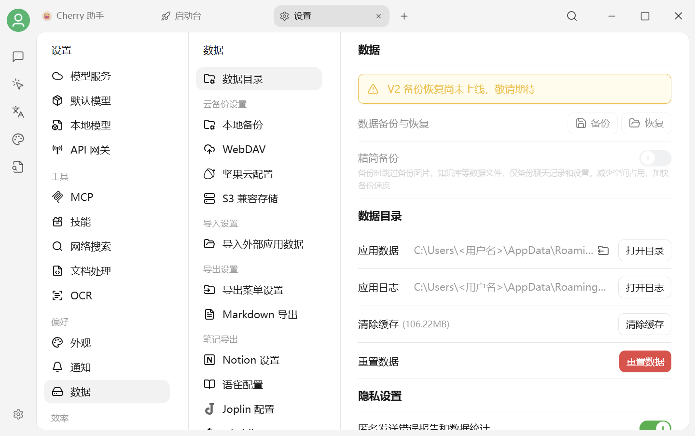

# 数据存储位置

Cherry Studio 默认把对话、助手、知识库和应用设置保存在当前系统的用户目录中。

<figure><figcaption>
设置 → 数据设置 → 数据目录
</figcaption></figure>

## 默认位置

* **Windows**：`%APPDATA%\CherryStudio`
* **macOS**：`~/Library/Application Support/CherryStudio`
* **Linux**：`~/.config/CherryStudio`

实际目录可能因开发版、便携版或独立测试配置而不同，请以 `设置 → 数据设置 → 数据目录` 中显示的路径为准。

## 查看与迁移数据目录

当前页面可以：

* 查看应用数据目录；
* 打开数据目录；
* 点击路径右侧的文件夹迁移图标，选择新的数据目录；
* 打开应用日志；
* 清除缓存或重置数据。


迁移前请退出其他 Cherry Studio 实例，并保留足够的磁盘空间。迁移期间不要强制关闭应用；完成后应用可能会自动重启。


### 迁移步骤

1. 在 **设置 → 数据设置 → 数据目录** 找到“应用数据”；
2. 点击当前路径右侧的文件夹迁移图标；
3. 选择一个非系统根目录、可写且空间充足的文件夹；
4. 按提示决定复制现有数据，或切换到已有数据的目录；
5. 等待复制和应用重启完成，再检查对话、模型配置、知识库与文件。

如果目标目录非空，Cherry Studio 会提示直接使用其中已有的数据，不会自动覆盖其中的文件。无法确认目录内容时，请取消并换一个空目录。

***

### 💡 获取帮助与提交反馈

如果您在配置或使用过程中遇到疑问，请参考 [反馈与建议](../../question-contact/suggestions.md)。
