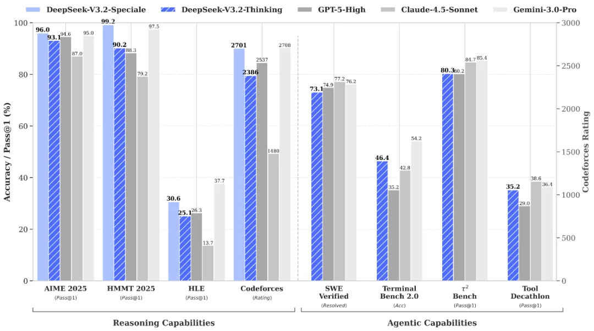
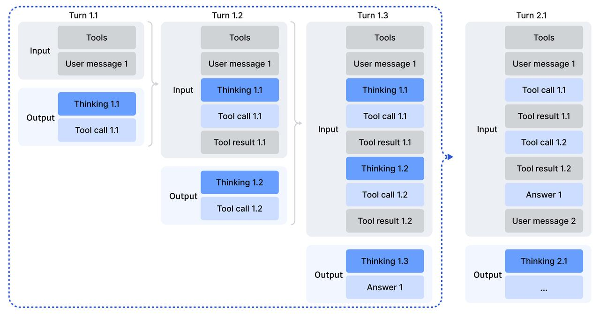
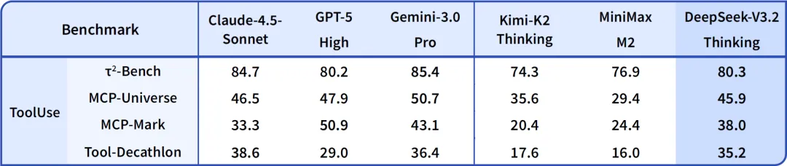
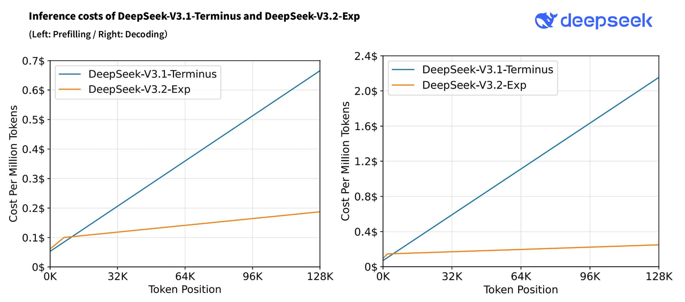

# DeepSeek V3.2

Cherry Studio 用户现在可以通过内置的 **CherryIN** 服务免费体验 **DeepSeek V3.2**——DeepSeek 于 2025 年 12 月 1 日发布的旗舰级稀疏注意力 MoE 模型，首次将"思考"原生集成到工具调用中，是进阶 Agent 与长上下文场景的理想选择。

***

## 🚀 什么是 DeepSeek V3.2？

DeepSeek V3.2 基于 V3.2-Exp 迭代而来，采用 Mixture-of-Experts（MoE）架构，并引入 **DeepSeek Sparse Attention（DSA）** 稀疏注意力机制，在保持超大规模总参数的同时显著降低长上下文推理成本。

- 架构：MoE + DeepSeek Sparse Attention（DSA）+ Multi-Head Latent Attention（MLA）
- 总参数量：685B
- 每 Token 激活参数量：约 37B
- 专家数：每层 256 个专家
- 开源许可：MIT
- 发布时间：2025 年 12 月 1 日（V3.2-Exp 于 2025 年 9 月 29 日发布）

V3.2 同时发布了面向 API 的 **DeepSeek-V3.2-Speciale** 版本，在复杂推理任务上取得 IMO、CMO、ICPC World Finals 与 IOI 2025 的金牌级表现。

<figure><figcaption></figcaption></figure>

***

## 📚 延续扎实的训练与对齐流程

DeepSeek V3.2 沿用了 V3 系列成熟的训练流水线，并针对 Agent 场景做了关键扩展：

1. **大规模预训练**：在海量高质量多语言语料上完成基础训练，覆盖代码、数学与科学知识。
2. **稀疏注意力引入**：在 128K 序列长度下训练主模型与 lightning indexer，每个 query token 选择 2048 个 key-value token 参与注意力。
3. **大规模 Agent 数据合成**：覆盖 1,800+ 环境与 85,000+ 复杂指令的全新 Agent 训练数据合成方法。
4. **思考与工具调用融合**：V3.2 是 DeepSeek 首个将"思考"原生集成到工具调用中的模型，支持在"思考模式"与"非思考模式"下均可调用工具。

<figure><figcaption></figcaption></figure>

***

## ⚙️ 旗舰级核心能力

DeepSeek V3.2 主打"与 GPT-5 水平相当"的综合能力，并在 Agent 与复杂推理上大幅强化：

- ✅ **原生思考 + 工具调用**：首个将 thinking 集成进 tool-use 的 DeepSeek 模型
- ✅ **顶级推理能力**：V3.2-Speciale 在 IMO / CMO / ICPC World Finals / IOI 2025 上达到金牌水平
- ✅ **代码与开发任务**：继承 V3 系列强代码能力
- ✅ **长上下文稳定性**：DSA 带来的长文档与代码库级分析能力
- ✅ **结构化工具调用**：适合构建多步规划与执行的 Agent

<figure><figcaption></figcaption></figure>

***

## 💡 DeepSeek Sparse Attention：更长、更省

DSA 是 V3.2 的核心技术升级，通过 **lightning indexer + 细粒度 token 选择** 实现：

- 首次在大模型上实现细粒度稀疏注意力
- 将核心注意力复杂度从 O(L²) 降低
- 在长上下文训练与推理上显著提速，同时保持与稠密注意力几乎一致的输出质量

| 场景 | 推荐用法 | 示例 |
| --- | --- | --- |
| 短对话 / 简单问答 | 直接调用 | 日常问答、摘要 |
| 中等复杂任务 | 启用工具调用 | 数据分析、代码重构 |
| 复杂 Agent 任务 | 思考 + 工具调用 | 多步规划、代码库分析、长文档审阅 |

***

## 🌟 开放、可用、生态友好

- ⚡ DSA 带来的长上下文推理加速
- 💰 通过 CherryIN 在 Cherry Studio 中**免费使用**
- 🖥️ 开源权重、MIT 许可，vLLM、SGLang 等主流推理框架 Day-0 支持

<figure><figcaption></figcaption></figure>

***

## 🧠 聚焦实用能力：代码与 Agent

DeepSeek V3.2 在实际开发工作流中表现尤为出色：

- 多语言代码生成与重构
- 代码仓库级上下文理解与补丁生成
- Agent 工具链：稳定调用外部工具、搜索、代码执行
- 数学与复杂推理：支持竞赛级题目

***

## 🧭 如何在 Cherry Studio 中使用？

1. 打开 Cherry Studio，进入 **设置 → 模型服务**。
2. 找到 **CherryIN** 服务商并开启。
3. 在模型列表中选择 **DeepSeek V3.2**。
4. 返回聊天界面，在顶部模型选择处切换为 **DeepSeek V3.2** 即可开始对话。

> 💡 提示：CherryIN 提供的免费模型额度由 Cherry Studio 官方承担，适合日常体验与评测；生产环境建议结合 DeepSeek 官方 API 使用。

***

📘 **立即体验 DeepSeek V3.2，开启旗舰级推理与 Agent 之旅！**
