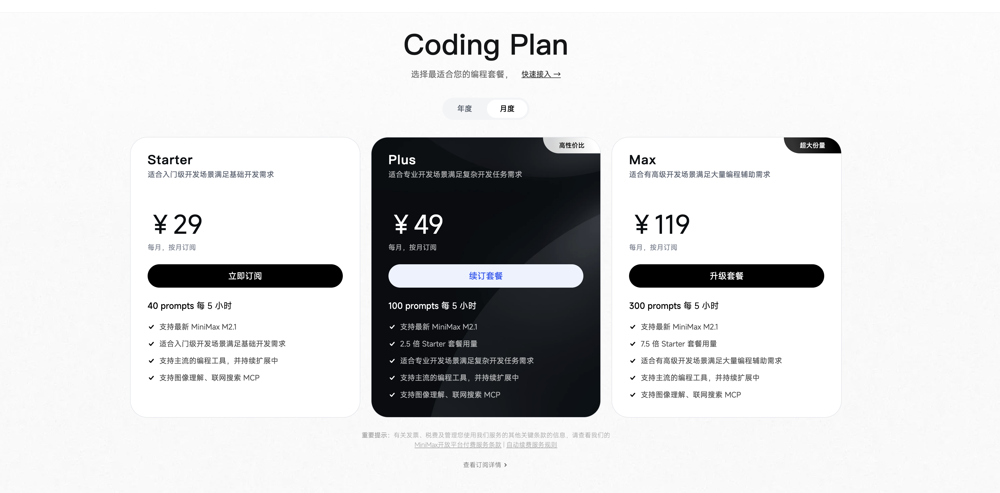

# MiniMax Coding Plan

**Coding Plan** 是 MiniMax 推出的高性价比编程订阅服务（如 Starter/Plus 套餐）。通过在 Cherry Studio 中配置该套餐，你可以以极低的固定成本（最低 ¥29/月）使用 `MiniMax-M2.1` 模型。


**核心优势**

* **适用人群**：拥有 MiniMax Coding Plan 订阅（Starter / Plus / Max）的用户。
* **计费模式**：按时段刷新额度（如每 5 小时 40 次 Prompt），而非按 Token 计费，无需担心消耗过快。


### 1. 准备工作

在开始之前，请确保你已经购买了套餐并获取了密钥：

1. 登录  [**MiniMax 开放平台**](https://platform.minimaxi.com/)。
2.  进入 [**Coding Plan** 页面](https://platform.minimaxi.com/subscribe/coding-plan?code=FYWiC6CtHy\&source=link)，确保套餐已生效。

    <figure><figcaption></figcaption></figure>
3. 在 **Coding Plan** 中复制你的专属 `API Key`（以 `sk-` 开头）。

<figure><figcaption></figcaption></figure>

### 2. 配置步骤

#### 第一步：定位服务商

进入 Cherry Studio，点击侧边栏的 **设置** > **模型服务**，在列表中找到 **MiniMax**。


如果列表较长，可以在顶部的搜索框输入 `mini` 快速定位。


<figure><figcaption></figcaption></figure>

#### 第二步：填写配置

**不需要**修改复杂的 API 地址，使用默认配置即可，请参考以下说明填写：

<table><thead><tr><th width="128.20703125">参数项</th><th>填写说明</th></tr></thead><tbody><tr><td><strong>API Key</strong></td><td>粘贴你的 Coding Plan 专属密钥 <em>(注意：必须是购买套餐后生成的 Key，不要有多余空格)</em></td></tr><tr><td><strong>API 地址</strong></td><td>保持默认 <code>https://api.minimaxi.com/v1</code></td></tr><tr><td><strong>开关</strong></td><td>点击右上角开关，确保为 <strong>绿色 (ON)</strong></td></tr></tbody></table>

<figure><figcaption></figcaption></figure>

#### 第三步：添加指定模型 (关键)

Coding Plan 套餐仅支持特定的模型，选错模型将无法使用或产生额外费用。

1. 点击配置页底部的 **管理 (Manage)** 按钮。

<figure><figcaption></figcaption></figure>

2. 在列表中找到并添加 **`MiniMax M2.1`**。


**请务必选择正确模型！**

* ✅ **推荐**：`MiniMax M2.1` (Coding Plan 指定主力模型)。


<figure><figcaption></figcaption></figure>

#### 第四步：保存并验证 

1. 点击 API 密钥输入框旁边的 **检测 (Check)** 按钮。

<figure><figcaption></figcaption></figure>

2. 如果显示绿色 **Success**，说明你的 Coding Plan 套餐已成功连接！

<figure><figcaption></figcaption></figure>

### 3. 用量与限制说明

Coding Plan 与普通 API 的计费模式完全不同，请务必理解以下机制：


**额度刷新机制** Coding Plan 的额度是**周期性刷新**的。例如 Starter 套餐：**每 5 小时** 提供 **40 次** 对话额度。

* **如果不回复了**：说明你当前 5 小时的额度已耗尽。
* **解决办法**：休息几个小时，等待额度自动恢复即可，无需额外付费。


### 4. 常见问题排查


**遇到 `429 Too Many Requests` 报错？**

这不是软件故障，而是触发了 **Coding Plan 的频控限制**。

* 这意味着你当前时段的“发消息次数”已用完。
* 请耐心等待下一个 5 小时周期刷新。



**遇到 `401 Unauthorized` 报错？**

* 检查 API Key 是否有多余空格。
* 登录 MiniMax 官网确认你的 Coding Plan 订阅是否已过期。

