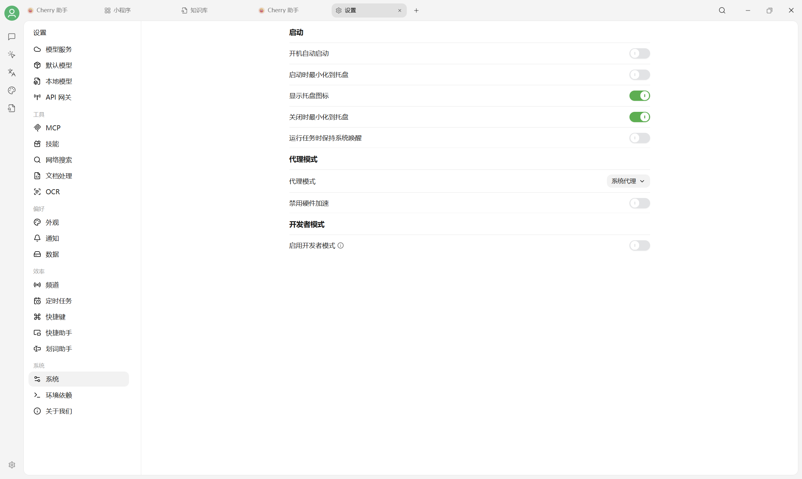

# 设置

Cherry Studio V2 把设置分为模型、工具、偏好、效率和系统五组。旧版“常规设置”“显示设置”“API 服务器”等名称已拆分或更名。

## V2 设置地图

| 分组 | 页面 | 主要用途 |
|---|---|---|
| 模型 | 模型服务 | Provider、API Key、端点与模型列表 |
| 模型 | 默认模型 | 默认助手、快速、翻译和绘画模型 |
| 模型 | 本地模型 | 下载和管理本地模型 |
| 模型 | API 网关 | 向外部程序暴露兼容 HTTP API |
| 工具 | MCP、技能、网络搜索、文档处理、OCR | 扩展工具、检索和文档解析能力 |
| 偏好 | 外观、通知、数据 | 界面、提醒、目录、备份和导出 |
| 效率 | 频道、定时任务、快捷键、快捷助手、划词助手 | 自动化、跨平台入口和全局工具 |
| 系统 | 系统、环境依赖、关于我们 | 启动、代理、运行依赖和版本信息 |

<figure><figcaption>
V2 设置左侧导航及系统设置页面。
</figcaption></figure>

本节重点文档：

* [模型服务设置](providers.md)
* [默认模型设置](default-models.md)
* [系统与通知](general.md)
* [外观设置](display.md)
* [快捷键设置](key-shortcut.md)
* [文档处理](doc-process.md)
* [技能](skills.md)
* [快捷短语](quick-phrase.md)

相关进阶文档：

* [API 网关](../../advanced-basic/api-server.md)
* [MCP](../../advanced-basic/mcp/)
* [频道](../../advanced-basic/agent-channels.md)
* [定时任务](../../advanced-basic/scheduled-tasks.md)
* [记忆能力（V2）](../../advanced-basic/memory.md)


大多数设置保存后立即生效。数据目录、硬件加速和环境依赖等系统级选项可能需要重启；涉及重置数据或迁移目录时，请先创建备份。


***

### 💡 获取帮助与提交反馈

如果您在配置或使用过程中遇到疑问，请参考 [反馈与建议](../../question-contact/suggestions.md)。
