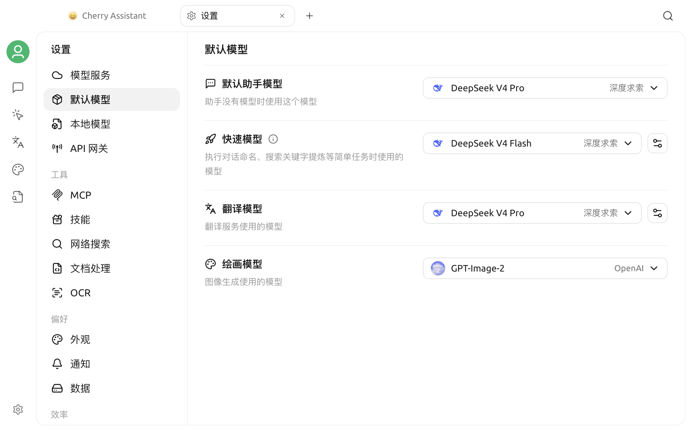

# 默认模型设置

Cherry Studio 的不同功能会在没有单独指定模型时使用默认模型。V2 当前提供四个全局角色：**默认助手模型**、**快速模型**、**翻译模型**和**绘画模型**。

它们可以选择同一个模型，也可以按质量、速度和成本分别配置。

## 使用前准备

进入默认模型设置前，先确认：

1. 已在**设置 → 模型服务**中配置至少一个服务商；
2. 目标模型已添加到该服务商；
3. 服务商和模型都处于启用状态；
4. 目标模型可以通过连接检测或实际对话。

设置方法见[模型服务设置](providers.md)。


前三个文本模型选择器只显示已启用服务商中的已启用对话模型，并排除嵌入、重排序和纯图像生成模型；绘画模型选择器只显示被识别为图像生成模型的项目。找不到目标模型时，应先回到模型服务检查启用状态和能力标记。


## 打开模型设置

进入：

> **设置 → 默认模型**

页面包含默认助手、快速、翻译和绘画四个模型选择器。快速模型和翻译模型右侧还提供附加设置。

## 四个默认模型

| 角色 | 主要用途 | 选择重点 |
| --- | --- | --- |
| 默认助手模型 | 助手未单独指定模型时的对话模型 | 稳定、指令遵循、日常成本 |
| 快速模型 | 话题命名、笔记摘要、部分轻量内部任务和 LLM 语言检测 | 响应快、输出简洁、成本低 |
| 翻译模型 | 翻译页面、快捷翻译及其他调用统一翻译模型的功能 | 语言覆盖、忠实度、格式保持 |
| 绘画模型 | 绘画页面默认使用的图像生成模型 | 图像生成能力、质量、速度和成本 |

## 默认助手模型

### 什么时候使用

助手实际模型的优先级通常为：

1. 助手当前明确选择的模型；
2. 助手自身保存的默认模型；
3. 全局默认助手模型。

因此，更改全局默认模型不会强制替换每个已经单独选择模型的助手。

### 如何选择

日常使用可优先考虑：

- 文本对话稳定；
- 能遵循系统提示词；
- 上下文长度满足常见任务；
- 当前账号额度和延迟可接受；
- 如经常使用 MCP、联网或智能体，模型应支持工具调用。

不要仅依据模型名称手动标记能力。视觉、原生联网和工具调用等能力必须与服务端实际支持一致。

## 快速模型

快速模型负责不需要主对话模型完整能力的后台或轻量任务，例如：

- 根据最近的对话内容生成话题名称；
- 为笔记内容生成简短标题或摘要；
- 在翻译功能选择 LLM 检测时识别源语言；
- 其他调用应用快速模型的内部流程。

### 选择建议

快速模型适合：

- 首字响应快；
- 短文本指令遵循稳定；
- 能可靠输出简短结果；
- 单次调用成本较低；
- 不依赖复杂工具或超长上下文。

最快的模型不一定最合适。如果话题名称经常跑题、语言识别不稳定或输出夹带解释，可换成更可靠的轻量模型。

### 话题命名设置

点击快速模型右侧的设置按钮，可以：

- 开启或关闭自动话题命名；
- 修改话题命名提示词；
- 恢复默认提示词。

关闭自动话题命名后，应用会尝试使用首条消息的文本作为话题名称，而不是调用快速模型生成名称。

自定义提示词时应保留界面说明中需要的变量。错误删除变量或要求模型输出长篇内容，可能导致话题名称不完整。

### 与翻译语言检测的关系

翻译页面的语言检测方式可选择算法或 LLM。选择 LLM 时会调用快速模型。

部分专用翻译模型不适合做语言检测。例如，当前实现会拒绝使用 Qwen-MT 类模型执行 LLM 语言检测。若翻译模型使用专用翻译模型，快速模型仍应选择普通对话模型。

## 翻译模型

翻译模型用于：

- 翻译页面；
- 快捷助手中的翻译；
- 划词助手的翻译操作；
- 调用统一翻译服务的其他入口。

有关快捷入口，见[快捷助手](../../cherrystudio/preview/quick-assistant.md)和[划词助手](../../cherrystudio/preview/selection-assistant.md)。

### 选择建议

根据自己的语言组合测试：

- 专有名词是否保留正确；
- Markdown、代码和占位符是否被意外改写；
- 长文本是否漏译；
- 小语种是否稳定；
- 输出是否夹带解释或前言；
- 成本和响应速度是否可接受。

普通对话模型和专用翻译模型都可以使用，但能力和参数不同。应使用真实文本做测试，不要只根据服务商宣传选择。

### 翻译附加设置

点击翻译模型右侧的设置按钮，可以修改：

- 翻译提示词；
- 自定义语言名称、代码和图标。

当翻译提示词被修改后，页面会出现恢复按钮。恢复操作会替换当前自定义提示词。

翻译提示词中的目标语言和原文变量必须保留。若删除变量，模型可能不知道要翻译成什么语言，或收不到待翻译文本。

## 绘画模型

绘画模型是绘画页面默认使用的图像生成模型。它不会自动回退到默认助手模型；未选择时，应先在模型服务中启用一个支持图像生成的模型，再回到本页选择。

选择时应实际测试目标尺寸、提示词遵循、中文文字生成、速度和计费方式。只有被 Cherry Studio 识别为图像生成模型的项目才会出现在该选择器中。

## 推荐配置方式

### 追求简单

默认助手、快速和翻译三个文本角色可以使用同一个稳定的通用对话模型；绘画模型仍需单独选择支持图像生成的模型。

### 兼顾成本

| 角色 | 建议 |
| --- | --- |
| 默认助手模型 | 日常最可靠的主力对话模型 |
| 快速模型 | 便宜、低延迟的轻量对话模型 |
| 翻译模型 | 在目标语言组合上测试表现最好的模型 |
| 绘画模型 | 在常用画面类型上质量、速度和成本合适的图像生成模型 |

### 重视隐私

可以选择本地模型，但仍需确认：

- 本地服务已启动；
- 模型在 Cherry Studio 中可连接；
- 机器内存或显存足够；
- 翻译和话题命名的速度可接受；
- 相关功能没有同时调用外部联网或第三方工具。

## 修改后的验证

### 默认助手模型

1. 新建一个未单独固定模型的助手或对话；
2. 检查顶部模型名称；
3. 发送一条简短消息；
4. 如需工具，额外做一次工具调用测试。

### 快速模型

1. 开启自动话题命名；
2. 新建话题并完成至少一轮对话；
3. 等待话题名称更新；
4. 检查名称是否简洁、与内容相关。

如使用 LLM 语言检测，再到翻译页输入一段短文本检查识别结果。

### 翻译模型

1. 打开翻译页面；
2. 输入包含专有名词、Markdown 或代码的测试文本；
3. 选择常用目标语言；
4. 比较译文完整性和格式；
5. 再测试一次快捷助手或划词助手。

### 绘画模型

1. 打开绘画页面；
2. 输入一条不含敏感信息的测试提示词；
3. 检查是否成功生成图片；
4. 核对尺寸、提示词遵循、耗时和本次费用。

## 常见问题

### 选择器中没有目标模型

检查服务商和模型是否都已启用。默认助手、快速和翻译选择器不会显示嵌入、重排序或纯图像生成模型；绘画模型选择器只显示图像生成模型。若分类不符合预期，请回到模型服务核对模型能力标记。

### 已选模型后来变成空白

可能是模型被删除、停用，服务商被停用，或模型唯一 ID 在迁移后发生变化。

回到[模型服务设置](providers.md)重新拉取或添加模型，再重新选择。

### 更改默认助手模型后，已有助手没有变化

这是正常现象。已有助手如果保存了自己的模型，会继续优先使用自己的选择。需要逐个修改助手，或清除其独立模型设置。

### 自动话题命名不工作

确认：

- 自动话题命名已开启；
- 快速模型仍存在并已启用；
- 快速模型的服务商和 API Key 可用；
- 对话已经产生足够消息；
- 话题名称没有被手动编辑；
- 自定义命名提示词没有损坏必要变量。

### 翻译提示模型不存在

重新选择翻译模型。若使用专用翻译模型，还需检查服务商是否要求特殊参数或支持的语言代码。

### 后台任务费用异常

话题命名、笔记摘要、LLM 语言检测和翻译都可能产生独立请求。可将快速模型换成成本更低的模型，或关闭不需要的自动话题命名与 LLM 检测。

## 数据与安全

- 默认模型设置不包含 API Key，凭证仍由模型服务管理；
- 模型调用会把相应文本发送给所选服务商；
- 话题命名可能发送最近几条消息的正文；
- 翻译会发送待翻译文本；
- 涉及敏感内容时，应选择符合隐私要求的服务商或本地模型。

***

### 获取帮助与提交反馈

如果默认模型无法工作，请通过[反馈与建议](../../question-contact/suggestions.md)中列出的官方渠道提交反馈。建议说明 Cherry Studio 版本、四个模型角色的选择、服务商、模型 ID 和脱敏后的错误提示。
