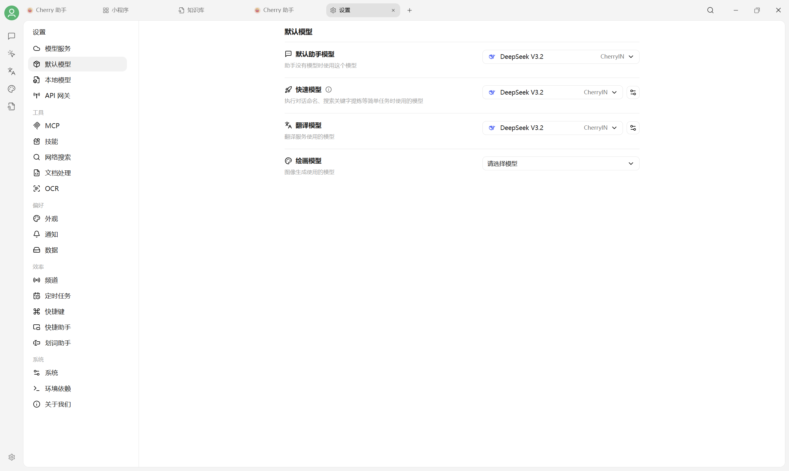

# 默认模型设置

默认模型用于 Cherry Studio 在没有临时指定模型时执行内部任务。V2 提供四类默认模型：

<figure><figcaption>
V2 默认助手、快速、翻译和绘画模型。
</figcaption></figure>

| 字段 | 用途 | 选择建议 |
|---|---|---|
| 默认助手模型 | 新助手没有单独设置模型时使用 | 稳定、常用的对话模型 |
| 快速模型 | 对话命名、搜索关键词提炼等轻量任务 | 延迟低、成本低的模型 |
| 翻译模型 | 翻译页及其他翻译操作 | 指令遵循和多语言能力好的模型 |
| 绘画模型 | 绘画页默认使用的图像模型 | 已配置且支持图像生成的模型 |

快速模型和翻译模型右侧的设置按钮可打开对应的高级配置。聊天时手动选择的模型，以及每个助手单独指定的模型，不会被这里强制覆盖。


下拉列表中没有目标模型时，请先到 `设置 → 模型服务` 添加并启用该模型。绘画模型还必须具备图像生成能力。


***

### 💡 获取帮助与提交反馈

如果您在配置或使用过程中遇到疑问，请参考 [反馈与建议](../../question-contact/suggestions.md)。
