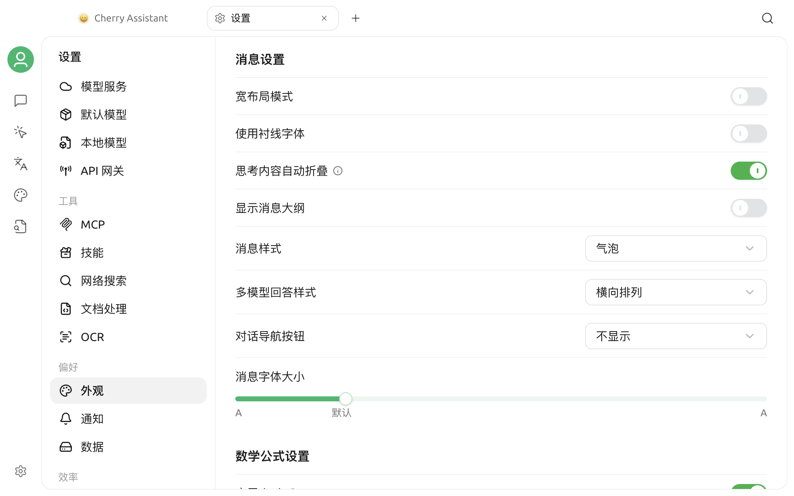

# 外观设置

Cherry Studio V2 的外观选项位于 **设置 > 外观**。页面包含显示与语言、字体、输入、消息、数学公式、代码显示、代码执行和自定义 CSS 等区域。本页重点说明主题、缩放、字体、消息显示和数学公式渲染。

## 主题与主题颜色

### 选择主题

**主题**提供三种模式：

| 模式 | 效果 |
| --- | --- |
| 浅色 | 始终使用浅色界面 |
| 深色 | 始终使用深色界面 |
| 系统 | 跟随操作系统当前的浅色或深色外观 |

选择后会立即更新应用界面。使用 **系统** 时，操作系统切换外观后，Cherry Studio 也会随之变化。

### 设置主题颜色

**主题颜色**影响主要按钮、选中状态和强调元素。你可以：

- 从绿色、红色、琥珀色、蓝色或紫色预设中选择。
- 点击颜色选择器选择其他颜色。
- 在输入框中填写十六进制颜色，例如 `#3B82F6`。

颜色输入支持 `#RGB` 和 `#RRGGBB`，保存时会转换为完整的六位大写格式。无效颜色不会应用。

默认主题颜色为 `#00B96B`。


主题颜色不是完整的自定义主题。若要修改更多界面样式，请使用[自定义 CSS](../personalization-settings/custom-css.md)，并在修改前保存原有样式。


## 平台专属窗口选项

部分显示选项只在对应系统出现：

- **macOS：透明窗口**——在透明与不透明窗口样式之间切换。
- **Linux：使用系统标题栏**——改用系统提供的窗口标题栏；确认后应用会重新启动。

Windows 不显示这两项。不同桌面环境、系统主题和显卡配置可能影响透明或标题栏效果。

## 界面缩放

**缩放**区域会显示当前比例：

- 点击 `-` 缩小界面。
- 点击 `+` 放大界面。
- 点击重置图标恢复默认比例。

每次调整以 10% 为步长。缩放会同时影响文字、图标和界面控件，不等同于单独修改聊天消息字体大小。

也可以使用以下默认快捷键：

| 操作 | macOS | Windows / Linux |
| --- | --- | --- |
| 放大 | `⌘ + =` | `Ctrl + =` |
| 缩小 | `⌘ + -` | `Ctrl + -` |
| 重置 | `⌘ + 0` | `Ctrl + 0` |

快捷键的当前状态以 **设置 > 快捷键** 为准，详见[快捷键设置](key-shortcut.md)。

## 字体设置

### 全局字体

**全局字体**影响应用界面的常规文字。选择器读取当前系统可用字体，并在列表中显示预览。

若字体名称未出现：

1. 确认字体已经安装到操作系统。
2. 关闭并重新打开 Cherry Studio，让应用重新读取字体列表。
3. 再次进入字体选择器搜索。

点击右侧的重置图标可恢复默认字体。

### 代码字体

**代码字体**用于代码内容和需要等宽显示的区域。建议选择包含目标语言字符、数字与常用符号的等宽字体，避免代码对齐异常或出现缺字。

全局字体与代码字体相互独立；重置其中一项不会影响另一项。


聊天消息的字号属于消息显示设置，不在这里单独调整。界面整体过大或过小时使用缩放；只想改变字体风格时使用全局字体或代码字体。


## 消息设置

消息设置控制对话内容的布局与阅读方式：

- **宽布局模式：** 扩大消息内容的可用宽度；
- **使用衬线字体：** 只改变消息正文的字体风格；
- **思考内容自动折叠：** 默认收起模型的思考过程；
- **显示消息大纲：** 为长对话提供消息结构入口；
- **消息样式：** 在气泡等显示样式之间切换；
- **多模型回答样式：** 选择折叠、纵向、横向或网格布局；
- **消息导航：** 选择不显示、按钮或锚点导航；
- **消息字体大小：** 只调整消息字号，不影响整个界面缩放。

消息字体大小的范围为 12–22，默认值为 14。

## 数学公式设置

**启用 `$...$`** 控制是否把单个美元符号包裹的内容渲染为行内数学公式。此项默认启用；如果普通文本中的美元金额被误判为公式，可以关闭后重新查看消息。

## 常见问题

### 选择“系统”主题后没有立即变化

先确认操作系统本身已经切换到另一种外观，并检查 Cherry Studio 是否仍选择 **系统**。若系统主题事件未被桌面环境正确传递，重新打开应用后再检查。

### 字体列表中没有刚安装的字体

Cherry Studio 在进入设置时读取系统字体。安装字体后请重新打开应用，再进入 **显示与语言**。

### 自定义 CSS 导致显示异常

进入 **设置 > 外观 > 自定义 CSS**，暂时清空相关样式并观察是否恢复。自定义 CSS 的选择器可能随版本调整，应避免依赖过深的内部 DOM 结构。

如问题仍存在，请通过[反馈与建议](../../question-contact/suggestions.md)提交操作系统、Cherry Studio 版本、显示设置值和完整界面截图。
