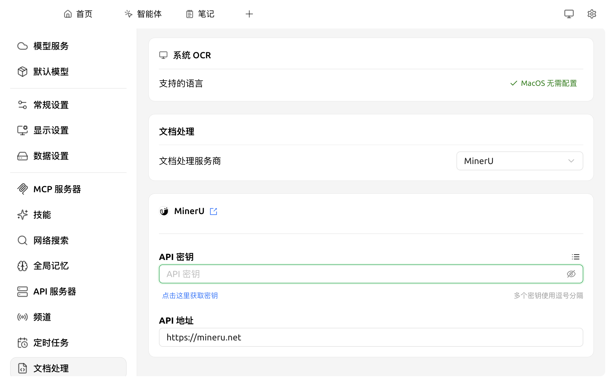

# 文档处理

简单说：**这是 Cherry Studio "把 PDF / 图片 / 扫描件认出文字" 的中央配置。**

举几个例子，下面这些事都依赖它：

* 你把一份扫描的合同 PDF 拖进对话框，想让 AI 读懂内容
* 你把一堆图片格式的发票放进[知识库](../../knowledge-base/knowledge-base.md)，希望以后能搜
* 你的 [Agent](../../advanced-basic/agent.md) 要打开本地文件夹里某张截图分析

这些场景背后都需要先把"图像里的文字"变成"可以被 AI 读的文字"，这一步技术上叫 **OCR**（Optical Character Recognition，光学字符识别）。

Cherry Studio 把 OCR 配置统一放在**一个设置页**：你在这里配一次，所有用到 OCR 的地方都会用同一套配置。

### 配置入口

打开 `设置 → 文档处理`：

<figure><figcaption>
文档处理设置面板
</figcaption></figure>

面板分两块，分别管"图片识字"和"PDF 解析"。

#### 1. OCR 服务 — 给图片认字

适用对象：图片（截图、扫描件）、需要先识别为文字才能被 AI 读取的内容。

* **macOS**：选择「系统 OCR」即可，**无需任何配置**，借用系统自带的识图能力，离线、免费 ✅
* **Windows**：选择「系统 OCR」开箱即用；如需识别非英文 / 中文以外的语种，需要在 Windows 系统中下载对应语言包
* **Linux / 进阶**：可选 Tesseract、Paddle OCR、OpenVINO 等

OCR 引擎对比

| 引擎 | 适合谁 |
|---|---|
| **系统 OCR** | 最简单，免配置，效果通常足够 |
| **Tesseract** | 经典开源 OCR，已内置在 Cherry Studio 中，支持自定义语言 |
| **Paddle OCR** | 中文识别效果更好（百度开源），需要"星河社区访问令牌 + API URL" |
| **OpenVINO** | Intel 显卡可加速 |

不确定时用默认系统 OCR，识别效果不佳再换。

#### 2. 文档处理服务商 — 给 PDF / 复杂文档做结构化解析

适用对象：带表格 / 多栏 / 扫描页的 PDF、长文档。普通纯文本 PDF 直接读就行，无需经过这里。

| 服务商 | 简单说明 |
|---|---|
| **MinerU**（默认） | 免费云服务，专攻复杂版式 PDF（学术论文、合同等），需到 [mineru.net](https://mineru.net) 注册获取 API Key |
| **Paddle OCR** | 离线方案，需配置星河社区访问令牌 |
| **三方 Provider** | 调用你已配置的某家 AI 服务商的视觉模型来识别（效果更智能但需付费） |

### 配置 MinerU（默认方案）

1. 在 **API Key** 字段填入 MinerU 申请到的 key（点击 **Get API Key** 直达申请页）
2. **API Host** 保持默认 `https://mineru.net`
3. 切换到知识库或 Agent 时无需额外配置，会自动使用此处的设置

### 与知识库的关系

* 文档处理仅负责"非文本 → 文本"这一步
* 转换后的文本继续走 [嵌入模型](../../knowledge-base/emb-models-info.md) 向量化、入库
* 详细的"在知识库中启用"流程见 [知识库文档预处理](../../knowledge-base/document-preprocessing.md)

### 何时不需要配置

* 你只用知识库导入纯文本（`.md` / `.txt` / `.docx` 中的纯文字段落）→ 完全不经过文档处理
* 你只用对话功能、不传文件 → 同上

### 提示与技巧

* MinerU 对带表格 / 多栏排版的 PDF 效果显著优于 Tesseract，遇到学术论文等首选
* 离线场景请用 Paddle OCR 或 Tesseract（无网络也能跑）
* 切换处理器后，之前已向量化的资料**不会自动重做** —— 需手动重新导入

如遇问题，请在 [反馈与建议](../../question-contact/suggestions.md) 中提交反馈。

***

### 💡 获取帮助与提交反馈

如果您在配置或使用过程中遇到任何疑问、Bug 或有功能改进建议，请参考 [反馈与建议](../../question-contact/suggestions.md) 中提供的官方渠道。
