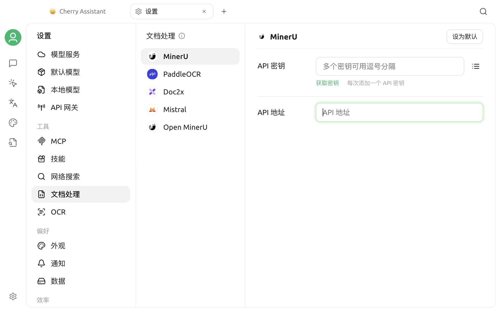

# 文档处理

Cherry Studio V2 使用两个独立设置页处理文件：**OCR** 把图片转换为纯文本，**文档处理**把 PDF 等文档转换为 Markdown，供后续检索、解析和知识库索引使用。

Cherry Studio V2 将处理能力分成两类：

| 能力 | 输入 | 输出 | 常见用途 |
| --- | --- | --- | --- |
| 图片转文字（OCR） | 图片文件 | 纯文本 | 提取截图、扫描图片中的文字 |
| 文档转 Markdown | 文档文件 | Markdown 与相关资源 | 保留标题、段落、表格等结构，供知识库继续处理 |

两个入口分别选择默认处理器。一个服务同时支持两种能力时，会分别出现在 **OCR** 和 **文档处理**页面中，配置与默认状态也分别管理。

## 打开 OCR 与文档处理设置

- 图片转文字：进入 **设置 > OCR**。
- 文档转 Markdown：进入 **设置 > 文档处理**。

在 **文档处理**页面中，左侧按当前 UI 顺序显示 MinerU、PaddleOCR、Doc2x、Mistral 和 Open MinerU。**OCR** 页面会显示当前设备可用的图片处理器。

OCR 处理器会根据平台和运行环境过滤。列表与本文不完全一致时，以当前应用实际显示为准。


V2 初始不会预设图片或文档的默认处理器。配置完成后，需要在相应能力项上点击 **设为默认**；只填写 API 密钥不会自动设为默认。


## 处理器能力对照

### 图片转文字

| 处理器 | 运行位置 | 凭据 | 适用范围 |
| --- | --- | --- | --- |
| System OCR | 本地 | 无 | macOS 与 Windows；直接调用系统 OCR |
| Tesseract OCR | 本地 | 无 | macOS、Windows、Linux；可选择语言包 |
| PaddleOCR | API 或自部署服务 | API Key | 图片 OCR；可选择 PaddleOCR 解析模型 |
| Mistral | Mistral API | API Key | 图片转文字 |
| Intel OV OCR | 本地 | 无 | 仅在满足条件的 Windows Intel Core Ultra 设备上显示 |

System OCR 不支持 Linux。Intel OV OCR 还要求应用检测到所需的本地运行脚本，因此并非所有 Intel 设备都会出现。

### 文档转 Markdown

| 处理器 | 默认 API 地址 | 凭据 | 说明 |
| --- | --- | --- | --- |
| MinerU | `https://mineru.net` | API Key | 提交远程解析任务并轮询结果 |
| PaddleOCR | `https://paddleocr.aistudio-app.com/` | API Key | 支持文档解析，也可改为自部署地址 |
| Doc2x | `https://v2.doc2x.noedgeai.com` | API Key | 提交远程解析与导出任务 |
| Mistral | `https://api.mistral.ai` | API Key | 使用 Mistral OCR 解析文档 |
| Open MinerU | `http://127.0.0.1:8000` | 可选 | 连接自行部署的 MinerU 兼容服务 |

表中的地址是当前内置值。服务商接口变更、自建反向代理或私有部署时，可以在界面中修改 **API 地址 (Base URL)**。


远程处理器会把待处理文件发送到对应服务。处理合同、客户资料或其他敏感文件前，请确认服务商的数据处理、保留和合规政策。希望文件留在本机时，应选择可用的本地处理器或可信的自部署服务。


## 配置本地 OCR

### System OCR

System OCR 只在 macOS 和 Windows 显示。选择后，页面会显示系统 OCR 已可用，无需填写 API Key 或地址。

- macOS 使用系统提供的 OCR 能力，不显示语言选择器。
- Windows 可以在 **语言** 中选择识别语言；所需语言仍须由操作系统支持。

点击 **设为默认** 后，System OCR 才会成为图片转文字的默认处理器。

### Tesseract OCR

Tesseract 在三个桌面平台均可使用，并在本地运行。

在 **语言** 中选择一个或多个识别语言。未选择时，当前版本使用简体中文、繁体中文和英语作为默认语言组合。

语言越多不一定越准确，也可能增加处理时间。只选择图片中实际出现的语言通常更合适。

### Intel OV OCR

Intel OV OCR 只在以下条件同时满足时出现：

- Windows 系统；
- CPU 型号包含 Intel 与 Ultra；
- 应用安装中存在所需的 OV OCR 运行脚本。

它不是通用的“所有 Intel 显卡均可用”选项。列表中没有出现时，表示当前环境未通过可用性检测。

## 配置 API 处理器

PaddleOCR、Mistral、MinerU 和 Doc2x 都需要 API Key；Open MinerU 的 Key 可选，是否需要取决于你的服务端。

### 填写 API Key

可以直接在 **API 密钥 (API Key)** 输入框中填写一个或多个 Key，多个 Key 用逗号分隔。也可以点击输入框右侧的列表按钮，逐条新增、编辑、复制或删除。

保存时会自动：

- 去除前后空格；
- 忽略空值；
- 合并重复 Key。

配置多个 Key 后，同一处理器发起新任务时会按顺序轮换使用。图片与文档能力共享该处理器的 Key 列表。

不要在截图、问题反馈或共享配置中暴露完整 Key。

### 修改 API 地址

**API 地址 (Base URL)** 在输入框失去焦点时校验并保存。地址不合法时，页面会显示警告且不应用该值。

使用自部署或代理地址时：

1. 确认服务实现了对应处理器所需的接口，而不只是普通的 OpenAI 兼容聊天接口。
2. 保留正确的 `http://` 或 `https://` 协议。
3. 确认 Cherry Studio 所在设备可以访问该地址。
4. 若地址指向局域网服务，检查防火墙、端口和证书。

### 选择 PaddleOCR 模型

PaddleOCR 会根据入口显示不同的模型列表：

- **OCR：** `PP-OCRv6`、`PP-OCRv5`；内置默认值为 `PP-OCRv6`。
- **文档处理：** `PaddleOCR-VL-1.5`、`PaddleOCR-VL-1.6`、`PaddleOCR-VL`、`PP-StructureV3`；内置默认值为 `PaddleOCR-VL-1.5`。

所选模型必须由目标 PaddleOCR 服务支持；自部署版本的可用模型可能与云端不同。

页面提供 [PaddleOCR 项目](https://github.com/PaddlePaddle/PaddleOCR)链接，供自部署时参考。Cherry Studio 不会代替你安装或维护服务端。

## 分别设置两个默认处理器

图片转文字与文档转 Markdown 的默认值彼此独立：

1. 在左侧选择用于图片转文字的处理器。
2. 完成本地语言或 API 配置。
3. 点击 **设为默认**。
4. 再选择用于文档转 Markdown 的处理器。
5. 完成 API 配置并点击 **设为默认**。

设为默认后，左侧项目和详情页都会显示 **默认** 标记。

同一个处理器支持两种能力时，API Key 在处理器级别共享，但 API 地址和模型值按能力分别保存。更改其中一个能力的地址，不应假定另一个能力也会同步改变。

## 与知识库的关系

知识库的文档文件可以先转换为 Markdown，再进行分块、嵌入和索引。相关流程请参阅[知识库文档预处理](../../knowledge-base/document-preprocessing.md)。


每个知识库会保存自己的文件处理器选择。这里的全局默认不会自动覆盖已有知识库的配置；请同时在知识库的 RAG 设置中确认 **文件处理** 项。


切换处理器不会自动重做已经完成的索引。希望旧文档使用新处理器时，需要按知识库功能提供的方式重新处理或重新导入。

文档处理只负责内容转换，不替代嵌入模型。转换后的 Markdown 仍需由[嵌入模型](../../knowledge-base/emb-models-info.md)建立向量索引。

## 验证配置

当前文档处理设置页没有独立的“连接测试”按钮。最可靠的验证方式是：

1. 为目标能力设好默认处理器。
2. 对于知识库，在该知识库的 RAG 设置中选择同一文档处理器。
3. 使用不含敏感信息的小型测试图片或文档执行一次真实处理。
4. 检查任务是否完成，以及输出文字、标题、表格和段落是否符合预期。

不同处理器的文件大小、页数、格式、配额和并发限制由服务端决定，应以对应服务当前规则为准。

## 常见问题

### 列表中没有 System OCR

System OCR 仅支持 macOS 和 Windows。Linux 请使用 Tesseract、PaddleOCR 或其他可用处理器。

### 列表中没有 Intel OV OCR

该处理器只在符合要求的 Windows Intel Core Ultra 环境且本地组件存在时显示。无法通过手动填写 API 地址让它出现。

### 已填 API Key，处理时仍提示没有默认处理器

Key 与默认处理器是两项独立配置。回到对应能力的处理器页面，点击 **设为默认**。

### API Key 很多，如何管理？

点击 Key 输入框右侧的列表按钮逐条管理。重复 Key 不会重复保存，多个有效 Key 会按处理器轮换使用。

### 自部署服务无法连接

检查 Base URL、端口、防火墙、HTTPS 证书和服务端接口版本。PaddleOCR 与 Open MinerU 需要各自兼容的接口，不能直接填写普通聊天模型的 API 地址。

### 改了处理器，已有知识库为什么没有变化？

知识库保存独立的文件处理器选择，已完成的索引也不会自动重建。请修改知识库的 RAG 配置，并根据需要重新处理相关文档。

如仍无法解决，请通过[反馈与建议](../../question-contact/suggestions.md)提交操作系统、处理器名称、文件类型、错误提示和已脱敏的配置截图。
