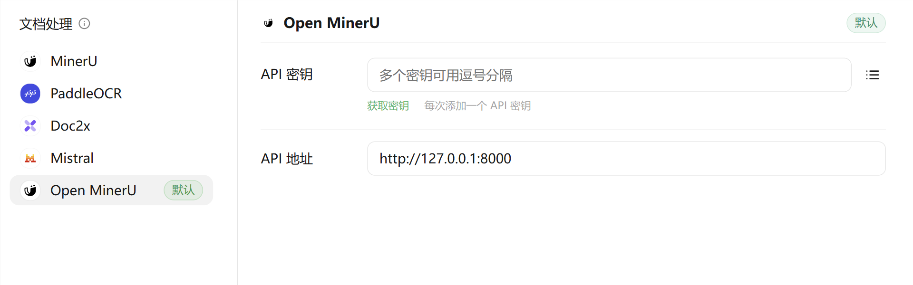

# 文档处理

文档处理用于在知识库索引前，把 PDF、Word、PowerPoint、Excel 等文件转换为更适合分块和检索的 Markdown。它主要解决扫描件、复杂排版、表格和多栏 PDF 难以直接提取的问题。

普通文本、Markdown、HTML、CSV、JSON、EPUB，以及文字层清晰的常规文档，通常可以先使用 Cherry Studio 的内置读取能力，不必为了“能导入”而配置云端解析服务。

<figure><figcaption>
设置 → 文档处理：已选择自部署 Open MinerU
</figcaption></figure>

## 内置读取与文档解析服务

| 方式 | 如何使用 | 是否需要 API Key | 适合场景 |
|---|---|---|---|
| 内置读取 | 在知识库的检索设置中将 **文档处理** 保持为 **未设置** | 不需要 | 文字层清晰的 PDF、Word，以及 Markdown、HTML、TXT、CSV 等常规资料 |
| 文档解析服务 | 先在 `设置 → 文档处理` 配置服务，再在知识库的检索设置中选择它 | 视服务而定 | 扫描 PDF、论文、合同、表格、多栏排版，以及需要尽量保留结构的 Office 文件 |

选择文档解析服务后，PDF、DOC、DOCX、PPTX、XLSX、XLS 会先转换为 Markdown，再进入知识库的分块与索引流程。图片文字识别属于相邻的 `设置 → OCR` 功能，不要把 OCR 与文档结构解析混为一项。

## 当前入口与可选服务

打开 `设置 → 文档处理` 可以配置服务、API 地址并设为默认；知识库是否实际使用某个服务，以该知识库 `检索设置 → 文档处理` 中的选择为准。

| 服务 | 部署方式 | API Key |
|---|---|---|
| MinerU | 官方云端服务；默认 API 地址为 `https://mineru.net` | 需要 |
| PaddleOCR | PaddleOCR 文档解析接口或兼容部署 | 需要 |
| Doc2x | Doc2X 云端文档还原服务 | 需要 |
| Mistral | Mistral OCR / 文档解析 API | 需要 |
| Open MinerU | 自部署服务；默认地址为 `http://127.0.0.1:8000` | 可选，取决于部署是否启用鉴权 |

出于防误用考虑，知识库的处理器下拉框只会显示已经具备可用密钥的 API 服务；Open MinerU 即使不填密钥也可以选择。API 地址始终需要与实际部署一致。

## 如何选择

* **先用内置读取**：文件以电子文本为主、能正常复制文字、排版不复杂。
* **优先 MinerU / Doc2x / Mistral**：复杂 PDF、论文、合同、公式、表格或多栏排版需要更完整的结构还原。
* **选择 PaddleOCR**：已经使用 PaddleOCR 文档解析服务，或希望统一图片与文档处理链路。
* **选择 Open MinerU**：企业内网、自托管或资料不适合发送给第三方云服务。

云端解析会把原文件发送到所选服务商。涉及合同、财务或内部资料时，应先确认组织的数据合规要求；没有复杂解析需求时，保留“未设置”通常更简单。

## 如何确认处理成功

文件加入知识库后，状态会先显示 **处理中**。当文档解析、分块和索引全部完成后，状态变为 **就绪**；此时可以预览原文或用召回测试验证关键段落是否能够检索到。

如果显示 **预处理失败**，问题发生在文档转换阶段；如果显示 **嵌入失败**，则应检查知识库使用的嵌入模型，而不是文档处理服务。

## 常见问题

### 知识库中看不到已配置的服务

MinerU、PaddleOCR、Doc2x 和 Mistral 需要先保存至少一个有效 API Key。Open MinerU 不强制要求密钥，但必须填写可访问的 API 地址。

### 文件一直处理中或预处理失败

检查 API Key、API 地址、网络代理、服务额度和自部署服务状态。超大文件或服务端排队也会延长处理时间。

### 扫描 PDF 只有空白或乱码

内置读取依赖文件中的文字层。改用适合复杂文档的解析服务；如果问题集中在图片文字识别，再检查 `设置 → OCR`。

### 更换处理器后，旧文件没有变化

已经生成处理产物的文件在普通重新索引时会继续复用该产物。需要用新处理器重新转换时，先确认原文件可重新取得，再移除并重新导入该数据源。

更多知识库配置见 [文档预处理](../../knowledge-base/document-preprocessing.md)。

***

### 💡 获取帮助与提交反馈

如果您在配置或使用过程中遇到疑问，请参考 [反馈与建议](../../question-contact/suggestions.md)。
