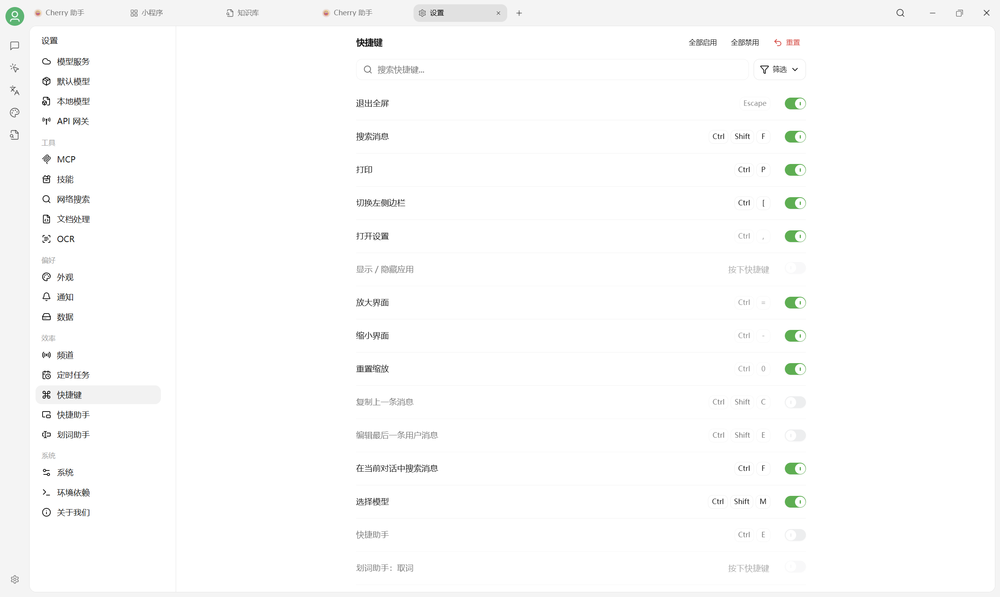

# 快捷键设置

打开 `设置 → 快捷键`。V2 支持搜索、筛选、全部启用、全部禁用和一键重置。

<figure><figcaption>
V2 快捷键列表；每一项都可以单独启用或停用。
</figcaption></figure>

## 修改方法

1. 在搜索框输入功能名，或用 **筛选** 缩小范围；
2. 点击当前按键组合；
3. 按下新的组合键；
4. 打开该行右侧开关。

如果出现冲突，换一个组合键或停用其中一项。页面右上角 **重置** 会恢复默认配置。

## 常用快捷键

下表是当前 Windows 界面的默认示例。macOS 通常以 `⌘` 代替 `Ctrl`；实际值以你自己的快捷键页面为准。

| 功能 | 默认示例 |
|---|---|
| 退出全屏 | `Esc` |
| 搜索消息 | `Ctrl + Shift + F` |
| 打印 | `Ctrl + P` |
| 切换左侧边栏 | `Ctrl + [` |
| 打开设置 | `Ctrl + ,` |
| 放大 / 缩小 / 重置缩放 | `Ctrl + =` / `Ctrl + -` / `Ctrl + 0` |
| 在当前对话中搜索 | `Ctrl + F` |
| 选择模型 | `Ctrl + Shift + M` |
| 新建话题 | `Ctrl + N` |
| 重命名话题 | `Ctrl + T`（默认可能关闭） |
| 切换另一侧栏 | `Ctrl + ]` |
| 快捷助手 | `Ctrl + E`（默认可能关闭） |

还可以为 **显示/隐藏应用**、**划词助手取词**和其他全局动作自定义快捷键。


V2 已移除旧版输入区中的“清除上下文”和“清空当前话题”动作，对应的旧快捷键说明也不再适用。需要干净上下文时请新建话题；需要删除消息时使用话题或消息菜单。


## 快捷助手与划词助手

快捷键只负责触发。还需要分别到：

* `设置 → 快捷助手` 开启快捷助手；
* `设置 → 划词助手` 开启划词助手，并选择取词方式。

全局快捷键在某些系统上可能需要辅助功能、输入监听或后台运行权限。

***

### 💡 获取帮助与提交反馈

如果您在配置或使用过程中遇到疑问，请参考 [反馈与建议](../../question-contact/suggestions.md)。
