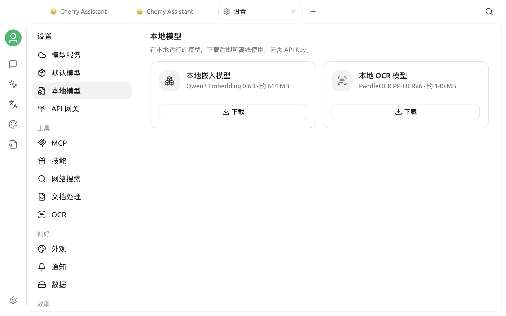

# 本地模型

本地模型在你的设备上运行。模型下载完成后可以离线使用，不需要 API Key；首次下载仍需要网络连接。

## 打开本地模型

打开 **设置 > 本地模型**。页面包含两张模型卡片，并显示每个模型的用途、近似大小和当前状态。

## 可用模型

| 模型 | 页面显示大小 | 用途 |
| --- | --- | --- |
| **本地嵌入模型**（Qwen3 Embedding 0.6B） | 约 614 MB | 为知识库内容生成文本向量 |
| **本地 OCR 模型**（PaddleOCR PP-OCRv6） | 约 140 MB | 从图片中识别文字 |

本地 OCR 只处理图片，不用于文档转 Markdown。

## 下载与管理

1. 在需要的模型卡片中点击 **下载**。
2. 下载期间查看进度条和百分比；如需停止，点击 **取消**。
3. 下载完成后，卡片会显示 **已就绪**。
4. 不再需要模型时，点击卡片右上角的删除图标。

卡片显示的是模型的近似大小。首次下载任一模型时，Cherry Studio 还可能下载两个模型共用的运行组件，因此实际下载量和磁盘占用可能略高。

## 删除约束与自动行为

- 本地嵌入模型下载完成后会出现在知识库的嵌入模型选项中。如果在创建新知识库前已经就绪，新知识库会默认使用它。
- 如果本地嵌入模型仍被知识库使用，Cherry Studio 不会删除其文件，并会提示模型仍在使用。请先为相关知识库更换嵌入模型，再重试删除。
- 本地 OCR 下载完成后，如果你没有明确选择其他图片转文字处理器，Cherry Studio 会将它设为默认处理器；删除它后会恢复平台默认处理器。

## 平台限制

Intel Mac 不支持这些本地模型。此时页面会显示 **当前平台不支持本地模型**，并隐藏下载卡片。

## 常见问题

### 下载失败

检查网络连接后重新点击 **下载**。失败或取消的下载不会保留为可用模型。

### 删除本地嵌入模型后仍然显示

该模型仍被至少一个知识库使用。先为相关知识库更换嵌入模型，再返回本页删除。

### 删除失败

重新打开本页后再试。若仍然失败，请查看应用日志中的错误信息。
