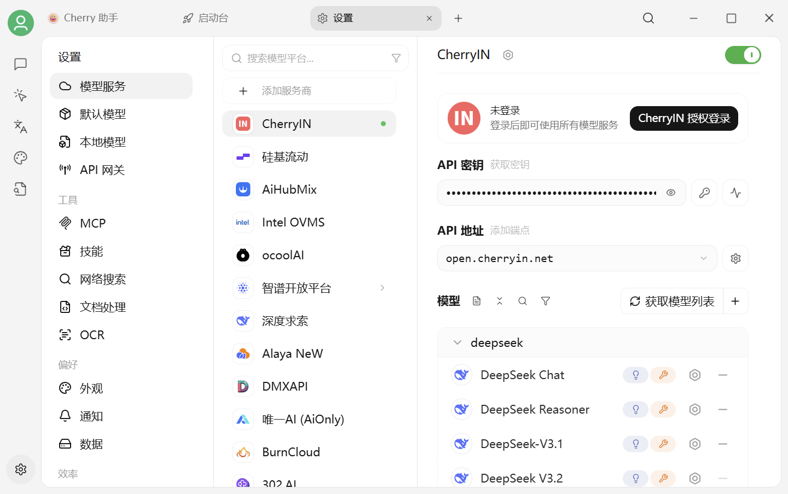

# 模型服务设置

当前页面仅做界面功能的介绍，配置教程可以参考基础教程中的 [服务商配置](../providers/) 教程。

<figure><figcaption>
设置 → 模型服务：选择服务商、填写凭据并管理模型
</figcaption></figure>


不同服务商对凭据的叫法可能不同：API Key、密钥、令牌或授权登录。V2 还支持部分服务商的账号授权、多个端点和自定义请求头。


### API 密钥

在 Cherry Studio 当中，单个服务商支持多 Key 轮询使用，轮询方式为从前到后列表循环的方式。

* 多 Key 用英文逗号隔开添加。如以下示例方式：

<pre><code><strong>sk-xxxx1,sk-xxxx2,sk-xxxx3,sk-xxxx4
</strong></code></pre>


必须使用 **英文** 逗号。


### API 地址

在使用内置服务商时一般不需要填写 API 地址，如果需要修改请严格按照对应的官方文档给的地址填写。

> 如果服务商给的地址为 <mark style="background-color:red;">https://xxx.xxx.com</mark><mark style="background-color:green;">/v1/chat/completions</mark> 这种格式，只需要填写根地址部分（<mark style="background-color:red;">https://xxx.xxx.com</mark>）即可。
>
> Cherry Studio 会自动拼接剩余的路径（<mark style="background-color:green;">/v1/chat/completions</mark>），未按要求填写可能会导致无法正常使用。


说明：大多数服务商的大语言模型路由是统一的，一般情况下不需要进行如下操作。如果服务商请求路由不是常规的 <mark style="background-color:green;">/v1/chat/completions</mark> 时，可在 API 地址栏手动输入 **完整的API地址**，并以 `#`结尾。

即：

* API地址使用 `#` 结尾时不执行拼接操作，只使用填入的地址。 


### 添加模型

点击服务商页面的 **获取模型列表**，从远端列表中选择要添加的模型；也可以点击 **添加模型** 手动填写。


获取到的远端列表不会自动全部加入“我的模型”。需要明确选择要使用的模型，保存后才会出现在模型选择器中。


### 连通性检查

点击服务商页面的 **检测** 按钮即可测试配置。


检测失败时依次检查 API Key/授权状态、API Host、端点、网络代理、账户余额和所选模型是否可用。



配置成功后务必打开右上角的开关，否则该服务商仍处于未启用状态，无法在模型列表中找到对应模型。


***

### 💡 获取帮助与提交反馈

如果您在配置或使用过程中遇到任何疑问、Bug 或有功能改进建议，请参考 [反馈与建议](../../question-contact/suggestions.md) 中提供的官方渠道。
