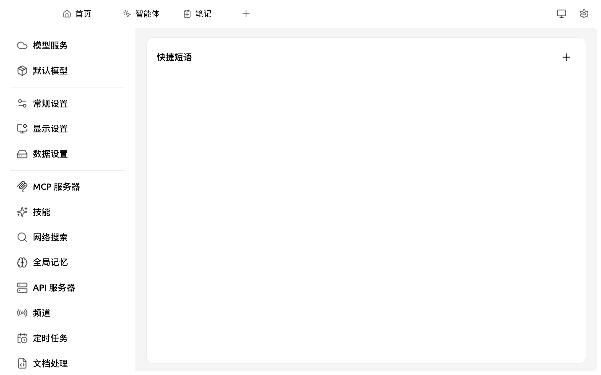

# 快捷短语

快捷短语（Quick Phrase）是一组**预设的对话模板**，可在对话框中通过快捷菜单一键调用，避免重复输入提示词。

短语分两类：

* **全局短语**：在任何助手 / 对话中都可调用
* **助手短语**：仅在所属助手下生效，适合给某个角色配套专用模板

### 添加快捷短语

打开 `设置 → 快捷短语`：

<figure><figcaption><p>快捷短语管理面板</p></figcaption></figure>

1. 点击页面右上角的 **+** 按钮（鼠标悬停显示"添加短语"提示）
2. 填写：
   * **标题**：在调用菜单中显示的名字（如"翻译成英文"、"代码 review"）
   * **内容**：实际插入对话框的文本，**支持变量**（见下）
   * **添加位置**：选择 `全局短语` 或某个特定助手
3. 保存

### 内容中的变量：`${name}` 语法

快捷短语支持**用户自定义变量**，语法为 `${变量名}`。调用短语后，按 <kbd>Tab</kbd> 键可在多个变量位置之间快速跳转并填写。

示例：

```
帮我规划从 ${出发地} 到 ${目的地} 的路线，并发送到 ${邮箱}。
```

调用此短语时：

1. 内容会插入对话框，光标自动定位到 `${出发地}`
2. 输入"上海"，按 <kbd>Tab</kbd> 跳到 `${目的地}`
3. 输入"杭州"，按 <kbd>Tab</kbd> 跳到 `${邮箱}`
4. 填完地址按 Enter 发送

变量名可任意命名（中文、英文皆可），相同名称的变量会保持同步填写。


**与"助手提示词变量"的区别**：助手 / Cherry Agent 的**系统提示词**支持另一套**预设变量**（如 `{{date}}`、`{{time}}`、`{{model_name}}`、`{{username}}` 等），由 Cherry Studio 在运行时自动替换。两套机制各自独立：

* `${name}`：仅用于快捷短语，**用户自定义**、运行时手动填写
* `{{date}}` 等：仅用于助手 / Agent 系统提示词，**系统自动替换**


### 在对话框中使用

* 在 [对话界面](../../cherrystudio/preview/chat.md) 的输入工具栏中点击 ⚡ **快捷短语** 图标，或在输入框中输入 `/` 唤起斜杠菜单
* 选择目标短语 → 内容自动插入到当前输入框，光标停在第一个变量上
* 按 <kbd>Tab</kbd> 跳到下一个变量

### 排序与编辑

* 拖拽列表项可调整顺序
* 点击短语条目可编辑或删除（删除后无法恢复）

### 提示与技巧

* 写一条 **「对下列代码做 review，按 严重度 / 类型 / 修复建议 三列汇总：`${code}`」**，调用后粘贴代码到 `${code}` 处即可
* 与 [划词助手](../../cherrystudio/preview/selection-assistant.md) 互补：划词助手处理"已选中的内容"，快捷短语提供"通用模板"
* 多个短语可形成你的"提示词工程库"，建议按场景分类命名

***

### 💡 获取帮助与提交反馈

如果您在配置或使用过程中遇到任何疑问、Bug 或有功能改进建议，请参考 [反馈与建议](../../question-contact/suggestions.md) 中提供的官方渠道。
