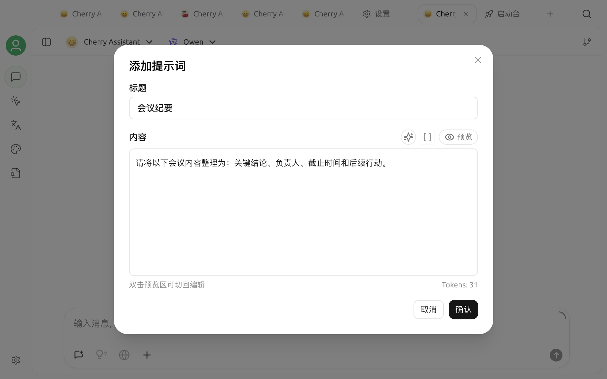

# 提示词与快速插入

提示词用于保存经常重复输入的内容，例如固定的写作要求、分析框架或回复格式。保存后，可以从对话输入框快速搜索并插入，不必每次重新输入。

Cherry Studio V2 使用“提示词”统一管理这类内容，替代旧版本的“快捷短语”。

## 新建提示词

### 从资源库新建

1. 打开[资源库](../../cherrystudio/preview/library.md)。
2. 在左侧选择 **提示词**。
3. 点击新建按钮，填写名称和内容。
4. 点击保存。

名称用于搜索和识别，内容是插入输入框的实际文本。保存后，提示词会显示在资源库和对话输入框的提示词列表中。

### 从输入框新建

1. 在对话输入框下方点击闪电图标，打开提示词列表。
2. 选择列表底部的“添加…”。
3. 填写名称和内容并保存。

如需编辑或删除已有提示词，请前往资源库。

## 从输入框插入提示词

可以使用以下任一方式打开提示词列表：

* 点击对话输入框下方的闪电图标。
* 在输入框中输入 `/`，打开快捷面板，然后选择“提示词”。

在列表中搜索并选择提示词后，Cherry Studio 会把提示词正文插入当前光标位置。如果已经选中一段文字，使用闪电按钮插入时会替换选中的内容；通过 `/` 打开快捷面板时，则会替换用于触发和搜索的文字。

插入后仍可继续编辑，再发送给模型。

## 关于变量

提示词编辑器可以插入 `${variable}` 作为占位文本。当前版本会按原样保存和插入提示词，不会自动为占位符赋值。插入对话输入框后，按 Tab 可以依次选中下一个 `${...}` 占位符；到达最后一个后，再按一次会回到第一个，仍需手动替换内容。


发送消息前，请手动把 `${variable}` 替换为实际内容。不要在提示词中保存密码、API Key 或其他敏感信息。


## 使用建议

* 名称尽量描述任务，例如“检查产品文档”或“生成会议摘要”。
* 把稳定的要求写进提示词，把每次变化的资料留到插入后补充。
* 定期清理不再使用或内容重复的提示词，保持搜索结果简洁。
