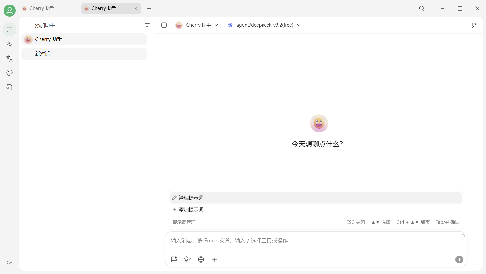
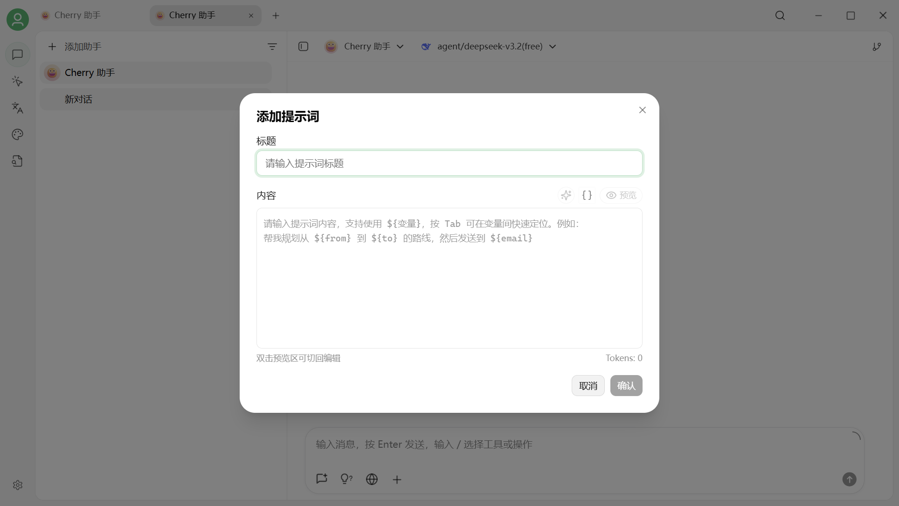

# 提示词管理

提示词是可以重复调用的对话模板，用于保存常用指令，避免反复输入。旧版本中的“快捷短语”已经并入对话输入框的 **提示词管理**，设置页不再提供单独的“快捷短语”入口。

## 打开提示词面板

1. 进入任意 [对话页面](../../cherrystudio/preview/chat.md)；
2. 点击输入框下方的 **输入快捷面板**；
3. 选择 **提示词管理**。

<figure><figcaption><p>从输入快捷面板打开提示词管理</p></figcaption></figure>

在这里可以：

* 直接选择已有提示词，将内容插入输入框；
* 点击 **管理提示词**，整理、编辑或删除已有项目；
* 点击 **添加提示词**，新建常用模板。

## 添加提示词

新建时填写：

* **标题**：显示在调用菜单中的名称，例如“翻译成英文”或“代码审查”；
* **内容**：实际插入输入框的提示词正文；
* **变量**：正文支持 `${变量名}`，也可以通过 **插入变量** 按钮添加；
* **预览**：保存前检查提示词和变量是否符合预期。

<figure><figcaption><p>填写标题、正文并按需插入变量</p></figcaption></figure>

例如：

```text
帮我规划从 ${出发地} 到 ${目的地} 的路线，并发送到 ${邮箱}。
```

调用后依次填写变量即可。相同名称的变量会使用同一份输入内容。


助手或工作中的 Agent 系统提示词还支持 `{{date}}`、`{{time}}`、`{{model_name}}` 等由系统自动替换的预设变量。它们与提示词正文中的 `${变量名}` 不是同一套机制。


## 使用与维护

* 在输入快捷面板中选择提示词，内容会插入当前输入框；
* 需要修改模板时，进入 **管理提示词**；
* 多个提示词可以按翻译、写作、代码、分析等场景命名，便于快速查找；
* 提示词适合通用模板；处理已选中的屏幕文字时，可配合 [划词助手](../../cherrystudio/preview/selection-assistant.md)。

***

### 💡 获取帮助与提交反馈

如果您在配置或使用过程中遇到任何疑问、Bug 或有功能改进建议，请参考 [反馈与建议](../../question-contact/suggestions.md) 中提供的官方渠道。
