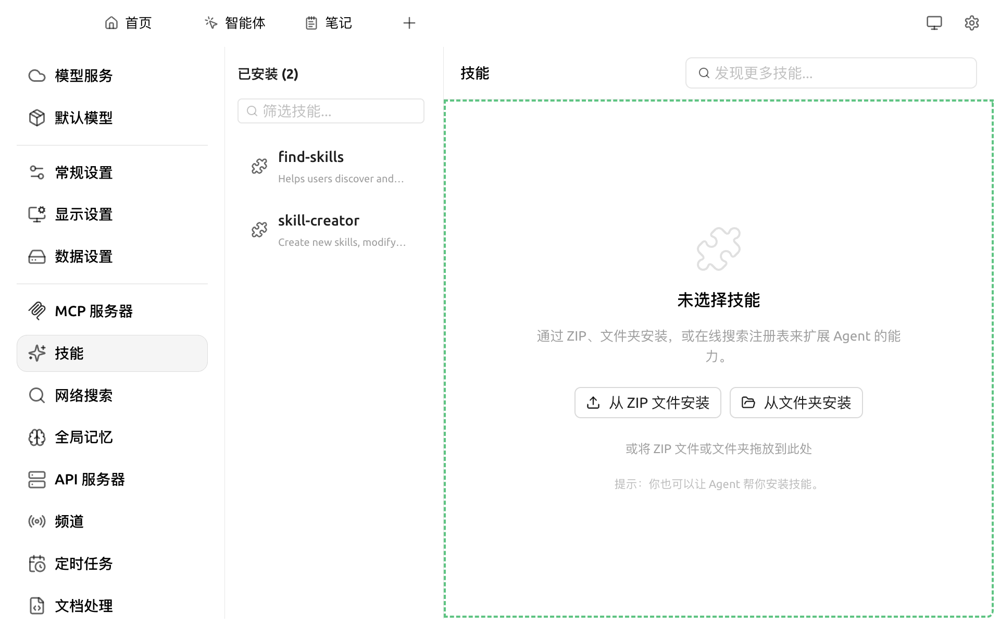

# 技能（Skills）

**技能为 AI 加装"专业能力组件"**。

类比：手机出厂自带相机、地图、计算器等基础应用，但若需要观看短视频则需安装抖音、若需要点外卖则需安装美团 —— **应用扩展了手机的专项能力**。

Cherry Studio 中的 AI 同样如此：默认具备对话能力，若需要"撰写小红书图文"、"起草专利申请"、"绘制 Mermaid 流程图"等专项任务，可**为其加装对应的技能**。

* **可加装对象**：[助手](../../cherrystudio/preview/agents.md) 或 [Cherry Agent](../../advanced-basic/agent.md)
* **不可加装对象**：底层模型。技能属于 Cherry Studio 层的能力，不影响模型本身
* **启用效果**：处理相关任务时，AI 自动按技能定义的专业方式响应

> 推荐先阅读 [概念入门](../../advanced-basic/concepts-101.md) 了解技能、MCP、助手的差异。

### 在哪里管理技能

打开 `设置 → 技能`：

<figure><figcaption>
技能管理面板
</figcaption></figure>

可看到：

* **已安装**：当前账号已添加的技能
* **内置**：Cherry Studio 自带的内置技能（无需安装即可使用）
* **搜索 / 筛选**：按名称或类别筛选

### 安装技能

1. 在技能管理面板点击 **添加更多技能**
2. 在技能市场中浏览或搜索
3. 点击安装即可，之后在助手或 Agent 设置中可勾选启用

### 在助手中启用技能

* 进入 `助手设置 → 技能`
* 勾选要启用的技能
* 对话时助手会按提示词自动调用所选技能

### 在 [Cherry Agent](../../advanced-basic/agent.md) 中启用

* 进入 Agent 编辑界面 → `工具` 选项卡
* 在"技能"分组下勾选启用
* Agent 会自主决定何时调用

### 技能 vs MCP 工具 vs Provider

| 类型 | 提供方 | 适合做什么 |
|---|---|---|
| **技能（Skills）** | 内置或第三方技能包 | 模板化任务（写邮件 / 画图 / 写 PPT） |
| **[MCP 工具](../../advanced-basic/mcp/)** | 任意 MCP Server | 需要调用外部 API / 系统命令的任务 |
| **Provider 模型** | 各 AI 厂商 | 底层对话能力 |

三者可叠加：一个 Agent 可以同时挂载多个技能 + 多个 MCP 工具 + 任一 Provider 的模型。

如遇问题，请在 [反馈与建议](../../question-contact/suggestions.md) 中提交反馈。
